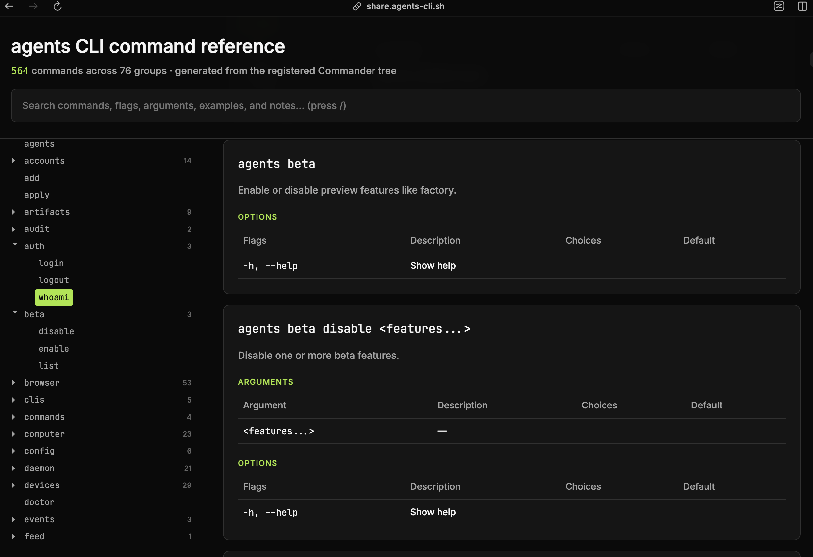
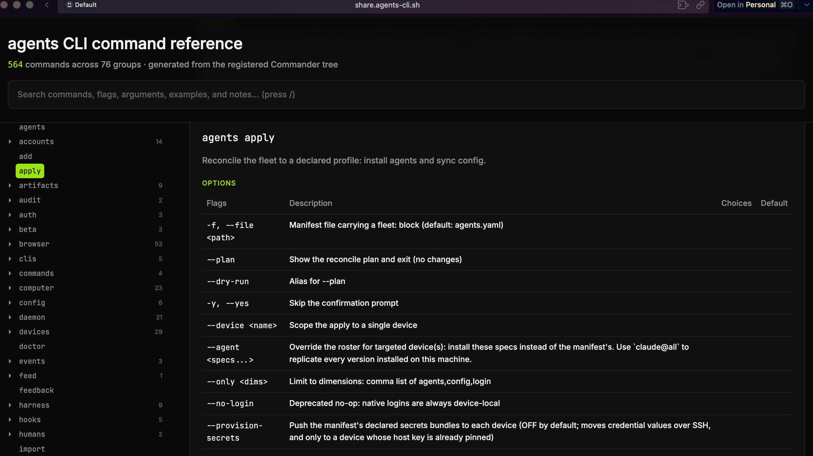
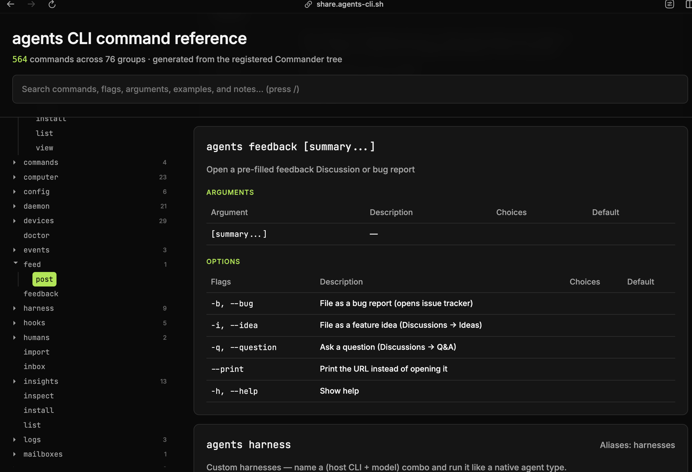

## Focus for review

Four verdicts. Nothing is implemented until these land.

1. **beta parent** — `setup beta` (recommended), `config beta`, or leave it. Not `update`.
2. **apply** — retire the top-level leftover; keep `agents fleet apply` / `agents devices apply`. Do not rename to `onboard`.
3. **feedback** — keep as a leaf. Not worth a nest.
4. **harness** — shrink it (drop login/logout). Do **not** add a new top-level `create` verb.

## Intent

You walked the command reference after nesting `alias` under `setup` and pointed at the next leftovers: `beta`, then `apply` (fleet/devices), then `feedback`, then `harness`. The ask is to understand what each actually does — especially apply, which you have never used and suspected was dead — and propose where it should live, including a better word if one exists.

## Purpose

The sidebar is an alphabet of 76 groups. Several are leftover flattened verbs, not nouns. RUSH-2965 already set the rule: nest by relatedness, retire the old top-level name so spellcheck cannot silently misroute. This plan applies that rule to the four groups you highlighted, and stops before inventing a new `create` dumping ground.

## Current architecture

`devices` is the noun. `.command('devices').alias('fleet')` — one tree, two names, both plural on purpose. `setup fleet` is the Tailscale **onboarding wizard**. `fleet update` rolls out agents-cli. `fleet apply` (also registered as top-level `apply`) reconciles every device to a `fleet:` block in `agents.yaml`.

That `fleet:` block on this machine is `devices: {}`. So `agents apply --plan` runs, probes nothing, and prints `No target devices — nothing to apply.` The engine is not broken. There is no declared roster to converge.

<figure class="artifact-figure artifact-figure-diagram artifact-figure-wide">
  <svg class="artifact-diagram" viewBox="0 0 920 340" role="img" aria-label="Three fleet verbs: setup fleet onboards, fleet update rolls the CLI, fleet apply reconciles a manifest">
    <text x="20" y="24" fill="#c8c8c8" font-family="Inter, system-ui, sans-serif" font-size="14">Three different verbs under one noun. apply is reconcile, not onboard.</text>
    <rect x="20" y="48" width="280" height="120" rx="8" fill="#0e1418" stroke="#38bdf8" stroke-width="1.5"/>
    <text x="160" y="78" text-anchor="middle" fill="#c8c8c8" font-family="Inter, system-ui, sans-serif" font-size="13">setup fleet</text>
    <text x="160" y="100" text-anchor="middle" fill="#38bdf8" font-family="JetBrains Mono, monospace" font-size="11">onboard</text>
    <text x="160" y="122" text-anchor="middle" fill="#8a8a8a" font-family="Inter, system-ui, sans-serif" font-size="11">Tailscale sync, SSH auth,</text>
    <text x="160" y="140" text-anchor="middle" fill="#8a8a8a" font-family="Inter, system-ui, sans-serif" font-size="11">write ssh config, ping</text>
    <rect x="320" y="48" width="280" height="120" rx="8" fill="#0e1418" stroke="#38bdf8" stroke-width="1.5"/>
    <text x="460" y="78" text-anchor="middle" fill="#c8c8c8" font-family="Inter, system-ui, sans-serif" font-size="13">fleet update</text>
    <text x="460" y="100" text-anchor="middle" fill="#38bdf8" font-family="JetBrains Mono, monospace" font-size="11">rollout</text>
    <text x="460" y="122" text-anchor="middle" fill="#8a8a8a" font-family="Inter, system-ui, sans-serif" font-size="11">agents upgrade --yes</text>
    <text x="460" y="140" text-anchor="middle" fill="#8a8a8a" font-family="Inter, system-ui, sans-serif" font-size="11">on every online device</text>
    <rect x="620" y="48" width="280" height="120" rx="8" fill="#16120a" stroke="#f59e0b" stroke-width="2"/>
    <text x="760" y="78" text-anchor="middle" fill="#c8c8c8" font-family="Inter, system-ui, sans-serif" font-size="13">fleet apply  (= apply)</text>
    <text x="760" y="100" text-anchor="middle" fill="#f59e0b" font-family="JetBrains Mono, monospace" font-size="11">reconcile</text>
    <text x="760" y="122" text-anchor="middle" fill="#8a8a8a" font-family="Inter, system-ui, sans-serif" font-size="11">install-cli, add-agent,</text>
    <text x="760" y="140" text-anchor="middle" fill="#8a8a8a" font-family="Inter, system-ui, sans-serif" font-size="11">sync-config, optional secrets</text>
    <rect x="20" y="196" width="880" height="120" rx="8" fill="#0e1418" stroke="#333" stroke-width="1.5"/>
    <text x="40" y="224" fill="#8a8a8a" font-family="JetBrains Mono, monospace" font-size="11">agents.yaml  fleet:</text>
    <text x="40" y="246" fill="#c8c8c8" font-family="JetBrains Mono, monospace" font-size="12">devices: {}          # this machine — empty map, so apply has nothing to do</text>
    <text x="40" y="268" fill="#8a8a8a" font-family="JetBrains Mono, monospace" font-size="11">discovery: { zion: approved, yosemite-s0: approved, ... }   # not a roster</text>
    <text x="40" y="294" fill="#f59e0b" font-family="Inter, system-ui, sans-serif" font-size="12">Live run, 2026-08-20: `agents apply --plan` → "No target devices — nothing to apply." Engine ran. Manifest was empty.</text>
  </svg>
  <figcaption><b>Figure 1.</b> setup fleet onboards a box onto Tailscale. fleet update rolls the CLI. apply converges a declared roster. Renaming apply to onboard would collide with the wizard that already does that.</figcaption>
</figure>

What you see in the reference today:







### What each leftover actually is

| Group | What it does | Already nested? | Live signal |
| --- | --- | --- | --- |
| `beta` (3) | Opt into preview features. Writes `beta.enabled` in `~/.agents/agents.yaml`. Only `factory` is still gated. | No | `agents beta list` works |
| `apply` (0 children) | Reconcile fleet to `fleet:` — install CLI, add agents, sync config. Native OAuth is never copied. | **Yes** — `devices apply` / `fleet apply` via `registerFleetApplyAlias` | `--plan` exits 0; 0 targets because `devices: {}` |
| `feedback` (0) | Opens a GitHub Discussion / bug issue, prefilled with version + OS + Node | No | `feedback --print -i` returns a discussions URL |
| `harness` (9) | Named (host CLI + model) pin. `agents run spark` then behaves like a native type. Replaced the old `profiles` tree. | No | `harness list` shows `deepseek` plus presets |
| `devices` / `fleet` | One command tree. Alias is already correct. | n/a | `devices apply --help` and `fleet apply --help` are the same flags |

Harness verbs today: `add`, `fork`, `edit`, `rename`, `list`, `view`, `remove`, `login`, `logout`. Credentials already moved to `agents accounts`. `add --auth-provider` throws *"Harnesses no longer own credentials."* `login` / `logout` are leftover.

<div class="artifact-behavior">
  <div class="artifact-behavior-panel" data-state="current" data-evidence="mockup">
    <svg viewBox="0 0 420 300" role="img" aria-label="Current command-reference sidebar with leftover top-level groups highlighted">
      <text fill="currentColor" x="12" y="20" font-size="11" font-weight="600">CURRENT — leftover verbs at the root</text>
      <rect x="12" y="32" width="180" height="252" rx="6" fill="none" stroke="currentColor" opacity="0.35"/>
      <text fill="currentColor" x="24" y="54" font-size="11" opacity="0.55">accounts</text>
      <text fill="currentColor" x="24" y="74" font-size="11" opacity="0.55">add</text>
      <rect x="20" y="82" width="160" height="18" rx="3" fill="none" stroke="currentColor"/>
      <text fill="currentColor" x="24" y="96" font-size="11" font-weight="600">apply</text>
      <text fill="currentColor" x="24" y="116" font-size="11" opacity="0.55">artifacts</text>
      <rect x="20" y="122" width="160" height="18" rx="3" fill="none" stroke="currentColor"/>
      <text fill="currentColor" x="24" y="136" font-size="11" font-weight="600">beta</text>
      <text fill="currentColor" x="24" y="156" font-size="11" opacity="0.55">browser   53</text>
      <text fill="currentColor" x="24" y="176" font-size="11" opacity="0.55">devices   29</text>
      <rect x="20" y="182" width="160" height="18" rx="3" fill="none" stroke="currentColor"/>
      <text fill="currentColor" x="24" y="196" font-size="11" font-weight="600">feedback</text>
      <rect x="20" y="202" width="160" height="18" rx="3" fill="none" stroke="currentColor"/>
      <text fill="currentColor" x="24" y="216" font-size="11" font-weight="600">harness    9</text>
      <text fill="currentColor" x="24" y="236" font-size="11" opacity="0.55">sessions  18</text>
      <text fill="currentColor" x="24" y="256" font-size="11" opacity="0.55">setup      8</text>
      <text fill="currentColor" x="210" y="96" font-size="10">also devices apply</text>
      <text fill="currentColor" x="210" y="136" font-size="10">preview flags</text>
      <text fill="currentColor" x="210" y="196" font-size="10">opens a GH form</text>
      <text fill="currentColor" x="210" y="216" font-size="10">named host+model pin</text>
    </svg>
  </div>
  <div class="artifact-behavior-panel" data-state="proposed" data-evidence="mockup">
    <svg viewBox="0 0 420 300" role="img" aria-label="Proposed sidebar: apply and beta nested, feedback kept, harness shrunk">
      <text fill="currentColor" x="12" y="20" font-size="11" font-weight="600">PROPOSED — nouns at the root</text>
      <rect x="12" y="32" width="180" height="252" rx="6" fill="none" stroke="currentColor" opacity="0.35"/>
      <text fill="currentColor" x="24" y="54" font-size="11" opacity="0.55">accounts</text>
      <text fill="currentColor" x="24" y="74" font-size="11" opacity="0.55">add</text>
      <text fill="currentColor" x="24" y="94" font-size="11" opacity="0.35">apply   gone</text>
      <text fill="currentColor" x="24" y="114" font-size="11" opacity="0.55">artifacts</text>
      <text fill="currentColor" x="24" y="134" font-size="11" opacity="0.35">beta    gone</text>
      <text fill="currentColor" x="24" y="154" font-size="11" opacity="0.55">browser   53</text>
      <text fill="currentColor" x="24" y="174" font-size="11">devices   30</text>
      <text fill="currentColor" x="40" y="194" font-size="10">apply   (kept here)</text>
      <text fill="currentColor" x="24" y="214" font-size="11" opacity="0.55">feedback     keep</text>
      <text fill="currentColor" x="24" y="234" font-size="11">harness    7</text>
      <text fill="currentColor" x="24" y="254" font-size="11">setup      9</text>
      <text fill="currentColor" x="40" y="274" font-size="10">beta   (if you pick setup)</text>
      <text fill="currentColor" x="210" y="174" font-size="10">fleet = same tree</text>
      <text fill="currentColor" x="210" y="234" font-size="10">login/logout dropped</text>
    </svg>
  </div>
</div>

## Proposed Changes

### 1. `apply` — retire the top-level leftover

Same pattern as RUSH-2965 / `alias`. The nested command already exists and is tested (`apply.test.ts` pins identical flags on `devices apply` and top-level `apply`).

| Before | After |
| --- | --- |
| `agents apply --plan` | `agents fleet apply --plan` (or `devices apply`) |
| `agents apply` | `unknown command`, in `RETIRED_TOP_LEVEL_COMMANDS` |

Keep the word **apply**. It is the terraform/k8s verb for "make live state match the file." `onboard` is already `setup fleet`. `sync` is already rematerialize version homes. `update` is already roll the CLI.

Do not invent a third name for a command nobody types because they cannot find it. Put it where they look (`fleet` / `devices`) and delete the ghost at the root.

```diff title=apps/cli/src/commands/apply.ts
@@ registerApplyCommand @@
-export function registerApplyCommand(program: Command): void {
-  const applyCmd = configureApplyCommand(program.command('apply'));
-  setHelpSections(applyCmd, { examples: `agents apply --plan ...` });
-}
+// Top-level `agents apply` is gone (RUSH-2981 follow-on).
+// Canonical: `agents fleet apply` / `agents devices apply`.
```

`registerFleetApplyAlias(devicesCmd)` in `ssh.ts` stays.

### 2. `beta` — pick a parent

| Parent | Fit | Why |
| --- | --- | --- |
| **`setup beta`** (recommended) | Strong | Same class as `setup alias` / `setup browser` / `setup watchdog`: opt into a capability on this machine. RUSH-2981 is already filed this way. |
| `config beta` | Weak | `config` is run defaults, budget, project root. Feature flags are not that. |
| `update beta` | No | `update` moves a frozen installation to a new release. Unrelated. |
| leave top-level | No | 3 verbs, not a noun. You already said it does not belong next to sessions/browser. |

```bash
agents setup beta list
agents setup beta enable factory
agents setup beta disable factory
```

`lib/beta.ts` `betaEnableHint` and factory help strings follow. Top-level `agents beta` becomes unknown command.

A worktree `nest-setup-beta` already has this wired against `setup`. It stays parked until you pick.

### 3. `feedback` — keep

It is a one-line leaf: open a prefilled GitHub Discussion or bug issue. No children. Cheap to keep at the root, easy to find when someone is stuck. Nesting it under `insights` or `doctor` would hide it. Hiding it entirely would mean the only path is the GitHub UI.

Verdict: leave `agents feedback` where it is. Not a statistic; not a nest.

### 4. `harness` — shrink, do not replace with `create`

Your sketch:

```bash
agents create custom-harness --harness claude-code --account work
```

That is already this, today:

```bash
agents harness add custom-harness --host claude --model <id> --account work
```

`--model` is required when the source is a native host (there is no model to inherit). `--host` is the flag, not `--harness` (the group is already named harness).

A new top-level `create` looks clean for the add path and then has nowhere to put the rest:

| Harness verb | If `create` eats add |
| --- | --- |
| add / fork | `agents create` |
| list / view | already `agents view <name>` for view; list still needs a home |
| edit / rename | still need a group |
| remove | collides with `agents remove` (uninstall a version) |
| login / logout | already dead; use `agents accounts` |

`create` is a verb. The CLI rule is nest by noun. A free-floating `create` becomes the next dumping ground (`create team`, `create alias`, `create routine`). `agents add` already means install a CLI (`agents add claude`). Overloading it with `--harness` is the same collision.

**Recommended shrink (this pass, small):**

- Drop `harness login` / `harness logout` (credentials live on `accounts`).
- Keep `harness add|fork|edit|rename|list|view|remove`.
- Point help at `agents run <name>` and `agents accounts add`.

**If you still want the create wording:** make `agents create <name>` a **hidden alias of `harness add`**, not a new public group. Public help stays `harness add`. That is a one-file follow-up, not a refactor of the pin model.

## Public Interface

```bash
# After this pass (given the recommended picks)
agents fleet apply --plan                 # was: agents apply --plan
agents devices apply -y --device zion     # same engine
agents apply                              # unknown command

agents setup beta enable factory          # was: agents beta enable factory
agents beta                               # unknown command

agents feedback -b "apply --plan hung"    # unchanged
agents harness add spark --host opencode --model meta/muse-spark-1.1 --account work
agents run spark "hello"
```

## Plan

- [x] Trace apply / fleet / devices / setup fleet (apply works; empty `devices: {}`)
- [x] Trace feedback (leaf URL opener) and harness (9 verbs, login leftover)
- [ ] Pick the four verdicts
- [ ] PR 1 — retire top-level `apply` (copy RUSH-2965)
- [ ] PR 2 — nest `beta` under the chosen parent
- [ ] PR 3 — drop `harness login` / `logout`; docs
- [ ] Feedback: no PR

## Validation

| Check | Expected |
| --- | --- |
| `agents fleet apply --plan` | same matrix as today; empty roster still says nothing to apply |
| `agents apply` | `unknown command`, not auto-corrected to `add` |
| `agents setup beta list` (if picked) | same yaml write path as `agents beta list` |
| `agents feedback --print -i` | discussions URL with version + OS |
| `agents harness login` after PR 3 | unknown / gone; `accounts add` in the hint |

## Risks

| Risk | Mitigation |
| --- | --- |
| Muscle memory for `ag apply` | RUSH-2965-style hard break, not a hidden alias. Changelog fragment. |
| Empty `fleet.devices` keeps apply looking dead | Separate from this surface work. A follow-up could error *"fleet.devices is empty — set devices: all or name boxes"* instead of a quiet no-op. |
| `create` as a new top-level | Rejected in this plan. Hidden alias only if you still want the word. |
| Companion `.agents-system` still teaches `agents apply` / `agents beta` | Same audit RUSH-2965 ran for `alias`. |

<aside class="artifact-callout"><strong>Load-bearing takeaway:</strong> apply is not broken and is not onboard. It is already <code>agents fleet apply</code>. Delete the top-level ghost. Put beta under setup. Keep feedback. Shrink harness; do not invent <code>create</code>.</aside>

## Tracking

- [RUSH-2981](https://linear.app/getrush/issue/RUSH-2981) — nest beta (parent still a pick)
- [RUSH-2965](https://linear.app/getrush/issue/RUSH-2965) — the alias precedent (done)
- Parked worktree: `.agents/worktrees/nest-setup-beta` (beta-under-setup, uncommitted to main)
