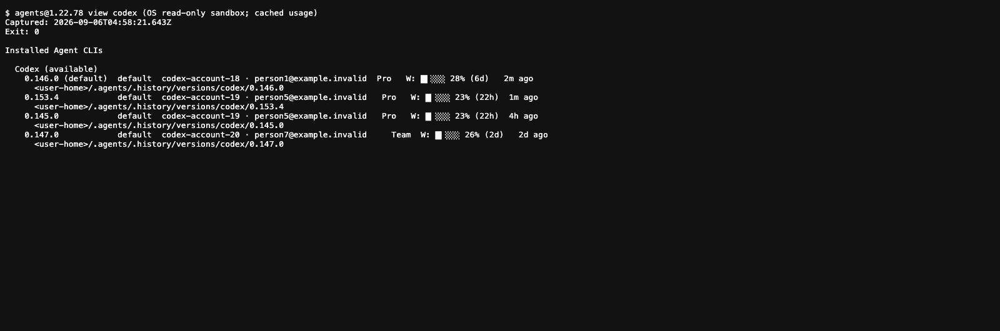
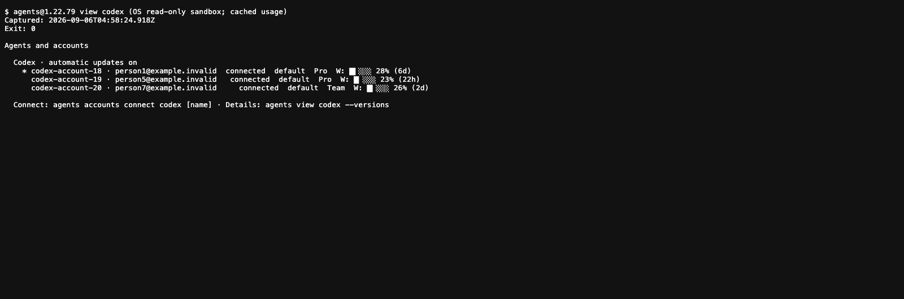
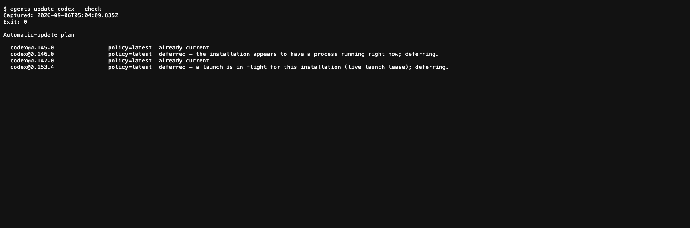
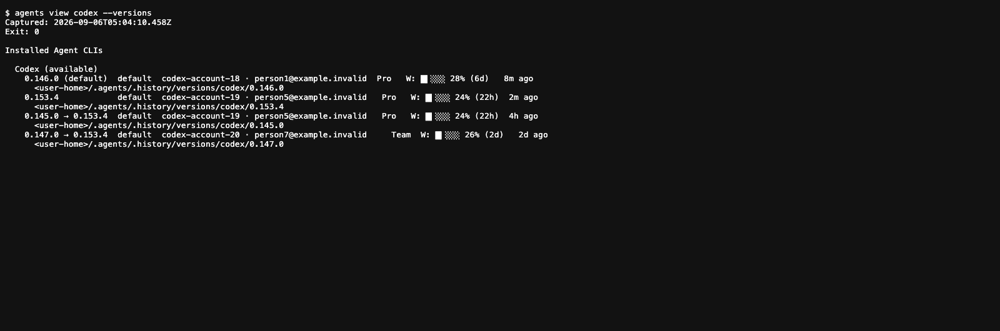
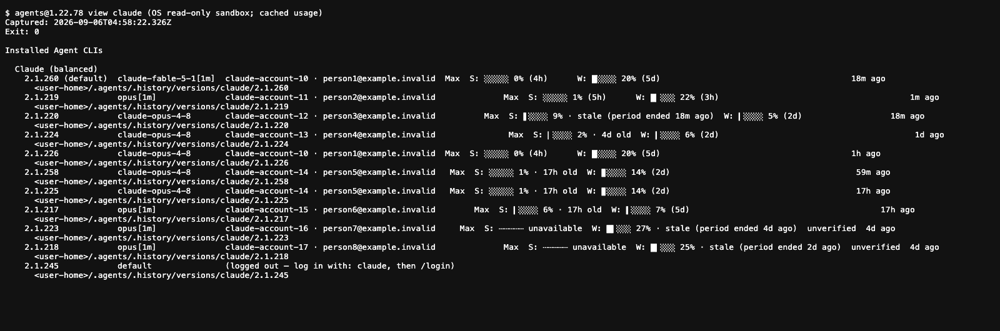
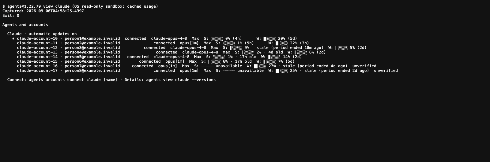

## Summary

Choose **Codex or Claude, then an account**. Each account keeps its own login and home while Agents manages the installed release. Existing connected accounts do not need to be connected again merely because the executable updates.

<figure class="artifact-figure">
<div class="artifact-grid artifact-grid-2">
<section class="artifact-panel">
<h3>Before · 4 installation rows</h3>
<p>Published 1.22.78. The same Codex identity appears under two release labels.</p>
<a href="before-codex.png"></a>
</section>
<section class="artifact-panel">
<h3>After · 3 account rows</h3>
<p>Installed 1.22.79. Accounts are the primary view; installation details are optional.</p>
<a href="after-codex.png"></a>
</section>
</div>
<figcaption>Same real account state, two published CLIs. Images are browser screenshots of captured CLI text, not native Terminal windows. Labels and emails were anonymized after execution. Click an image for full size in the downloaded bundle.</figcaption>
</figure>

The Codex main view has **25% fewer rows**, with no deletion of account credentials. This compares UI presentation today, not a reconstructed screenshot from before the upgrade. [Before log](logs/before-codex-readonly.txt) · [After log](logs/after-codex-readonly.txt).

<aside class="artifact-callout">
<strong>What you need day to day:</strong> <code>agents view codex</code>, <code>agents accounts</code>, and an account name. You do not need an installation version to choose an account.
</aside>

## How it works

<figure class="artifact-figure artifact-figure-diagram artifact-figure-wide">
<svg class="artifact-diagram" viewBox="0 0 940 350" role="img" aria-label="An account name resolves to a persistent device-bound home; the updater changes the executable while preserving credentials and defers busy installations">
<rect x="25" y="35" width="230" height="105" rx="8" fill="#16120a" stroke="#f59e0b" stroke-width="1.5"/>
<text x="45" y="63" fill="#f59e0b" font-family="JetBrains Mono, monospace" font-size="13">YOU CHOOSE</text>
<text x="45" y="93" fill="#c8c8c8" font-family="Inter, system-ui, sans-serif" font-size="18">Codex → work</text>
<text x="45" y="118" fill="#8a8a8a" font-family="Inter, system-ui, sans-serif" font-size="12">Harness + stable account name</text>
<path d="M255 88 H315 M307 82 L315 88 L307 94" fill="none" stroke="#38bdf8" stroke-width="2"/>
<rect x="320" y="35" width="285" height="105" rx="8" fill="#0e1418" stroke="#38bdf8" stroke-width="1.5"/>
<text x="340" y="63" fill="#38bdf8" font-family="JetBrains Mono, monospace" font-size="13">PERSISTENT ACCOUNT HOME</text>
<text x="340" y="93" fill="#c8c8c8" font-family="Inter, system-ui, sans-serif" font-size="17">Login · settings · history</text>
<text x="340" y="118" fill="#8a8a8a" font-family="Inter, system-ui, sans-serif" font-size="12">Device-bound; no OAuth copying</text>
<path d="M605 88 H665 M657 82 L665 88 L657 94" fill="none" stroke="#38bdf8" stroke-width="2"/>
<rect x="670" y="35" width="245" height="105" rx="8" fill="#0f160a" stroke="#a3e635" stroke-width="1.5"/>
<text x="690" y="63" fill="#a3e635" font-family="JetBrains Mono, monospace" font-size="13">REPLACEABLE EXECUTABLE</text>
<text x="690" y="93" fill="#c8c8c8" font-family="Inter, system-ui, sans-serif" font-size="17">Current managed release</text>
<text x="690" y="118" fill="#8a8a8a" font-family="Inter, system-ui, sans-serif" font-size="12">Same home; new binary</text>
<rect x="25" y="195" width="890" height="120" rx="8" fill="#0e1418" stroke="#38bdf8" stroke-width="1.5"/>
<text x="45" y="225" fill="#38bdf8" font-family="JetBrains Mono, monospace" font-size="13">DAEMON UPDATE PASS</text>
<text x="45" y="255" fill="#c8c8c8" font-family="Inter, system-ui, sans-serif" font-size="17">Policy enabled → not pinned → idle → stage + verify → replace executable</text>
<text x="45" y="285" fill="#8a8a8a" font-family="Inter, system-ui, sans-serif" font-size="14">Busy or launching? Defer. Failed candidate? Keep the working installation.</text>
<path d="M795 195 V147 M789 155 L795 147 L801 155" fill="none" stroke="#38bdf8" stroke-width="2" stroke-dasharray="3 3"/>
</svg>
<figcaption>Conceptual architecture, not a claim that credentials moved into a new directory. Existing installation labels and homes stay valid.</figcaption>
</figure>

The daemon schedules a pass roughly **every 15 minutes**, with its first pass about **60 seconds after startup**. This is periodic polling, not an immediate push notification from a vendor. Running agents and installations being launched are deferred. Global off overrides a harness-specific on. Pins and manual/vendor-managed installations are skipped by the automatic pass. [Cadence source](https://github.com/phnx-labs/agi-cli/blob/cab106f1cda5b1ab7a59248741e14553b2b8f92b/cli/src/lib/daemon/harness-update-service.ts#L42) · [Policy source](https://github.com/phnx-labs/agi-cli/blob/cab106f1cda5b1ab7a59248741e14553b2b8f92b/cli/src/lib/installations/update-policy.ts#L73).

## How to use it

### 1. See the accounts already connected

```bash
agents view codex
agents view claude
agents accounts
```

Use the account names printed on your machine. The screenshots use anonymized names; do not copy those identifiers. `agents accounts` also includes provider API-key/token profiles, which are separate from native Claude/Codex logins.

### 2. Add a genuinely new account, or reconnect an expired login

```bash
agents accounts connect codex work
agents accounts connect claude work
```

Here `work` is an example name you choose. For a **new** name, Agents creates an isolated home, installs the current harness release, and starts its native sign-in flow. Repeat with another name for another account. Ten accounts may use the same release while retaining separate homes and logins.

For an **existing** name, the command reuses that account's home and checks the identity; it refuses to overwrite a home already associated with a different identity. Reconnect only when needed. Native OAuth credentials are not copied to another machine: run the native connect flow there too. API-key/token profiles use `agents accounts add`, not this native login command. [Installed connect help](logs/connect-help.txt).

### 3. Pick an account for future launches

```bash
# Interactive account picker; changes the default after you choose.
agents accounts switch codex

# Or specify an existing account name directly.
agents accounts switch codex work

# Choose an account for one run without changing the default.
agents run codex --account work "Review the current changes"
```

Replace `codex` with `claude` for Claude. Switching affects future launches; it does not sign a running conversation into a different account. [Installed switch help](logs/switch-help.txt).

### 4. Leave updates automatic, or turn them off

```bash
agents config get updates.auto
agents daemon status

# Disable / enable automatic harness updates globally.
agents config set updates.auto off
agents config set updates.auto on

# Disable / enable automatic Codex updates only.
agents config set updates.codex.auto off
agents config set updates.codex.auto on
```

Choose the setting you want; the off/on pairs above demonstrate alternatives, not a script you need to run wholesale. **Unset means enabled.** A global `off` wins even if Codex is set to `on`. These switches control managed harness updates, not the separate Agents CLI self-updater. The daemon must be running for background passes. [Captured global setting](logs/global-setting.txt) · [Codex setting](logs/codex-setting.txt).

### 5. Preview an update without changing anything

```bash
agents update codex --check
agents update codex --check --json
```

<figure class="artifact-figure">

<figcaption>Actual installed CLI output. This capture did not apply an update. <a href="logs/update-preview-human.txt">Text log</a> · <a href="logs/update-preview.txt">JSON output</a>.</figcaption>
</figure>

For a policy-respecting update now, use `agents update --auto`; it runs the daemon's pass across all managed harnesses and respects pins and automatic-update switches.

`agents update codex` is an explicit manual action and ignores the automatic-update toggle. With multiple installations it skips pinned ones, but **a sole installation is treated as an explicit target and may update even when pinned**. This exception is present in the shipped code but omitted from its help's bulk-update wording. A `--check` preview describes automatic policy, not an unconditional promise that the manual command will do the same thing. [Manual target selection](https://github.com/phnx-labs/agi-cli/blob/cab106f1cda5b1ab7a59248741e14553b2b8f92b/cli/src/commands/update.ts#L265) · [Installed update help](logs/update-help.txt).

### Optional: inspect versions or keep a specific release

```bash
agents view codex --versions

# Expert override: substitute a real installation label and exact release.
agents update codex@<installation-label> --to <exact-version>

# Rejoin the latest-release policy for that installation.
agents update codex@<installation-label> --to latest
```

Angle-bracket values are placeholders, not commands to paste unchanged. An exact release pins that installation; `latest` unpins it. Old version-looking installation labels remain valid identifiers even after the executable has changed.

<figure class="artifact-figure">

<figcaption>The arrows show the retained installation label and the newer executable release. Versions remain available for troubleshooting, outside the main account view. <a href="logs/version-details.txt">Full log</a>.</figcaption>
</figure>

## Findings

### Real upgrades preserved the existing account state

Two existing Codex installations updated during the release verification. Their history records and their actual executables agree:

| Retained installation label | Previous release | Installed executable now | Recorded update, UTC |
|---|---|---|---|
| `0.145.0` | `0.145.0` | `codex-cli 0.153.4` | 2026-09-06 04:37:07.896 |
| `0.147.0` | `0.147.0` | `codex-cli 0.153.4` | 2026-09-06 04:37:12.549 |

These are read from the installed installation store and from each real executable's `--version`, not inferred from the account UI. Daemon completion records are separate evidence of update passes, not per-installation success messages. [Installation history and daemon excerpts](logs/installation-history.txt).

The preservation check compared the earlier release baseline with the current state: **27 account identities retained**, **7 baselined Codex home directories still at the same inodes**, and **4 baselined credential files with unchanged fingerprints**. No credential values or fingerprints are published. The seven-directory/four-file sample is not a claim that every native home was fingerprinted. [Aggregate preservation result](logs/preservation.json).

### Claude also becomes account-first

<figure class="artifact-figure">
<div class="artifact-grid artifact-grid-2">
<section class="artifact-panel">
<h3>Before · 11 installation rows</h3>
<a href="before-claude.png"></a>
</section>
<section class="artifact-panel">
<h3>After · 8 account rows</h3>
<a href="after-claude.png"></a>
</section>
</div>
<figcaption>Three fewer main-view rows: duplicate identities are grouped and an empty logged-out installation is not an account. Nothing was deleted. Cached stale/unverified usage remains visibly marked. <a href="logs/before-claude-readonly.txt">Before</a> · <a href="logs/after-claude-readonly.txt">After</a>.</figcaption>
</figure>

### Completeness against the request

Original intent: make version management transparent, let users choose a harness and account, preserve existing logins during upgrades, provide configurable automatic updates and a simpler connect/switch flow, retain diagnostics, then release and prove the installed result.

| Requested outcome | Delivery / demonstration status | Evidence |
|---|---|---|
| Account-first Codex and Claude views | Installed and exercised on real data | Four before/after captures above |
| Existing accounts survive migration and updates | Observed for all 27 account IDs; deeper home/credential check covers the stated sample | [Preservation](logs/preservation.json) |
| Automatic latest-release updates | Two real upgrades observed; active installations deferred | [History](logs/installation-history.txt), [preview](logs/update-preview.txt) |
| Automatic-update on/off controls | Shipped; current defaults read live; toggles not changed for this demo | [Settings](logs/global-setting.txt), linked policy source |
| Connect/reconnect without version selection | Shipped; installed command/help verified; fresh OAuth completion not performed in this demo | [Connect help](logs/connect-help.txt), [feature PR](https://github.com/phnx-labs/agi-cli/pull/3473) |
| Named account selection | Shipped; installed interface verified; live default not changed for a screenshot | [Switch help](logs/switch-help.txt) |
| Keep diagnostic versions and explicit pins | Diagnostic view exercised; pin mutation not performed on active homes | [Version details](logs/version-details.txt), [update help](logs/update-help.txt) |
| Publish, install, demonstrate | 1.22.79 released and installed; this report exercises that binary | [Version log](logs/installed-version.txt), [release PR](https://github.com/phnx-labs/agi-cli/pull/3477) |

### Limits you should know

- **Fresh login is not demonstrated here.** No OAuth sign-out/sign-in, live default switch, or policy/pin mutation was done merely to create screenshots. The guide documents the shipped interfaces; help text is not proof of a completed provider login.
- **Connected is local identity evidence, not provider health.** These captures use cached usage and do not prove that every account's current token can make an authenticated request. Stale and unverified Claude usage is still shown.
- **Not every account updates immediately.** A long-running session or live launch lease can defer an installation. Native/provider-managed installs outside the managed updater remain outside this guarantee.
- **No cross-machine native OAuth transfer.** A stable account name does not turn device-bound credentials into a fleet-wide login.
- **A remaining model-display ambiguity is visible.** Existing homes for the same Claude account can retain different model settings. The new account row currently shows its representative home's model, which can differ from the legacy default installation's model. In these captures, the starred account row shows Opus while the legacy default installation shows Fable. The screenshot does not prove the default launch model changed. Use `agents view claude --versions` to inspect individual homes; explicit account selection and pinned-default routing can choose different homes. [Catalog selection](https://github.com/phnx-labs/agi-cli/blob/cab106f1cda5b1ab7a59248741e14553b2b8f92b/cli/src/lib/account-catalog.ts#L219).
- **No latency improvement claimed.** This demonstration measures account-row simplification and state preservation, not faster launches or improved provider usage freshness.

## Evidence

### What was actually run

The after captures use the globally installed npm release **1.22.79**, not a development build. The before captures use published **1.22.78**, installed separately with `--ignore-scripts`; the global CLI was not downgraded. Both full CLI entrypoints read the same real home on the same machine, non-interactively, with OS-level writes, network access, and Mach lookup denied. Usage is cached. Identifier redaction happened after collection.

The following shows the capture method on macOS. `CAPTURE_ENTRY` means the actual path to the chosen published package's `dist/index.js`; set it separately for each version. The `agents@1.22.78` notation in log headers identifies the package, not a literal executable name.

```bash
env AGENTS_CLI_DISABLE_AUTO_UPDATE=1 AGENTS_NO_AUTOPULL=1 \
  AGENTS_SKIP_MIGRATION=1 AGENTS_DISABLE_EVENT_LOG=1 \
  AGENTS_DISABLE_PERF=1 NO_COLOR=1 FORCE_COLOR=0 COLUMNS=180 \
  sandbox-exec -p '(version 1) (allow default) (deny file-write*) (deny network*) (deny mach-lookup)' \
  node "$CAPTURE_ENTRY" view codex
```

The read-only sandbox is for the comparison, **not** for normal use or login. Other evidence commands are read-only previews, version/config reads, and help. Capture timestamps are UTC; the local capture date was September 5, 2026 Pacific time.

### Raw evidence index

- [Capture manifest, timestamps, command labels, SHA-256 hashes](logs/capture-manifest.json)
- [Report visual verification and accepted renderer warnings](logs/report-verification.json)
- [Codex before](logs/before-codex-readonly.txt) · [Codex after](logs/after-codex-readonly.txt)
- [Claude before](logs/before-claude-readonly.txt) · [Claude after](logs/after-claude-readonly.txt)
- [Update preview, readable](logs/update-preview-human.txt) · [Update preview, JSON output](logs/update-preview.txt)
- [Actual installation history and daemon completion excerpts](logs/installation-history.txt)
- [Aggregate preservation check](logs/preservation.json)
- [Installed release](logs/installed-version.txt) · [Version diagnostics](logs/version-details.txt)
- [Native connect help](logs/connect-help.txt) · [Account switch help](logs/switch-help.txt) · [Update help](logs/update-help.txt)
- [Global update setting](logs/global-setting.txt) · [Codex update setting](logs/codex-setting.txt)

The HTML embeds its screenshot images for offline reading. Use the ZIP bundle to retain the full-size PNG links and original text/JSON files alongside it. Published evidence excludes the full account catalog, raw private captures, credentials, account handles, device names, and user home paths.

## Tracking

- [PHNX-3940: existing account-management ticket](https://linear.app/getrush/issue/PHNX-3940)
- [Feature PR #3473, merged](https://github.com/phnx-labs/agi-cli/pull/3473)
- [Release PR #3477, merged](https://github.com/phnx-labs/agi-cli/pull/3477)
- [Walkthrough PR #3479: evidence, visual verification, and independent review](https://github.com/phnx-labs/agi-cli/pull/3479)

Demo checklist: real input comparison captured; installed update/state evidence collected; guide and limitations authored; desktop/mobile light/dark rendering inspected. Non-author review and merge checks are recorded with the walkthrough PR.
