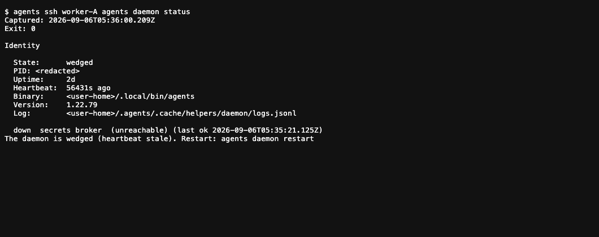

## Story

**Updated repair proposal:** [Accounts stay. Executables update.](../phnx-3940-repair-plan/plan.html) now specifies shared releases, preserved native homes, truthful update health, credential delivery, migration and release gates. PHNX-3940 has been moved back to Plan. The evidence below remains the original dated snapshot.

**Yes, there is still a real fleet problem.** Retaining an old installation label is intentional; leaving eligible releases outdated while displaying only “automatic updates on” is not a complete user experience. The daemon also reports a stale heartbeat. That is a recovery lead, not proof that its update service caused the pending releases.

The read-only checks below exercised the installed **1.22.79** CLI on the affected worker at **2026-09-06 05:36 UTC**. The device and account identifiers are anonymized for this committed document. No updates, restarts, removals, token minting, or account changes were performed.

## Figure

<figure class="artifact-figure artifact-figure-diagram artifact-figure-wide">
<svg class="artifact-diagram" viewBox="0 0 940 315" role="img" aria-label="Automatic-update policy is enabled, but the daemon heartbeat is stale; three older installations are ready to update and two older installations are deferred as busy">
<rect x="25" y="28" width="245" height="112" rx="8" fill="#0f160a" stroke="#a3e635" stroke-width="1.5"/>
<text x="45" y="56" font-family="JetBrains Mono, monospace" font-size="13" fill="#a3e635">POLICY</text>
<text x="45" y="90" font-family="Inter, system-ui, sans-serif" font-size="22" fill="#c8c8c8">Updates enabled</text>
<text x="45" y="118" font-family="Inter, system-ui, sans-serif" font-size="13" fill="#8a8a8a">Permission to update; not progress</text>
<path d="M270 84 H338 M330 78 L338 84 L330 90" fill="none" stroke="#38bdf8" stroke-width="2"/>
<rect x="345" y="28" width="250" height="112" rx="8" fill="#16120a" stroke="#f59e0b" stroke-width="1.5"/>
<text x="365" y="56" font-family="JetBrains Mono, monospace" font-size="13" fill="#f59e0b">REPORTED DAEMON STATE</text>
<text x="365" y="90" font-family="Inter, system-ui, sans-serif" font-size="22" fill="#c8c8c8">Daemon wedged</text>
<text x="365" y="118" font-family="Inter, system-ui, sans-serif" font-size="13" fill="#8a8a8a">Heartbeat 56,431 seconds old</text>
<path d="M595 84 H663" fill="none" stroke="#f59e0b" stroke-width="2" stroke-dasharray="4 4"/>
<path d="M624 74 L644 94 M644 74 L624 94" fill="none" stroke="#f59e0b" stroke-width="2"/>
<rect x="670" y="28" width="245" height="112" rx="8" fill="#0e1418" stroke="#38bdf8" stroke-width="1.5"/>
<text x="690" y="56" font-family="JetBrains Mono, monospace" font-size="13" fill="#38bdf8">RELEASE STATE</text>
<text x="690" y="90" font-family="Inter, system-ui, sans-serif" font-size="22" fill="#c8c8c8">1 current · 5 behind</text>
<text x="690" y="118" font-family="Inter, system-ui, sans-serif" font-size="13" fill="#8a8a8a">Six retained installations</text>
<rect x="25" y="178" width="890" height="103" rx="8" fill="#0e1418" stroke="#38bdf8" stroke-width="1.5"/>
<text x="45" y="208" font-family="JetBrains Mono, monospace" font-size="13" fill="#38bdf8">READ-ONLY PREVIEW: agents update codex --check</text>
<text x="45" y="241" font-family="Inter, system-ui, sans-serif" font-size="18" fill="#c8c8c8">3 older installs ready to update · 2 older installs busy · 1 current install busy</text>
<text x="45" y="264" font-family="Inter, system-ui, sans-serif" font-size="12" fill="#8a8a8a">The busy statuses are the updater's process-detection result; individual process attribution was not audited.</text>
</svg>
<figcaption>Measured snapshot, not a future-state mockup. <a href="logs/daemon-status.txt">Daemon evidence</a> · <a href="logs/update-plan.txt">Update-plan evidence</a>. A stale daemon heartbeat and pending releases are observed together. The dashed link is suspected, not proven: the update service's last successful pass and the heartbeat failure's cause have not been established.</figcaption>
</figure>

<aside class="artifact-callout artifact-callout-warn">
<strong>The ticket's Done state is too broad for fleet completion.</strong> The earlier release demonstrated local updates and preserved accounts. It did not establish a healthy updater and usable credentials on every worker. The existing PHNX-3940 remains the appropriate scope for this follow-through; this diagnostic does not close or reopen tracker items.
</aside>

<figure class="artifact-figure">

<figcaption>Browser screenshot of the redacted real CLI log, not a native Terminal capture. The underlying command and capture time are preserved; identifiers and unrelated status sections are omitted. <a href="logs/daemon-status.txt">Download the text evidence</a>.</figcaption>
</figure>

## Data

### Three different things currently look like “a version”

| What it is | Example | What the value means |
|---|---|---|
| Agents CLI package | `1.22.79` | The manager implementing accounts, update policy, and fleet commands |
| Permanent installation label | `0.145.0` | A historical identifier retained so references and homes survive upgrades |
| Executable release inside that installation | `0.146.0` | The Codex release actually recorded for that label today |

`0.145.0 → 0.146.0` means **label 0.145.0 currently carries release 0.146.0**. It does not mean “up to date.” The target discovered by this preview is `0.153.4`. Rows without an arrow have matching label and release. These values come from installation metadata; this diagnostic did not execute all six Codex binaries. [Recorded versions](logs/versions.txt) · [Current/target/policy fields](logs/update-plan.txt).

### Exact worker state

| Permanent label | Recorded release | Target | Account presence | Update decision |
|---|---|---|---|---|
| `0.145.0` | `0.146.0` | `0.153.4` | Logged out | Deferred: process detected |
| `0.146.0` | `0.146.0` | `0.153.4` | Logged out; legacy installation default | Deferred: process detected |
| `0.147.0` | `0.147.0` | `0.153.4` | Team account | Would update |
| `0.153.2` | `0.153.2` | `0.153.4` | Logged out | Would update |
| `0.153.3` | `0.153.3` | `0.153.4` | Secondary account | Would update |
| `0.153.4` | `0.153.4` | `0.153.4` | Personal account | Already current; process detected |

All six report `policy: latest`; none is held by an exact-release pin. Three account rows coexist with six installation rows. “Connected” here is local credential/identity presence, not a fresh authenticated provider request. A legacy installation default and a named account default also have different meanings; the UI should label their scope. [Account view](logs/accounts.txt) · [Version view](logs/versions.txt).

### The duplicate Agents CLI warning is separate

The supplied terminal output reports a running user-local **1.22.79** and a discovered legacy **1.20.42**. It warns that upgrades affect the running copy, not every discovered copy. Our current SSH and login-shell checks resolved the user-local CLI, and the remote account view now renders the new layout. We cannot prove which executable produced the earlier old-layout capture after the fact. Keeping multiple copies is nevertheless a real drift risk, not a Codex account issue. No legacy copy was removed. [Current remote CLI version](logs/cli-version.txt).

## Proposed user-facing behavior

These are **mockups**, not screenshots of shipped behavior. They show what the follow-through should deliver.

<section class="artifact-panel">
<h3>Today: policy only</h3>
<pre><code>Codex · automatic updates on
  personal   connected
  secondary  connected
  team       connected</code></pre>

This abbreviated transcription is grounded in the account-view log, but hides updater health and pending releases.

</section>
<section class="artifact-panel">
<h3>Proposed: policy + health + action</h3>
<pre><code>Codex · updates enabled
Daemon unhealthy · heartbeat 15.7h old

  personal   credential present · current
  secondary  credential present · update pending
  team       credential present · update pending

Details: agents view codex --versions
Health:  agents daemon status</code></pre>

Account names remain primary. Versions stay optional; unhealthy supervision is visible without claiming an unmeasured updater failure.

</section>

The diagnostic view should have explicit **Home label / Installed release / Target / Policy / Reason** columns, using the same planner data as `--check`. It should distinguish named-account default from legacy installation default. A present credential should never be relabeled “verified” without a dated live request.

### Operational follow-through

<figure class="artifact-figure artifact-figure-diagram artifact-figure-wide">
<svg class="artifact-diagram" viewBox="0 0 940 160" role="img" aria-label="Proposed repair sequence: reconcile the selected CLI path, recover the daemon, let idle installations update, then verify remote launch and account preservation">
<rect x="20" y="30" width="200" height="92" rx="8" fill="#0e1418" stroke="#38bdf8" stroke-width="1.5"/>
<text x="38" y="59" font-family="JetBrains Mono, monospace" font-size="12" fill="#38bdf8">1 · CLI RESOLUTION</text>
<text x="38" y="85" font-family="Inter, system-ui, sans-serif" font-size="14" fill="#c8c8c8">One intended entrypoint</text>
<text x="38" y="107" font-family="Inter, system-ui, sans-serif" font-size="11" fill="#8a8a8a">Local · SSH · supervisor</text>
<path d="M220 76 H252 M246 70 L252 76 L246 82" fill="none" stroke="#38bdf8" stroke-width="2"/>
<rect x="260" y="30" width="200" height="92" rx="8" fill="#16120a" stroke="#f59e0b" stroke-width="1.5"/>
<text x="278" y="59" font-family="JetBrains Mono, monospace" font-size="12" fill="#f59e0b">2 · DAEMON RECOVERY</text>
<text x="278" y="85" font-family="Inter, system-ui, sans-serif" font-size="14" fill="#c8c8c8">Fresh heartbeat + broker</text>
<text x="278" y="107" font-family="Inter, system-ui, sans-serif" font-size="11" fill="#8a8a8a">Preserve running harnesses</text>
<path d="M460 76 H492 M486 70 L492 76 L486 82" fill="none" stroke="#38bdf8" stroke-width="2"/>
<rect x="500" y="30" width="200" height="92" rx="8" fill="#0e1418" stroke="#38bdf8" stroke-width="1.5"/>
<text x="518" y="59" font-family="JetBrains Mono, monospace" font-size="12" fill="#38bdf8">3 · GUARDED UPDATES</text>
<text x="518" y="85" font-family="Inter, system-ui, sans-serif" font-size="14" fill="#c8c8c8">Idle installs converge</text>
<text x="518" y="107" font-family="Inter, system-ui, sans-serif" font-size="11" fill="#8a8a8a">Pins and busy processes wait</text>
<path d="M700 76 H732 M726 70 L732 76 L726 82" fill="none" stroke="#38bdf8" stroke-width="2"/>
<rect x="740" y="30" width="180" height="92" rx="8" fill="#0f160a" stroke="#a3e635" stroke-width="1.5"/>
<text x="758" y="59" font-family="JetBrains Mono, monospace" font-size="12" fill="#a3e635">4 · REAL PROOF</text>
<text x="758" y="85" font-family="Inter, system-ui, sans-serif" font-size="14" fill="#c8c8c8">Remote account run</text>
<text x="758" y="107" font-family="Inter, system-ui, sans-serif" font-size="11" fill="#8a8a8a">Same home and identity</text>
</svg>
<figcaption>Proposed work, not actions performed in this diagnosis. The daemon normally schedules harness checks about every 15 minutes, but an enabled timer does not prove it is executing.</figcaption>
</figure>

First inspect the update service's registration, health, and last-pass evidence separately from the daemon heartbeat. Recovery should then use the canonical daemon lifecycle where needed, followed by a successful automatic pass. Any removal of the legacy CLI requires explicit approval and exact target confirmation. Neither `sync --prune-clis` nor an unsolicited process kill is part of this read-only investigation. [Daemon update scheduler](https://github.com/phnx-labs/agi-cli/blob/e7ba4540778ff4f87d1500a6e04c7b6fbdb1bfcc/cli/src/lib/daemon/harness-update-service.ts#L42) · [Separate update and heartbeat service registration](https://github.com/phnx-labs/agi-cli/blob/e7ba4540778ff4f87d1500a6e04c7b6fbdb1bfcc/cli/src/lib/daemon/daemon.ts#L1105).

## Account synchronization and long-lived tokens

The desired default is **device-role based**: the personal/interactive machine keeps its native OAuth login, while a worker uses its account's supported automation credential. Provider restrictions still apply: Codex documents workspace access tokens for trusted **non-interactive** CLI/app-server automation, not as an established interactive-TUI login path. Retain independent native login for worker Codex TUIs unless that surface is separately supported and verified.

| Account type | Interactive machine | Worker credential | What the provider supports |
|---|---|---|---|
| Claude subscription | Native browser OAuth | `CLAUDE_CODE_OAUTH_TOKEN` | `claude setup-token` creates a one-year, inference-only token |
| Codex Business / Enterprise workspace | Native browser OAuth | `CODEX_ACCESS_TOKEN` for permitted non-interactive automation; independent native login for TUI | Workspace access token with configurable validity, subject to workspace policy; not a universal one-year promise |
| Codex personal Pro | Native browser OAuth | Independent per-worker Codex login; API key only if deliberately chosen | No personal-Pro equivalent to Claude's one-year setup-token is established by current official docs |

Claude's token cannot establish Remote Control sessions or fetch claude.ai connectors. Codex access-token eligibility requires workspace permission; the screenshot's “Team” label alone does not establish access. API keys are a separate authentication/billing choice, not a transparent substitute for subscription use. [Claude authentication](https://code.claude.com/docs/en/authentication#generate-a-long-lived-token) · [Codex access tokens](https://learn.chatgpt.com/docs/enterprise/access-tokens) · [Codex authentication](https://learn.chatgpt.com/docs/auth).

For ordinary Codex OAuth, let each worker own and retain its own refreshable credential state, authorized through device-code login where available. Do **not** distribute the laptop's same rotating `auth.json` to concurrently running machines. OpenAI's advanced runner guidance explicitly warns against that sharing pattern and against overwriting refreshed credentials with an old seed. It documents auth-cache copying only as a controlled fallback, not a fleet-wide live-sync design. [Official runner guidance](https://learn.chatgpt.com/docs/auth/ci-cd-auth).

### Existing Agents pieces versus the missing connection

| Existing mechanism, code-verified | Missing behavior for the requested invariant |
|---|---|
| Native identity/name metadata syncs; account-to-home mapping is device-local | A name appearing on a worker does not prove local usable authentication |
| `agents accounts mint claude --fleet` captures and pushes both the named provider bundle and reserved per-email `auth` bundle | `accounts connect` does not invoke mint, and mint creates a separate provider account rather than adding an automation credential to the same native identity |
| Reserved bundle sync fills peers with a missing bundle | Peers reporting “ready” are skipped; new or rotated tokens do not automatically converge to them |
| Worker Claude adapter resolves the selected home's email to a setup-token | Shipping a bundle does not establish that home's identity/binding |
| Claude adapter tries to keep native login on personal/desktop roles | Provider-account selection can inject a setup-token after that adapter, bypassing the invariant |
| Installed Codex supports `login --with-access-token` | Agents does not yet have a first-class Codex access-token account path; its existing OpenAI provider path maps credentials to `OPENAI_API_KEY` |

Evidence: [connect](https://github.com/phnx-labs/agi-cli/blob/e7ba4540778ff4f87d1500a6e04c7b6fbdb1bfcc/cli/src/lib/accounts/connect.ts#L402), [mint and both stores](https://github.com/phnx-labs/agi-cli/blob/e7ba4540778ff4f87d1500a6e04c7b6fbdb1bfcc/cli/src/lib/auth-mint.ts#L474), [sync skips ready](https://github.com/phnx-labs/agi-cli/blob/e7ba4540778ff4f87d1500a6e04c7b6fbdb1bfcc/cli/src/lib/secrets/reserved-sync.ts#L53), [role decision](https://github.com/phnx-labs/agi-cli/blob/e7ba4540778ff4f87d1500a6e04c7b6fbdb1bfcc/cli/src/lib/harness/adapters/claude.ts#L59), [later environment overlay](https://github.com/phnx-labs/agi-cli/blob/e7ba4540778ff4f87d1500a6e04c7b6fbdb1bfcc/cli/src/lib/exec.ts#L633), [OpenAI mapping](https://github.com/phnx-labs/agi-cli/blob/e7ba4540778ff4f87d1500a6e04c7b6fbdb1bfcc/cli/src/lib/account-provider-registry.ts#L74).

### Proposed account model: one identity, role-specific credentials

<figure class="artifact-figure artifact-figure-diagram artifact-figure-wide">
<svg class="artifact-diagram" viewBox="0 0 940 360" role="img" aria-label="Proposed canonical account connects to native OAuth on the interactive machine and role-appropriate automation credentials on workers; credential revisions are acknowledged per worker and rotating OAuth is not fleet-shared">
<rect x="25" y="122" width="235" height="100" rx="8" fill="#0e1418" stroke="#38bdf8" stroke-width="1.5"/>
<text x="45" y="154" font-family="JetBrains Mono, monospace" font-size="13" fill="#38bdf8">ONE ACCOUNT IDENTITY</text>
<text x="45" y="184" font-family="Inter, system-ui, sans-serif" font-size="18" fill="#c8c8c8">Name + provider identity</text>
<text x="45" y="207" font-family="Inter, system-ui, sans-serif" font-size="12" fill="#8a8a8a">Independent of releases</text>
<path d="M260 171 H304 V74 H342 M334 68 L342 74 L334 80 M304 171 V249 H342 M334 243 L342 249 L334 255" fill="none" stroke="#38bdf8" stroke-width="2"/>
<rect x="350" y="25" width="565" height="100" rx="8" fill="#0f160a" stroke="#a3e635" stroke-width="1.5"/>
<text x="370" y="55" font-family="JetBrains Mono, monospace" font-size="13" fill="#a3e635">INTERACTIVE DEVICE</text>
<text x="370" y="84" font-family="Inter, system-ui, sans-serif" font-size="18" fill="#c8c8c8">Native OAuth in that account's local home</text>
<text x="370" y="108" font-family="Inter, system-ui, sans-serif" font-size="12" fill="#8a8a8a">Final launch guard prevents token fallback after environment merging</text>
<rect x="350" y="166" width="565" height="163" rx="8" fill="#16120a" stroke="#f59e0b" stroke-width="1.5"/>
<text x="370" y="196" font-family="JetBrains Mono, monospace" font-size="13" fill="#f59e0b">TRUSTED WORKER</text>
<text x="370" y="226" font-family="Inter, system-ui, sans-serif" font-size="17" fill="#c8c8c8">Claude setup-token / eligible Codex access token</text>
<text x="370" y="253" font-family="Inter, system-ui, sans-serif" font-size="14" fill="#c8c8c8">Encrypted bundle revision → device acknowledgment → local binding</text>
<text x="370" y="282" font-family="Inter, system-ui, sans-serif" font-size="14" fill="#c8c8c8">No supported automation token? Independent device login.</text>
<text x="370" y="309" font-family="Inter, system-ui, sans-serif" font-size="12" fill="#8a8a8a">Never fleet-sync one rotating OAuth cache; missing auth stays needs-login</text>
</svg>
<figcaption>Proposed design, not shipped parity. Reuse the existing secret transport and account catalog; connect them through one credential-selection decision at final launch. Codex access tokens are documented for non-interactive automation; worker TUIs retain independent login until supported and verified.</figcaption>
</figure>

The payoff is that users choose one account, while Agents reports each device as **ready / credential missing / update pending / daemon unhealthy**, with updater-specific failure states only when supported by service evidence. Portable automation tokens should have per-account revisions and per-device acknowledgments, so an existing bundle is not mistaken for the latest bundle. Native OAuth remains per-device. No silent API-key billing fallback or token substitution on the personal device.

## What would justify closing the work

1. The account view exposes updater health and pending/deferred reasons; the version view clearly separates label from installed release.
2. Interactive shell, SSH passthrough, and daemon supervisor resolve the intended current CLI. Approved legacy cleanup leaves no competing executable in those launch paths.
3. The affected worker has a fresh daemon heartbeat, a successful automatic update pass, and correct handling of busy installations without interrupting their sessions.
4. The same named account launches successfully on the interactive device with native OAuth and on a worker with its supported worker credential; identity is checked from a real authenticated operation.
5. Rotating an automation token converges to a worker whose bundle already existed; adding an account also establishes its device-local home binding.
6. Personal-device launches cannot select or inherit a worker setup-token through a later provider/environment override. For Codex Pro, independent worker logins are shown honestly instead of a fabricated one-year-token capability.

This is a diagnosis and visual proposal, not an implementation or fleet repair. The earlier local release remains delivered; the broader fleet invariant is not yet proven. Closing PHNX-3940 as fully complete was premature relative to that broader claim.

## Evidence and tracking

- [PHNX-3940, now in Plan](https://linear.app/getrush/issue/PHNX-3940)
- [Released account/update implementation, PR #3473](https://github.com/phnx-labs/agi-cli/pull/3473)
- [Earlier installed local demo, PR #3479](https://github.com/phnx-labs/agi-cli/pull/3479)
- [This diagnostic artifact, PR #3480](https://github.com/phnx-labs/agi-cli/pull/3480)
- [Remote CLI version](logs/cli-version.txt), [account view](logs/accounts.txt), [version view](logs/versions.txt), [update preview](logs/update-plan.txt), [daemon status](logs/daemon-status.txt)
- [Capture manifest and SHA-256 hashes](logs/manifest.json)

The static captures are dated snapshots. Authentication gaps are source-verified, not newly exploited or exercised with real credentials. The diagnosis does not establish why the daemon heartbeat is stale or whether the updater independently ran, does not confirm individual busy-process ownership, and does not establish this user's Codex access-token entitlement.
