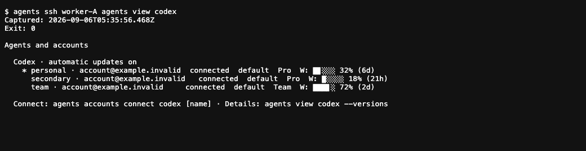

## Focus for review

**Yes: three accounts should normally use one shared Codex release on a device.** Extra releases are justified only by a pin, a running session, a bounded rollback window, or unresolved legacy ownership. Even zero accounts may keep one installed executable ready for first login.

<figure class="artifact-figure artifact-behavior">
<section class="artifact-behavior-panel" data-state="current" data-evidence="capture">
<h3>Today · real, dated output</h3>

Three accounts; “automatic updates on.” A separate check found six installations, five behind. Nothing here explains that gap.

</section>
<section class="artifact-behavior-panel" data-state="proposed" data-evidence="mockup">
<h3>Proposed · the normal account view</h3>
<pre><code>$ agents view codex
Agents and accounts

  Codex · up to date
    Automatic updates on
    Last successful check: 2m ago

    * personal    native login · checked 2m ago
      secondary   native login · checked 4m ago
      team        native login · checked 5m ago

    Default account: personal
    3 accounts · 1 shared executable

  Connect: agents accounts connect codex [name]
  Details: agents view codex --versions</code></pre>

No version number is needed in the everyday view. Plan/usage can remain secondary, with their own timestamps.

</section>
</figure>

Left: browser capture of the existing redacted CLI log from 2026-09-06 05:35:56 UTC, not a fresh probe or native Terminal screenshot. Right: proposed terminal output, not implemented behavior. Account names are anonymized. “Checked” requires an actual successful identity request; a stored credential alone cannot earn it.

<aside class="artifact-callout">
<strong>The fix is not “update six copies” or “delete three logged-out homes.”</strong> Separate the executable from the account home. Then one update benefits every unpinned account without moving its login, settings, or sessions.
</aside>

This revision builds on the account-first view and updater shipped in 1.22.79. It does not claim they were never implemented. It closes the remaining storage, health, migration and authentication seams. This is a plan-only deliverable: no daemon restart, native login change, token copying or package removal was performed.

## Purpose

Users choose **Claude or Codex + an account**. Agents owns executable download, release selection, update policy and safe retention. On an interactive device, that account uses its native OAuth login. On a trusted worker, it uses a supported automation credential or an independent device login—not a cloned rotating OAuth cache.

Scope: the user's trusted device fleet and the CLI's managed-harness paths. Start with Claude and Codex; other npm harnesses enter only when their adapters prove isolated account-home support. Global/vendor-managed binaries retain explicitly different capabilities. This is not customer-cloud credential redistribution, API billing fallback, or removal of every historical item folded into PHNX-3940.

## Current architecture

<figure class="artifact-figure artifact-figure-diagram artifact-figure-wide">
<svg class="artifact-diagram" viewBox="0 0 960 345" role="img" aria-label="Current design: launcher and updater both select an installation label containing one binary and one native home; account view groups homes only after enumerating installations">
<rect x="20" y="28" width="265" height="82" rx="8" fill="#0e1418" stroke="#38bdf8" stroke-width="1.5"/>
<text x="38" y="56" fill="#38bdf8" font-family="JetBrains Mono, monospace" font-size="13">COMMAND / SHIM / REMOTE</text>
<text x="38" y="86" fill="#c8c8c8" font-family="Inter, system-ui, sans-serif" font-size="15">Account → installation label</text>
<rect x="20" y="151" width="265" height="82" rx="8" fill="#16120a" stroke="#f59e0b" stroke-width="1.5"/>
<text x="38" y="180" fill="#f59e0b" font-family="JetBrains Mono, monospace" font-size="13">EXISTING DAEMON UPDATER</text>
<text x="38" y="210" fill="#c8c8c8" font-family="Inter, system-ui, sans-serif" font-size="15">Checks each installation</text>
<path d="M285 70 H345 M285 193 H315 V100 H345 M336 64 L345 70 L336 76" fill="none" stroke="#38bdf8" stroke-width="2"/>
<rect x="345" y="28" width="292" height="205" rx="8" fill="#16120a" stroke="#f59e0b" stroke-width="1.5"/>
<text x="365" y="57" fill="#f59e0b" font-family="JetBrains Mono, monospace" font-size="13">PER INSTALLATION DIRECTORY</text>
<text x="365" y="88" fill="#c8c8c8" font-family="Inter, system-ui, sans-serif" font-size="16">Permanent label: 0.147.0</text>
<text x="365" y="119" fill="#c8c8c8" font-family="Inter, system-ui, sans-serif" font-size="15">installation.json → release</text>
<text x="365" y="151" fill="#c8c8c8" font-family="Inter, system-ui, sans-serif" font-size="15">node_modules → executable</text>
<text x="365" y="183" fill="#c8c8c8" font-family="Inter, system-ui, sans-serif" font-size="15">home → credentials + sessions</text>
<text x="365" y="213" fill="#8a8a8a" font-family="Inter, system-ui, sans-serif" font-size="12">Repeated for each legacy / account slot</text>
<path d="M637 132 H683 M674 126 L683 132 L674 138" fill="none" stroke="#38bdf8" stroke-width="2"/>
<rect x="683" y="72" width="257" height="130" rx="8" fill="#0f160a" stroke="#a3e635" stroke-width="1.5"/>
<text x="700" y="101" fill="#a3e635" font-family="JetBrains Mono, monospace" font-size="13">ACCOUNT CATALOG → VIEW</text>
<text x="700" y="132" fill="#c8c8c8" font-family="Inter, system-ui, sans-serif" font-size="15">Groups identities for display</text>
<text x="700" y="163" fill="#8a8a8a" font-family="Inter, system-ui, sans-serif" font-size="13">Storage remains installation-led</text>
<rect x="20" y="269" width="920" height="52" rx="8" fill="#0e1418" stroke="#38bdf8" stroke-width="1.5"/>
<text x="38" y="302" fill="#c8c8c8" font-family="Inter, system-ui, sans-serif" font-size="15">Already shipped: stable installation ID + mutable releaseVersion. Still missing: independent home / executable storage.</text>
</svg>
<figcaption>Source: <a href="https://github.com/phnx-labs/agi-cli/blob/83dc2a8133e41241938a81155bb368a8dcd04f5a/cli/src/lib/installations/store.ts#L306">binary resolution</a>, <a href="https://github.com/phnx-labs/agi-cli/blob/83dc2a8133e41241938a81155bb368a8dcd04f5a/cli/src/lib/installations/store.ts#L439">home resolution</a>, <a href="https://github.com/phnx-labs/agi-cli/blob/83dc2a8133e41241938a81155bb368a8dcd04f5a/cli/src/lib/account-catalog.ts#L145">catalog enumeration</a>. Arrows show selection and data flow, not token transport.</figcaption>
</figure>

### What the existing evidence proves—and does not

| Evidence at the dated worker snapshot | What it means | What it does not prove |
|---|---|---|
| 6 labels, 3 identified accounts; target 0.153.4 | More installation slots than accounts | That any home is disposable |
| 1 current; 3 older idle candidates; 2 older process-deferred | The updater's preview sees work and deferral | That each detected process actually belongs to that installation |
| Daemon reports wedged; heartbeat 56,431 seconds old | Supervisor/liveness needs investigation | That the updater caused the stale heartbeat, or never ran |
| “Automatic updates on” | Update policy permits a pass | A recent successful pass |
| Multiple Agents CLI installs | More than one possible manager entrypoint exists | Which binary produced every earlier screenshot |

Read the [redacted update plan](https://github.com/phnx-labs/agi-cli/blob/83dc2a8133e41241938a81155bb368a8dcd04f5a/.agents/artifacts/2026-09-05/phnx-3940-fleet-explainer/logs/update-plan.txt), [versions](https://github.com/phnx-labs/agi-cli/blob/83dc2a8133e41241938a81155bb368a8dcd04f5a/.agents/artifacts/2026-09-05/phnx-3940-fleet-explainer/logs/versions.txt) and [daemon evidence](https://github.com/phnx-labs/agi-cli/blob/83dc2a8133e41241938a81155bb368a8dcd04f5a/.agents/artifacts/2026-09-05/phnx-3940-fleet-explainer/logs/daemon-status.txt). These are dated snapshots, not current fleet certification.

## Proposed architecture

<figure class="artifact-figure artifact-figure-diagram artifact-figure-wide">
<svg class="artifact-diagram" viewBox="0 0 960 445" role="img" aria-label="Proposed launch selection joins device-local account homes, shared immutable releases and role-aware credentials once, then all entrypoints use the existing executor">
<rect x="20" y="25" width="284" height="150" rx="8" fill="#0f160a" stroke="#a3e635" stroke-width="1.5"/>
<text x="38" y="54" fill="#a3e635" font-family="JetBrains Mono, monospace" font-size="13">ACCOUNT REGISTRY → HOMES</text>
<text x="38" y="88" fill="#c8c8c8" font-family="Inter, system-ui, sans-serif" font-size="16">personal → exact native path A</text>
<text x="38" y="118" fill="#c8c8c8" font-family="Inter, system-ui, sans-serif" font-size="16">secondary → native path B</text>
<text x="38" y="148" fill="#c8c8c8" font-family="Inter, system-ui, sans-serif" font-size="16">team → native path C</text>
<rect x="20" y="210" width="284" height="123" rx="8" fill="#16120a" stroke="#f59e0b" stroke-width="1.5"/>
<text x="38" y="239" fill="#f59e0b" font-family="JetBrains Mono, monospace" font-size="13">SHARED RELEASE STORE</text>
<text x="38" y="271" fill="#c8c8c8" font-family="Inter, system-ui, sans-serif" font-size="16">current → verified executable</text>
<text x="38" y="300" fill="#8a8a8a" font-family="Inter, system-ui, sans-serif" font-size="13">One copy / release / OS / architecture</text>
<path d="M304 100 H345 V171 H387 M304 271 H345 V201 H387" fill="none" stroke="#38bdf8" stroke-width="2"/>
<rect x="387" y="93" width="244" height="202" rx="8" fill="#0e1418" stroke="#38bdf8" stroke-width="1.5"/>
<text x="405" y="124" fill="#38bdf8" font-family="JetBrains Mono, monospace" font-size="13">ONE LAUNCH SELECTION</text>
<text x="405" y="157" fill="#c8c8c8" font-family="Inter, system-ui, sans-serif" font-size="15">Account + local home</text>
<text x="405" y="188" fill="#c8c8c8" font-family="Inter, system-ui, sans-serif" font-size="15">Release + executable lease</text>
<text x="405" y="219" fill="#c8c8c8" font-family="Inter, system-ui, sans-serif" font-size="15">Role + credential variant</text>
<text x="405" y="264" fill="#8a8a8a" font-family="Inter, system-ui, sans-serif" font-size="12">Existing exec.ts remains the owner</text>
<path d="M631 192 H694 M684 186 L694 192 L684 198" fill="none" stroke="#38bdf8" stroke-width="2"/>
<rect x="694" y="93" width="246" height="202" rx="8" fill="#0f160a" stroke="#a3e635" stroke-width="1.5"/>
<text x="712" y="124" fill="#a3e635" font-family="JetBrains Mono, monospace" font-size="13">EXISTING EXECUTOR</text>
<text x="712" y="157" fill="#c8c8c8" font-family="Inter, system-ui, sans-serif" font-size="15">Merge all environment layers</text>
<text x="712" y="188" fill="#c8c8c8" font-family="Inter, system-ui, sans-serif" font-size="15">Validate effective auth inputs</text>
<text x="712" y="219" fill="#c8c8c8" font-family="Inter, system-ui, sans-serif" font-size="15">Spawn + persist provenance</text>
<text x="712" y="264" fill="#8a8a8a" font-family="Inter, system-ui, sans-serif" font-size="12">Bare CLI · run · SSH · teams · routines</text>
<rect x="20" y="365" width="920" height="55" rx="8" fill="#0e1418" stroke="#38bdf8" stroke-width="1.5"/>
<text x="38" y="399" fill="#c8c8c8" font-family="Inter, system-ui, sans-serif" font-size="15">Existing daemon + one transaction owner: stage → probe → publish immutable release → advance current</text>
<path d="M161 365 V333 M155 343 L161 333 L167 343" fill="none" stroke="#38bdf8" stroke-width="2"/>
</svg>
<figcaption>New storage separation; existing executor, updater, locking, account registry and secret transport. Reuse the already-distinct <a href="https://github.com/phnx-labs/agi-cli/blob/83dc2a8133e41241938a81155bb368a8dcd04f5a/cli/src/lib/exec.ts#L282">version / configVersion options</a>. An SSH request carries identity and policy; the worker resolves its own paths and credential, never the laptop's path.</figcaption>
</figure>

### Update behavior

One existing daemon schedule checks supported harnesses every 15 minutes after its startup delay. A successful pass records the target, actual outcomes and completion time. A failed/cancelled child cannot advance last-success. Manual update uses the same lock and pipeline.

For a new release, download once, probe the real entrypoint, publish immutably and atomically advance current. New unpinned sessions use it; existing sessions retain a release lease. **Binary safety does not prove native-home format compatibility:** test each adapter's mixed-version behavior. If unknown or incompatible, defer only a busy home's next selection until idle. Never migrate its vendor data under a running process.

The manager owns updates inside its immutable cache, so vendor self-updaters remain disabled there. The user controls Agents' existing fleet-synced switches, not two racing updaters. Global/vendor-managed installations show that limitation explicitly. [Existing policy](https://github.com/phnx-labs/agi-cli/blob/83dc2a8133e41241938a81155bb368a8dcd04f5a/cli/src/lib/installations/update-policy.ts#L61), [existing scheduler](https://github.com/phnx-labs/agi-cli/blob/83dc2a8133e41241938a81155bb368a8dcd04f5a/cli/src/lib/daemon/harness-update-service.ts#L42).

## Visible states and user journeys

All terminal panels below are **proposed mock-ups**. Relative times and release numbers are examples, not live claims. Existing commands remain recognizable; newly proposed syntax is identified in Public Interface.

### Update status: policy is not progress

<section class="artifact-grid artifact-grid-2">
<article class="artifact-panel"><h3>Update staged / old session still running</h3><pre><code>Codex · update available
  Automatic updates on · checked 1m ago
  Downloading shared release…
  Existing sessions are unaffected.

After publication:
  New sessions: current release
  1 session retains an older release</code></pre>
A busy account home blocks only when compatibility is unknown; it does not require another package download.
</article>
<article class="artifact-panel"><h3>Updates paused by configuration</h3><pre><code>Codex · automatic updates off
  Source: updates.auto (fleet-wide)
  Installed release remains usable.
  Last successful check: yesterday
  Latest release status: not checked</code></pre>
Pinned and vendor-managed are distinct states, not both “manual updates.”
</article>
<article class="artifact-panel"><h3>Daemon unhealthy / pass unverified</h3><pre><code>Codex · update status unknown
  Automatic updates on
  Daemon: heartbeat stale
  Last successful update pass: unknown

  Inspect: agents daemon status
  Preview: agents update codex --check</code></pre>
Do not label the updater itself stopped without service-specific evidence.
</article>
<article class="artifact-panel"><h3>Failed check / failed package probe</h3><pre><code>Codex · update check failed
  Automatic updates on
  Last success: 2h ago
  Latest attempt: registry unavailable
  Retry: next scheduled check

Probe failure:
  New package rejected; current unchanged.</code></pre>
Keep last success and last attempt separate. Redact errors; never include credentials.
</article>
</section>

### What “versions” becomes

<figure class="artifact-figure">
<section data-state="proposed" data-evidence="mockup">
<pre><code>$ agents view codex --versions
Codex releases on this device

  0.153.4   current       3 accounts use this release
  0.153.3   retained      1 running session
  0.153.2   retained      rollback window
  0.147.0   pinned        explicit project pin

  Automatic updates on · last successful check: 2m ago

Legacy aliases / native homes (not release versions)
  0.147.0 → team home         preserved path
  0.153.3 → secondary home    preserved path
  0.153.4 → personal home     preserved path
  3 other historical homes  preserved · not selected

  Legacy packages: removal not approved</code></pre>
</section>
<figcaption>Illustrates retention reasons, not the measured machine inventory. Actual pins/running sessions are derived, never invented. Legacy labels remain compatibility names even when they resemble release numbers. The everyday account view omits this detail.</figcaption>
</figure>

### Connect once; a release change never asks for login again

1. Run the existing connect command with harness and optional account name.
2. Reuse the current package; allocate or adopt a separate native home. Existing users reconnect their selected home.
3. Drive the native OAuth/device flow; verify the returned provider identity before binding the account.
4. Save the binding and default selection. Cancelled/pending attempts remain resumable and are not shown as connected.
5. For a trusted worker, enroll that account with the supported credential kind. Installation and authentication are separate readiness gates.

<section class="artifact-grid artifact-grid-2">
<article class="artifact-panel"><h3>No accounts</h3><pre><code>$ agents view codex
Codex · ready to connect
  No accounts connected on this device.
  Current executable is installed.

  agents accounts connect codex personal</code></pre></article>
<article class="artifact-panel"><h3>Connecting / cancelled</h3><pre><code>$ agents accounts connect codex personal
Using the installed Codex executable.
Opening native account authorization…
Waiting for authorization.

If cancelled:
  Not connected. Login attempt preserved.
  Re-run connect to continue.</code></pre></article>
<article class="artifact-panel"><h3>Reconnect needed / wrong identity</h3><pre><code>personal · reconnect needed
  Provider rejected credentials · checked now
  agents accounts connect codex personal

If a different identity returns:
  Sign-in is for a different account.
  Existing binding was not replaced.</code></pre></article>
<article class="artifact-panel"><h3>Credentials present, not verified</h3><pre><code>personal · native credentials present
  Identity not checked on this device.
  Last usage data: 2h ago

  agents accounts check personal</code></pre>
Explicit check is proposed new syntax. View itself is read-only: no hidden login, refresh, migration or update.
</article>
</section>

### Worker enrollment and token updates

<figure class="artifact-figure artifact-figure-diagram artifact-figure-wide">
<svg class="artifact-diagram" viewBox="0 0 960 240" role="img" aria-label="Native login on interactive device remains local; a supported automation credential is stored encrypted and revisioned, delivered to an enrolled worker, acknowledged after import and home binding, and used only by allowed run surfaces">
<rect x="20" y="25" width="260" height="177" rx="8" fill="#0f160a" stroke="#a3e635" stroke-width="1.5"/>
<text x="38" y="57" fill="#a3e635" font-family="JetBrains Mono, monospace" font-size="13">INTERACTIVE DEVICE</text>
<text x="38" y="89" fill="#c8c8c8" font-family="Inter, system-ui, sans-serif" font-size="16">Native OAuth stays native</text>
<text x="38" y="122" fill="#c8c8c8" font-family="Inter, system-ui, sans-serif" font-size="14">Selected account → supported mint</text>
<text x="38" y="155" fill="#8a8a8a" font-family="Inter, system-ui, sans-serif" font-size="12">Never inject worker token locally</text>
<text x="38" y="180" fill="#8a8a8a" font-family="Inter, system-ui, sans-serif" font-size="12">No native refresh-cache cloning</text>
<path d="M280 113 H337 M327 107 L337 113 L327 119" fill="none" stroke="#38bdf8" stroke-width="2"/>
<rect x="337" y="25" width="268" height="177" rx="8" fill="#0e1418" stroke="#38bdf8" stroke-width="1.5"/>
<text x="355" y="57" fill="#38bdf8" font-family="JetBrains Mono, monospace" font-size="13">EXISTING SECRET TRANSPORT</text>
<text x="355" y="89" fill="#c8c8c8" font-family="Inter, system-ui, sans-serif" font-size="15">Account + kind + revision</text>
<text x="355" y="122" fill="#c8c8c8" font-family="Inter, system-ui, sans-serif" font-size="15">Encrypted storage → SSH stdin</text>
<text x="355" y="155" fill="#8a8a8a" font-family="Inter, system-ui, sans-serif" font-size="12">Authority + revocation tombstones</text>
<text x="355" y="180" fill="#8a8a8a" font-family="Inter, system-ui, sans-serif" font-size="12">Only explicitly enrolled trusted peers</text>
<path d="M605 113 H662 M652 107 L662 113 L652 119" fill="none" stroke="#38bdf8" stroke-width="2"/>
<rect x="662" y="25" width="278" height="177" rx="8" fill="#16120a" stroke="#f59e0b" stroke-width="1.5"/>
<text x="680" y="57" fill="#f59e0b" font-family="JetBrains Mono, monospace" font-size="13">WORKER: IMPORT → BIND → ACK</text>
<text x="680" y="89" fill="#c8c8c8" font-family="Inter, system-ui, sans-serif" font-size="15">Durable exact revision</text>
<text x="680" y="122" fill="#c8c8c8" font-family="Inter, system-ui, sans-serif" font-size="15">Provider + surface policy gate</text>
<text x="680" y="155" fill="#8a8a8a" font-family="Inter, system-ui, sans-serif" font-size="12">Unsupported token → own device login</text>
<text x="680" y="180" fill="#8a8a8a" font-family="Inter, system-ui, sans-serif" font-size="12">Offline / stale revision ≠ ready</text>
</svg>
<figcaption>Credential revision is not a package version. Import acknowledgment proves transport and local binding; a separate dated authenticated request proves usability. Offline copies may remain usable until provider revocation/expiry—no instantaneous erasure promise.</figcaption>
</figure>

<section class="artifact-grid artifact-grid-2">
<article class="artifact-panel"><h3>Already provisioned worker receives rotation</h3><pre><code>team / worker-A
  Executable: current
  Credential: revision 8 → 9 pending
  Worker online · delivering securely

After durable import + identity check:
  Revision 9 acknowledged
  Account checked now · ready</code></pre></article>
<article class="artifact-panel"><h3>Offline / expired / revoked</h3><pre><code>team / worker-B
  Offline · revision 9 pending
  Last acknowledgment: revision 8
  Authentication: last checked yesterday

If expired or revoked:
  Needs reconnect · launch blocked
  No alternate account or API-key fallback</code></pre></article>
<article class="artifact-panel"><h3>Codex personal account on a worker</h3><pre><code>personal / worker-A
  Portable automation token unavailable
  This worker needs its own Codex login.
  Start native device authorization.
  Authorize from the interactive browser.</code></pre>
Agents orchestrates the supported login flow; it cannot manufacture a one-year token.
</article>
<article class="artifact-panel"><h3>Old CLI / incompatible token surface</h3><pre><code>worker-C · upgrade required
  This CLI cannot read the new account layout.
  Existing account state was preserved.

If workspace token + interactive TUI:
  Credential not supported for this run.
  Use this worker's native login.</code></pre></article>
</section>

## Migration and retention

### Backfill is adoption, not a directory move

1. Inventory all installation labels, native paths, account IDs, defaults, pins, pending connects and session references. Record only metadata; no plaintext secret backup.
2. Stage updated managed launch/update entrypoints and verify the old-writer fence. Old CLIs cannot understand a new marker by magic: if any unsafe entrypoint remains executable, leave migration prepared—not active.
3. Under the canonical lock, journal discovery → validated inventory → published bindings → completed. Recheck concurrent registry revisions before publication; retry is idempotent.
4. Existing binding/default wins. Otherwise bind a sole matching identity. Preserve unknown and duplicate homes; never infer primary from newest version text.
5. Retain exact native paths and aliases, including short Codex home paths and Claude keychain scope. New releases need no account migration.
6. Verify native identity, config projection and resume before offering any package-only cleanup.

<section class="artifact-grid artifact-grid-2">
<article class="artifact-panel"><h3>Unambiguous migration</h3><pre><code>Account layout prepared
  3 account bindings adopted
  Native paths unchanged
  Credentials and sessions untouched
  Historical aliases preserved

Activation: entrypoint fence verified
Re-run: no changes</code></pre></article>
<article class="artifact-panel"><h3>Duplicate home / unresolved ownership</h3><pre><code>personal has 2 preserved native homes.
  Existing selection remains unchanged.
  Choose a primary home before consolidation.

3 other historical homes:
  No confirmed identity · preserved
  Not classified as disposable</code></pre></article>
</section>

### Cleanup answers “why is this retained?”

<figure class="artifact-figure">
<section data-state="proposed" data-evidence="mockup">
<pre><code>$ agents update codex --prune --check
Release retention preview · no files changed

  Keep current shared release
  Keep release leased by a running process
  Keep explicit project pin
  Keep prior release inside rollback window

  Legacy package candidate:
    ~/.agents/.history/versions/codex/0.153.2/node_modules
    Reason: no executable references after migration
    Removal requires explicit approval of this exact path.

  Preserved, never included:
    ~/.agents/.history/versions/codex/0.153.2/home
    Other native homes, sessions, credentials and CLI installs</code></pre>
</section>
<figcaption>Proposed new prune mode, separate from the existing destructive <code>agents sync --prune-clis</code> manager-install cleanup. The path is a generic example; implementation must resolve actual package roots, ownership, symlinks, references and byte counts before presenting an executable removal plan.</figcaption>
</figure>

Default retention for the **new manager-owned immutable cache**: current + all pins + all running/uncertain leases + the preceding release for 14 days. Only unreferenced cache entries past that disclosed window are eligible for automatic GC. Legacy directories are not silently enrolled in GC; their package-only cleanup requires explicit approval. No home deletion, symlink escape, forced removal of active state, or automatic global CLI purge.

## Research and independent verification

Official references checked for this plan in **2026**; capability statements are provider- and surface-specific:

| Provider fact | Design consequence | Official source |
|---|---|---|
| Claude supports setup-token; its docs describe long-lived subscription credentials with limited inference capabilities | Preserve laptop native OAuth; mint against the selected identity for supported worker runs, store encrypted, track expiration/revocation. Do not promise native UI/connectors parity. | [Claude authentication](https://code.claude.com/docs/en/authentication) |
| Codex workspace access tokens “authenticate trusted non-interactive local workflows” | Only use with qualifying workspace permission and a supported non-interactive surface. A Team label in local metadata is not an entitlement check. | [OpenAI workspace access tokens](https://learn.chatgpt.com/docs/enterprise/access-tokens) |
| Codex refresh caches belong to one machine or serialized authentication stream; stale seeds must not replace refreshed state | Independent native worker login for personal Pro / unsupported surfaces. Never distribute one rotating native cache across concurrently refreshing workers. | [OpenAI CI/CD authentication](https://learn.chatgpt.com/docs/auth/ci-cd-auth) |
| Claude environment credential precedence can override subscription login | Final role policy runs after environment merging, covering inherited API keys and provider-routing selectors as well as setup-tokens. | [Claude credential precedence](https://code.claude.com/docs/en/authentication) |

**Blind verifier: Claude, teammate blind-plan**, on a light Linux fleet worker; source baseline verified, no proposal shared. It completed a separate read-only plan in 5.3 minutes. It agreed on preserving native homes and existing updater machinery, and found concrete swallowed-failure and substring-process-matching gaps.

The material disagreement was whether to keep one package per installation and only report spares. That is smaller as an interim repair, but does not satisfy the requested shared executable model. We retain its health-first sequencing and use the existing execution/config split for the full fix. We also reject deriving pass success from the newest per-installation timestamp: a partial pass can fail afterward. Final credential policy belongs after all overlays, not only inside an adapter. See [full adopted/rejected findings](https://github.com/phnx-labs/agi-cli/blob/main/.agents/plans/phnx-3940-repair-plan/verification.md).

A separate non-author review found that environment-only enforcement is still insufficient: vendor settings can inject credentials after spawn. The plan now validates effective settings and CLI overrides as well, without rewriting preserved native files. Its config-origin-token regression is a release gate, not an assumed capability.

| Alternative | Decision |
|---|---|
| Update every legacy copy, hide version rows | Useful immediate health repair; incomplete end state because packages still multiply with accounts |
| Shared immutable releases + preserved native homes | Chosen: download once, preserve login/session paths, retain explicit exceptions |
| Enable vendor self-update inside every installation | Rejected for managed storage: multiple writers can mutate leased executable contents and do not remove account/package coupling |
| Rename or merge old homes while upgrading | Rejected: path-based credentials and session references needlessly put at risk |

## Proposed Changes

Illustrative contract diffs below are **not patches already applied**. The linked task list owns full implementation and tests. Extend current modules; add a leaf module only where the existing owner cannot express the concept cleanly.

### 1. Canonical selection: account identity is not a binary path

`cli/src/lib/exec.ts`, account registry/catalog and installation storage:

~~~diff
  version?: string;        // existing executable selection seam
  configVersion?: string;  // existing native-home selection seam
+ // Resolve once; preserve legacy inputs at the boundary.
+ selection: {
+   accountId, homeId, homePath,
+   releaseKey, executablePath,
+   credentialKind, credentialRevision, selectionReason
+ }
~~~

Keep one executor. Store account/home/release provenance with sessions. Config/skills/hooks projection and account discovery enumerate native homes independently from executable releases.

### 2. One updater outcome, not a misleading service tick

`cli/src/lib/daemon/harness-update-service.ts`, service/supervisor health and installation update runtime:

~~~diff
- await runHarnessUpdateTick(...); // returned failure can be ignored
+ const pass = await runHarnessUpdateTick(...);
+ recordPassOutcome(pass);         // same daemon health owner
+ propagateFailureOrCancellation(pass);
+ // Advance lastSuccessfulPass only after a completed successful check.
+ // Keep per-release updated/current/deferred/pinned/error outcomes.
~~~

Zero eligible releases can be a successful policy evaluation, but not proof of a package update. Report both. Reuse staged installer probes, cancellation and leases; share publication/manual update/migration/retention exclusion at the per-harness owner.

### 3. Final credential policy, once

`cli/src/lib/exec.ts`, harness adapters, auth-mint and reserved-secret sync:

~~~diff
- return { ...result, ...options.env };
+ const merged = { ...result, ...options.env };
+ const effectiveAuth = adapter.inspectAuthInputs({ env: merged, cwd, argv, configSources });
+ return finalizeCredentialPolicy(selection, deviceRole, runSurface, effectiveAuth);
~~~

Move existing decisions here; do not duplicate them. The finalizer rejects explicit incompatible overrides, removes disallowed inherited values and validates the selected identity. Provider adapters supply capability rules and inspect effective user/project/managed settings, credential helpers, profiles, provider selectors and CLI overrides—not merely the current process environment. Native-account runs fail with a named conflict when preserved settings could supply another credential; unreadable or unknown precedence fails closed. Do not execute arbitrary credential helpers to discover their secrets or rewrite settings to make the check pass. Prove a vendor-supported enforcement path for config read-after-check races before claiming the invariant; a preflight file read alone is not an enforcement boundary. Existing daemon-runner environment patches must be reconciled with this canonical finalizer. [Official auth precedence](https://code.claude.com/docs/en/authentication#authentication-precedence).

### 4. Additive migration and truthful read models

`cli/src/lib/installations/migrate.ts`, registry, connect and view/update/accounts:

~~~diff
- enumerate installed releases to discover account homes
+ enumerate registered/adopted Home records
+ join immutable Release records for executable diagnostics
+ show credential presence separately from dated identity verification
+ publish revisioned worker readiness after import + binding + check
~~~

Preserve legacy selectors, release pins, default-account meaning and pending connect attempts. Publish a versioned additive JSON shape. Old-schema execution is fenced before activation, not repaired opportunistically inside every consumer.

## Public Interface

Existing commands remain; these are not new workflows the user must learn:

~~~sh
agents view codex
agents view codex --versions
agents accounts
agents accounts connect codex personal
agents update codex --check
agents config set updates.auto true
agents config set updates.codex.auto false
~~~

Existing update switches are **fleet-synced**. Global off is the hard stop even when a harness says on. No silent per-device override is introduced. Explicit pins remain opt-in advanced behavior; legacy label selectors are resolved label-first, and a release-only fallback must be unique after auditing old multi-match callers.

| Proposed extension—not yet available | Contract |
|---|---|
| `agents accounts check <name>` | Explicit live identity check; update the dated result, never silently switch account |
| Extend `agents accounts sync <name> <device>` to unified native/automation identities | Enroll a trusted target, choose a supported credential surface, show exact revision and local binding; native OAuth remains local |
| `agents update <harness> --prune --check` | Read-only exact-target package-retention preview; separate from native-home removal and global CLI cleanup |
| Additive `--json` fields | Schema version, account/home/release IDs, policy, health timestamps, credential presence/verification, peer revision |

Account names are harness-scoped; a name shared across harnesses requires an explicit harness selector in check/sync rather than silently choosing. Final parser spelling must align with existing account-name resolution.

## Plan

| Order | Deliverable | Main source owners | Exit gate |
|---|---|---|---|
| T0 | Establish actual worker updater/supervisor cause; truthful pass health | daemon service, health, supervisor, CLI entrypoint resolution | Real automatic pass, two scheduled checks, failed child not green |
| T1 | One account/home/release launch selection | exec, registry/catalog, installation store | Every launch path resolves the same identity/home/release |
| T2 | Shared immutable release storage + updater | installations update/strategy/store/lease modules | 3 accounts share one package; old session survives; failed probe preserves current |
| T3 | Metadata-only migration + old-writer fence | migrate, registry/connect, Codex home, state | Exact native paths unchanged; retry inert; ambiguity preserved |
| T4 | Role-aware credentials + revisioned worker delivery | exec finalizer, adapters, mint, encrypted secret sync | Laptop native; supported worker token; rotation reaches an existing peer |
| T5 | Consumer parity + account-first UI | view/accounts/update, SSH, teams, daemon runner, routines, resume, projections | Same semantics in local and remote views, all documented states exercised |
| T6 | Safe retention, release, installed demo | retention/removal owners, scripts, docs | Approved package-only cleanup; published package installed and proven |

[Ordered, file-owned implementation checklist](https://github.com/phnx-labs/agi-cli/blob/main/.agents/plans/phnx-3940-repair-plan/tasks.md) · [change proposal](https://github.com/phnx-labs/agi-cli/blob/main/.agents/plans/phnx-3940-repair-plan/proposal.md) · [post-change delta specification](https://github.com/phnx-labs/agi-cli/blob/main/.agents/plans/phnx-3940-repair-plan/delta-spec.md). Planning milestones are separate from unchecked implementation work. No TaskCreate tool is exposed in this session; the ticket-bound file is the durable checklist.

Sequence the release gates in this order, not seven competing rewrites. Implementation may parallelize bounded files on fleet workers after the canonical selection contract is fixed. Keep T0's health repair usable while the new layout is prepared; do not activate destructive retention before T1–T5 proof.

## Validation

| Real scenario | Required observation |
|---|---|
| Existing 3 accounts, 6 historical labels | 3 account selections execute one shared package; every original native-home path, identity and session remains available |
| Update while a session is running | Real old process continues; new compatible launch uses current; both leases identify their actual binary |
| Fault / cancellation / disk full / registry failure | Pointer unchanged on failed publication; accurate failed/cancelled status; no half-published launch |
| Global off, harness off, pin, vendor-managed | Exact precedence and reason visible; no unintended download/pin rewrite |
| Retry interrupted migration / old CLI / duplicate identity | Journal resumes; bindings stable; unsupported writer blocked before activation; no secret/file move |
| Connect cancel / reconnect / wrong identity / no login | No false connected state or account overwrite; native browser flow resumable |
| Worker revision already exists, then rotates | New revision imported and acknowledged; stale peer not green; revocation tombstone cannot be overwritten |
| Laptop env contains token/API key/provider override | Final native-account guard holds after every overlay; no alternate billing/provider |
| Preserved vendor settings inject a token/helper; CLI selects another profile | Native-account run refuses the conflict without modifying files; real user/project/managed config regression and effective post-load auth proof |
| Bare shim, local run, SSH, teams, routine, native resume | Same canonical selection and role policy; resume uses its original home |
| Retention / unknown process / symlink escape | Exact package-only target; current/pin/lease/rollback preserved; any unknown ownership fails closed |
| Fresh published install on interactive device + Linux worker | Installed binary, real authenticated identity, no re-login after release update; dated redacted screenshots/logs |

Tests live beside source with nearby testdata, use real filesystem/processes and authenticated canaries without credential dumps, and include provider-version compatibility. Full suites/builds run off the laptop using canonical scripts. Release proof is registry version + installed executable + observed end-to-end behavior, not just CI or a merged PR. Offline devices remain pending.

Plan-artifact proof: validate and render source; inspect desktop/mobile in light and dark; verify local document/evidence links; non-author review; green required checks; plan-only PR. This does not substitute for the implementation gates above.

## Risks

All file anchors below refer to fetched baseline `83dc2a8133e41241938a81155bb368a8dcd04f5a`.

| Concrete failure path | Evidence | Prevention |
|---|---|---|
| Returned child failure is reported healthy | [harness-update-service.ts:220](https://github.com/phnx-labs/agi-cli/blob/83dc2a8133e41241938a81155bb368a8dcd04f5a/cli/src/lib/daemon/harness-update-service.ts#L220), [service.ts:175](https://github.com/phnx-labs/agi-cli/blob/83dc2a8133e41241938a81155bb368a8dcd04f5a/cli/src/lib/daemon/service.ts#L175) | Persist/propagate true pass result; heartbeat is separate |
| Substring process match indefinitely defers unrelated install | [active-check.ts:84](https://github.com/phnx-labs/agi-cli/blob/83dc2a8133e41241938a81155bb368a8dcd04f5a/cli/src/lib/installations/active-check.ts#L84) | Process/path-boundary evidence + leases; unknown still retains |
| Binary cleanup moves native home and transcripts | [versions.ts:1702](https://github.com/phnx-labs/agi-cli/blob/83dc2a8133e41241938a81155bb368a8dcd04f5a/cli/src/lib/installations/versions.ts#L1702) | New package-only retention never calls whole-installation deletion |
| Accounts disappear when old installation enumeration disappears | [account-catalog.ts:145](https://github.com/phnx-labs/agi-cli/blob/83dc2a8133e41241938a81155bb368a8dcd04f5a/cli/src/lib/account-catalog.ts#L145) | Home-led discovery/config projection before cleanup |
| Environment overlay bypasses headed-device token decision | [exec.ts:633](https://github.com/phnx-labs/agi-cli/blob/83dc2a8133e41241938a81155bb368a8dcd04f5a/cli/src/lib/exec.ts#L633) | Canonical final policy after all overlays, with explicit conflict errors |
| Mint uses another installation's login | [auth-mint.ts:389](https://github.com/phnx-labs/agi-cli/blob/83dc2a8133e41241938a81155bb368a8dcd04f5a/cli/src/lib/auth-mint.ts#L389) | Bind selected home and verify returned identity |
| Existing bundle incorrectly implies fresh worker credentials | [reserved-sync.ts:53](https://github.com/phnx-labs/agi-cli/blob/83dc2a8133e41241938a81155bb368a8dcd04f5a/cli/src/lib/secrets/reserved-sync.ts#L53) | Exact per-account revision acknowledgment; no whole-bundle last-writer-wins |
| New and old binaries concurrently write incompatible native data | [store.ts:439](https://github.com/phnx-labs/agi-cli/blob/83dc2a8133e41241938a81155bb368a8dcd04f5a/cli/src/lib/installations/store.ts#L439) identifies the currently shared home | Compatibility canary; defer busy-home selection if not proven safe |

## Tracking

- [Reviewed plan-only PR #3482](https://github.com/phnx-labs/agi-cli/pull/3482) — authoritative review/merge status for this document; no runtime release.
- [PHNX-3940](https://linear.app/getrush/issue/PHNX-3940) — moved from Done back to Plan for the unproven fleet follow-through. Keep open; a plan PR is not delivery of the runtime fix.
- [First account/update implementation, PR #3473](https://github.com/phnx-labs/agi-cli/pull/3473) — already shipped; extend rather than rebuild it.
- [Dated fleet diagnostic, PR #3480](https://github.com/phnx-labs/agi-cli/pull/3480) — evidence behind this revised proposal.
- [Proposal](https://github.com/phnx-labs/agi-cli/blob/main/.agents/plans/phnx-3940-repair-plan/proposal.md), [implementation checklist](https://github.com/phnx-labs/agi-cli/blob/main/.agents/plans/phnx-3940-repair-plan/tasks.md), [delta spec](https://github.com/phnx-labs/agi-cli/blob/main/.agents/plans/phnx-3940-repair-plan/delta-spec.md), [independent verification](https://github.com/phnx-labs/agi-cli/blob/main/.agents/plans/phnx-3940-repair-plan/verification.md).

This plan supersedes the diagnostic's remaining-work recommendations, not its dated observations. The subsequent implementation must be reviewed, merged, released and verified on installed binaries before claiming the broader fleet invariant is delivered.
