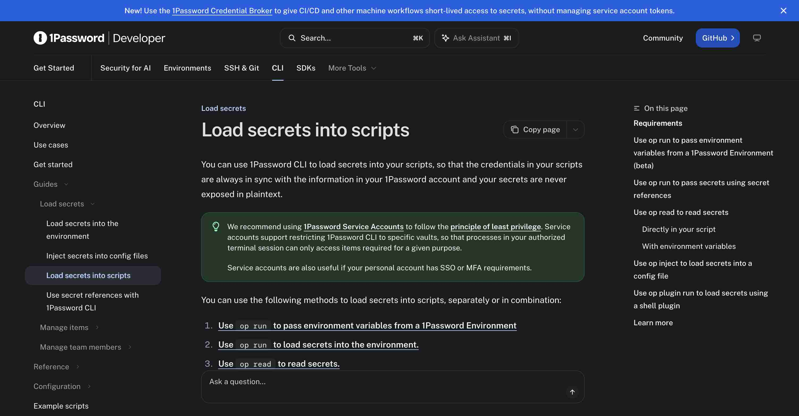
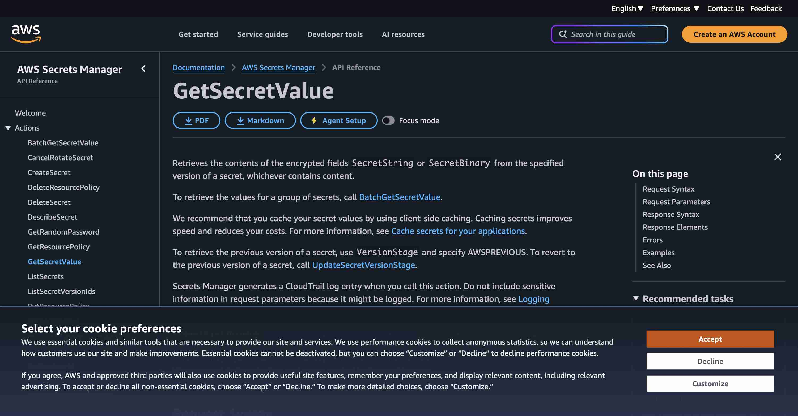

## Focus for review

- Extract the engine completely; keep a process client in agents-cli.
- Use explicit provider bindings, with native authentication.
- Separate remote secret source from command execution location.

## Purpose

**Yes: extract the implementation into a standalone package with its own CLI, SDK and release. Keep only the integration client and agent/fleet policy in agents-cli.** `secrets` and `@phnx-labs/secrets` below are proposed names, not registered or installed products.

This is a design deliverable. No secret stores, credentials or runtime behavior were changed. The screenshot's “keep” verdict establishes neither a packaging requirement nor an extraction boundary. The feature can remain useful while its implementation leaves the CLI.

<div class="artifact-callout">The important split is <strong>bundle format → secret provider → child process</strong>. A device is an execution or transport choice. It does not belong in the bundle format.</div>

<figure class="artifact-figure artifact-behavior">
<section class="artifact-panel" data-state="current" data-evidence="mockup"><h3>Today: agents is required · current behavior reconstructed from code</h3><pre><code>agents secrets exec prod -- ./deploy.sh
agents secrets exec prod --device worker -- ./deploy.sh
# Second command fetches remotely, runs locally.</code></pre></section>
<section class="artifact-panel" data-state="proposed" data-evidence="mockup"><h3>After: usable without agents-cli · proposed CLI mockup</h3><pre><code>secrets exec prod -- ./deploy.sh
secrets exec prod --from ssh://worker -- ./deploy.sh
# Same local child; source is now explicit.</code></pre></section>
</figure>

## Current architecture

<figure class="artifact-figure artifact-figure-diagram artifact-figure-wide"><svg class="artifact-diagram" viewBox="0 0 960 350" role="img" aria-label="Current: secrets code reaches back into the CLI"><defs><marker id="a350" viewBox="0 0 10 10" refX="9" refY="5" markerWidth="6" markerHeight="6" orient="auto-start-reverse"><path d="M 0 0 L 10 5 L 0 10 z" fill="#38bdf8"/></marker></defs><path d="M280 80 L355 80" stroke="#38bdf8" stroke-width="1.6" marker-end="url(#a350)"/><text x="324.5" y="72.0" fill="#91a8b5" font-family="Inter, sans-serif" font-size="12">calls</text><path d="M625 80 L700 80" stroke="#38bdf8" stroke-width="1.6" marker-end="url(#a350)"/><text x="669.5" y="72.0" fill="#91a8b5" font-family="Inter, sans-serif" font-size="12">reads</text><path d="M490 130 L490 230" stroke="#38bdf8" stroke-width="1.6" marker-end="url(#a350)"/><text x="497.0" y="172.0" fill="#91a8b5" font-family="Inter, sans-serif" font-size="12">imports</text><rect x="30" y="30" width="250" height="100" rx="8" fill="#11191c" stroke="#f59e0b" stroke-width="1.5"/><text x="46" y="58" fill="#f59e0b" font-family="Inter, sans-serif" font-size="17">Callers</text><text x="46" y="82" fill="#c8d0d4" font-family="Inter, sans-serif" font-size="13">run · accounts · browser</text><text x="46" y="101" fill="#c8d0d4" font-family="Inter, sans-serif" font-size="13">profiles · share · SSH</text><rect x="355" y="30" width="270" height="100" rx="8" fill="#11191c" stroke="#f59e0b" stroke-width="1.5"/><text x="371" y="58" fill="#f59e0b" font-family="Inter, sans-serif" font-size="17">Secrets inside agents-cli</text><text x="371" y="82" fill="#c8d0d4" font-family="Inter, sans-serif" font-size="13">commands + bundles + stores</text><text x="371" y="101" fill="#c8d0d4" font-family="Inter, sans-serif" font-size="13">grants + helper + crypto</text><rect x="700" y="30" width="230" height="100" rx="8" fill="#11191c" stroke="#a3e635" stroke-width="1.5"/><text x="716" y="58" fill="#a3e635" font-family="Inter, sans-serif" font-size="17">OS / encrypted stores</text><text x="716" y="82" fill="#c8d0d4" font-family="Inter, sans-serif" font-size="13">Keychain · file · age</text><text x="716" y="101" fill="#c8d0d4" font-family="Inter, sans-serif" font-size="13">libsecret · Credential Manager</text><rect x="355" y="230" width="270" height="95" rx="8" fill="#11191c" stroke="#38bdf8" stroke-width="1.5"/><text x="371" y="258" fill="#38bdf8" font-family="Inter, sans-serif" font-size="17">Agents infrastructure</text><text x="371" y="282" fill="#c8d0d4" font-family="Inter, sans-serif" font-size="13">daemon · feed · state</text><text x="371" y="301" fill="#c8d0d4" font-family="Inter, sans-serif" font-size="13">hosts · registry · resource filters</text></svg><figcaption>Current: secrets code reaches back into the CLI</figcaption></figure>

The current storage union is `keychain | file | vault`; its internal `ItemStore` already batches reads. References currently support `keychain`, `env`, `file`, and `exec`. 1Password is currently an import/export integration, not a live reference provider. Reuse these seams, but make network resolution asynchronous. [cli/src/lib/secrets/bundles.ts:51](https://github.com/phnx-labs/agents-cli/blob/f33fdfc456042a3812e87f1a3c5053156d2873c4/cli/src/lib/secrets/bundles.ts#L51) · [cli/src/lib/secrets/index.ts:119](https://github.com/phnx-labs/agents-cli/blob/f33fdfc456042a3812e87f1a3c5053156d2873c4/cli/src/lib/secrets/index.ts#L119) · [cli/src/lib/onepassword.ts:1](https://github.com/phnx-labs/agents-cli/blob/f33fdfc456042a3812e87f1a3c5053156d2873c4/cli/src/lib/onepassword.ts#L1).

| Audited surface | Physical lines, including comments/blanks | Scope |
|---|---:|---|
| Secrets library TypeScript | 11,748 | 33 non-test `.ts` files under `cli/src/lib/secrets/` |
| Secrets command TypeScript | 4,055 | 6 non-test `commands/secrets*.ts` files |
| Combined inventory | 15,803 | Excludes Swift, tests, setup, 1Password and external consumers |

As of 2026-09-06, commit `f33fdfc45604`. These are inventory counts, **not promised deleted lines or package-byte savings**. The original census uses a different grouping. [Raw per-file records and consumer inventory](inventory.json) accompany this plan; its appendix explains the counting recipe.

The command imports SSH and host resolution; bundle resolution imports resource filters, state and feed; low-level keychain reads can start the agents daemon. Removing just the command would leave the engine inside agents-cli. [cli/src/commands/secrets.ts:16](https://github.com/phnx-labs/agents-cli/blob/f33fdfc456042a3812e87f1a3c5053156d2873c4/cli/src/commands/secrets.ts#L16) · [cli/src/lib/secrets/bundles.ts:41](https://github.com/phnx-labs/agents-cli/blob/f33fdfc456042a3812e87f1a3c5053156d2873c4/cli/src/lib/secrets/bundles.ts#L41) · [cli/src/lib/secrets/index.ts:88](https://github.com/phnx-labs/agents-cli/blob/f33fdfc456042a3812e87f1a3c5053156d2873c4/cli/src/lib/secrets/index.ts#L88).

## The proposed boundary

<figure class="artifact-figure artifact-figure-diagram artifact-figure-wide"><svg class="artifact-diagram" viewBox="0 0 960 545" role="img" aria-label="Proposed: one-way integration; providers and remote execution stay distinct"><defs><marker id="a545" viewBox="0 0 10 10" refX="9" refY="5" markerWidth="6" markerHeight="6" orient="auto-start-reverse"><path d="M 0 0 L 10 5 L 0 10 z" fill="#38bdf8"/></marker></defs><path d="M220 125 L340 205" stroke="#38bdf8" stroke-width="1.6" marker-end="url(#a545)"/><text x="287.0" y="157.0" fill="#91a8b5" font-family="Inter, sans-serif" font-size="12">exec / SDK</text><path d="M775 125 L605 205" stroke="#38bdf8" stroke-width="1.6" marker-end="url(#a545)"/><text x="697.0" y="157.0" fill="#91a8b5" font-family="Inter, sans-serif" font-size="12">private pipe</text><path d="M355 310 L230 405" stroke="#38bdf8" stroke-width="1.6" marker-end="url(#a545)"/><text x="299.5" y="349.5" fill="#91a8b5" font-family="Inter, sans-serif" font-size="12">storage</text><path d="M475 310 L475 405" stroke="#38bdf8" stroke-width="1.6" marker-end="url(#a545)"/><text x="482.0" y="349.5" fill="#91a8b5" font-family="Inter, sans-serif" font-size="12">resolve</text><path d="M625 310 L760 405" stroke="#38bdf8" stroke-width="1.6" marker-end="url(#a545)"/><text x="699.5" y="349.5" fill="#91a8b5" font-family="Inter, sans-serif" font-size="12">remote source</text><rect x="25" y="20" width="270" height="105" rx="8" fill="#11191c" stroke="#a3e635" stroke-width="1.5"/><text x="41" y="48" fill="#a3e635" font-family="Inter, sans-serif" font-size="17">Any shell / application</text><text x="41" y="72" fill="#c8d0d4" font-family="Inter, sans-serif" font-size="13">secrets exec prod -- command</text><text x="41" y="91" fill="#c8d0d4" font-family="Inter, sans-serif" font-size="13">SDK available to other consumers</text><rect x="650" y="20" width="285" height="105" rx="8" fill="#11191c" stroke="#38bdf8" stroke-width="1.5"/><text x="666" y="48" fill="#38bdf8" font-family="Inter, sans-serif" font-size="17">agents-cli</text><text x="666" y="72" fill="#c8d0d4" font-family="Inter, sans-serif" font-size="13">small private client + fleet policy</text><text x="666" y="91" fill="#c8d0d4" font-family="Inter, sans-serif" font-size="13">run / browser / accounts callers</text><rect x="300" y="205" width="350" height="105" rx="8" fill="#11191c" stroke="#a3e635" stroke-width="1.5"/><text x="316" y="233" fill="#a3e635" font-family="Inter, sans-serif" font-size="17">Standalone secrets package</text><text x="316" y="257" fill="#c8d0d4" font-family="Inter, sans-serif" font-size="13">bundle validation · resolve · exec</text><text x="316" y="276" fill="#c8d0d4" font-family="Inter, sans-serif" font-size="13">grant broker · stores · audit events</text><rect x="25" y="405" width="270" height="110" rx="8" fill="#11191c" stroke="#a3e635" stroke-width="1.5"/><text x="41" y="433" fill="#a3e635" font-family="Inter, sans-serif" font-size="17">Local adapters</text><text x="41" y="457" fill="#c8d0d4" font-family="Inter, sans-serif" font-size="13">OS stores · encrypted file · age</text><text x="41" y="476" fill="#c8d0d4" font-family="Inter, sans-serif" font-size="13">signed helper keeps its identity</text><rect x="355" y="405" width="265" height="110" rx="8" fill="#11191c" stroke="#a3e635" stroke-width="1.5"/><text x="371" y="433" fill="#a3e635" font-family="Inter, sans-serif" font-size="17">Reference providers</text><text x="371" y="457" fill="#c8d0d4" font-family="Inter, sans-serif" font-size="13">1Password op:// references</text><text x="371" y="476" fill="#c8d0d4" font-family="Inter, sans-serif" font-size="13">AWS Secrets Manager selectors</text><rect x="680" y="405" width="255" height="110" rx="8" fill="#11191c" stroke="#38bdf8" stroke-width="1.5"/><text x="696" y="433" fill="#38bdf8" font-family="Inter, sans-serif" font-size="17">Optional SSH transport</text><text x="696" y="457" fill="#c8d0d4" font-family="Inter, sans-serif" font-size="13">OpenSSH targets, pinned keys</text><text x="696" y="476" fill="#c8d0d4" font-family="Inter, sans-serif" font-size="13">no device registry / Tailscale</text></svg><figcaption>Proposed: one-way integration; providers and remote execution stay distinct</figcaption></figure>

| Responsibility | Final owner | Concrete extraction |
|---|---|---|
| Bundles, validation, provider resolution, child injection | Standalone secrets | Move `bundles.ts`, `index.ts`, `lease.ts`, `session-store.ts`; split platform storage from reference resolution |
| OS stores, encrypted file, age vault, signed helper | Standalone secrets | Move local adapters and helper download/release inputs; keep current keychain service/access-group identity during cutover |
| Unlock/lock, hold expiry and broker | Standalone secrets | Broker owns its process lifecycle and helper reaping; agents daemon stops hosting it |
| Secret events and local usage | Standalone secrets, value-free event output | Replace imports of feed/analytics with local storage plus an optional event callback; agents consumes events through its client |
| Device aliases, host selection, credential provisioning election | agents-cli | Move `reserved-sync.ts` policy out of the secrets tree; retain one daemon executor |
| Harness/account rules and resource profile selection | agents-cli | Pass allowed bundle names and opaque grant scope into the client; no harness catalog in the package |
| OS-independent remote source / transfer | Optional secrets SSH adapter | Reuse existing transport validation and bounded subprocess primitives, using OpenSSH targets instead of a fleet registry |
| Managed ciphertext sync | Optional sync adapter | Keep `SyncBackend`; provider auth and service URL belong in its configuration, not core defaults |

Existing account/profile tokens are also consumers: `account-registry.ts` calls both raw keychain and bundle APIs, `profiles.ts` uses the raw-token shim, and browser calls resolve bundles directly. The client must cover raw-item operations as well as bundle resolution before the implementation can leave. [cli/src/lib/account-registry.ts:27](https://github.com/phnx-labs/agents-cli/blob/f33fdfc456042a3812e87f1a3c5053156d2873c4/cli/src/lib/account-registry.ts#L27) · [cli/src/lib/profiles.ts:16](https://github.com/phnx-labs/agents-cli/blob/f33fdfc456042a3812e87f1a3c5053156d2873c4/cli/src/lib/profiles.ts#L16) · [cli/src/lib/browser/chrome.ts:7](https://github.com/phnx-labs/agents-cli/blob/f33fdfc456042a3812e87f1a3c5053156d2873c4/cli/src/lib/browser/chrome.ts#L7).

**Packaging choice:** publish a standalone CLI/SDK from a separate repository. agents-cli depends on a small protocol client, not the full SDK or its transitive providers. Provision the executable through the existing external-CLI installer (`cli/src/lib/cli-resources.ts`), extending its manifest/update checks for this supported protocol pair, with an explicit supported protocol range. Verify the packed agents tarball contains no stores, Swift helper, vault crypto or provider SDK. A package dependency that rebundles those files fails the extraction goal.

## Device behavior without device coupling

<figure class="artifact-figure artifact-figure-diagram artifact-figure-wide"><svg class="artifact-diagram" viewBox="0 0 960 315" role="img" aria-label="Which machine holds the secret, and which machine runs the child?"><defs><marker id="a315" viewBox="0 0 10 10" refX="9" refY="5" markerWidth="6" markerHeight="6" orient="auto-start-reverse"><path d="M 0 0 L 10 5 L 0 10 z" fill="#38bdf8"/></marker></defs><path d="M160 115 L160 190" stroke="#38bdf8" stroke-width="1.6" marker-end="url(#a315)"/><text x="167.0" y="144.5" fill="#91a8b5" font-family="Inter, sans-serif" font-size="12"></text><path d="M485 115 L485 190" stroke="#38bdf8" stroke-width="1.6" marker-end="url(#a315)"/><text x="492.0" y="144.5" fill="#91a8b5" font-family="Inter, sans-serif" font-size="12"></text><path d="M805 115 L805 190" stroke="#38bdf8" stroke-width="1.6" marker-end="url(#a315)"/><text x="812.0" y="144.5" fill="#91a8b5" font-family="Inter, sans-serif" font-size="12"></text><rect x="25" y="25" width="270" height="90" rx="8" fill="#11191c" stroke="#a3e635" stroke-width="1.5"/><text x="41" y="53" fill="#a3e635" font-family="Inter, sans-serif" font-size="17">Local use</text><text x="41" y="77" fill="#c8d0d4" font-family="Inter, sans-serif" font-size="13">local provider → local child</text><rect x="350" y="25" width="270" height="90" rx="8" fill="#11191c" stroke="#38bdf8" stroke-width="1.5"/><text x="366" y="53" fill="#38bdf8" font-family="Inter, sans-serif" font-size="17">Remote execution</text><text x="366" y="77" fill="#c8d0d4" font-family="Inter, sans-serif" font-size="13">SSH → remote secrets → remote child</text><rect x="675" y="25" width="260" height="90" rx="8" fill="#11191c" stroke="#f59e0b" stroke-width="1.5"/><text x="691" y="53" fill="#f59e0b" font-family="Inter, sans-serif" font-size="17">Remote source</text><text x="691" y="77" fill="#c8d0d4" font-family="Inter, sans-serif" font-size="13">remote secrets → local child</text><rect x="25" y="190" width="270" height="95" rx="8" fill="#11191c" stroke="#a3e635" stroke-width="1.5"/><text x="41" y="218" fill="#a3e635" font-family="Inter, sans-serif" font-size="17">secrets exec prod -- …</text><text x="41" y="242" fill="#c8d0d4" font-family="Inter, sans-serif" font-size="13">no fleet installation needed</text><rect x="350" y="190" width="270" height="95" rx="8" fill="#11191c" stroke="#38bdf8" stroke-width="1.5"/><text x="366" y="218" fill="#38bdf8" font-family="Inter, sans-serif" font-size="17">agents ssh worker …</text><text x="366" y="242" fill="#c8d0d4" font-family="Inter, sans-serif" font-size="13">agents owns placement only</text><rect x="675" y="190" width="260" height="95" rx="8" fill="#11191c" stroke="#f59e0b" stroke-width="1.5"/><text x="691" y="218" fill="#f59e0b" font-family="Inter, sans-serif" font-size="17">secrets exec --from ssh://…</text><text x="691" y="242" fill="#c8d0d4" font-family="Inter, sans-serif" font-size="13">explicit ephemeral transfer</text></svg><figcaption>Which machine holds the secret, and which machine runs the child?</figcaption></figure>

| Intent | Proposed command | Where values go |
|---|---|---|
| Use a local or cloud-backed bundle | `secrets exec prod -- ./deploy.sh` | Provider → local child environment |
| Run on another machine | `agents ssh worker 'secrets exec prod -- ./deploy.sh'` | Remote provider → remote child; ordinary SSH also works |
| Use secrets held on another machine | `secrets exec prod --from ssh://worker -- ./deploy.sh` | Pinned SSH source → private local pipe → local child |
| Store a copy on another machine | `secrets export prod --to ssh://worker` | Explicit transfer into destination store; read-back before success |
| Inspect remote metadata | `ssh worker secrets list --json` | Names/status only; no resolved values |

`--from` and `--to` are proposed standalone transport options. They accept OpenSSH host aliases or `user@host`, with an explicit port field if needed; they do not look up agents devices. The optional transport uses a fixed remote executable and versioned request, never a shell command assembled from bundle values. `--device` stays on agents-owned placement commands. No permanent `agents secrets` management alias is proposed; update scripts, skills and callers at cutover.

Today `secrets exec --device` resolves remotely and then invokes local `spawn`. It rejects remote key-subset and expiry overrides. Separately, remote `agents run` rejects explicit `--secrets`. Preserve these distinctions in migration tests; don't silently reinterpret an existing command. Proposed remote-source resolution carries key selection and expiry policy in the protocol and refuses a peer that cannot enforce them. [cli/src/commands/secrets.ts:2468](https://github.com/phnx-labs/agents-cli/blob/f33fdfc456042a3812e87f1a3c5053156d2873c4/cli/src/commands/secrets.ts#L2468) · [cli/src/commands/exec.ts:1717](https://github.com/phnx-labs/agents-cli/blob/f33fdfc456042a3812e87f1a3c5053156d2873c4/cli/src/commands/exec.ts#L1717) · [cli/src/lib/hosts/passthrough.ts:165](https://github.com/phnx-labs/agents-cli/blob/f33fdfc456042a3812e87f1a3c5053156d2873c4/cli/src/lib/hosts/passthrough.ts#L165).

## A portable bundle format

The format declares **environment names and explicit sources**. It carries no device list, account tokens, machine paths for managed stores, or provider credential. Local connection settings live separately in the secrets config directory, selected with `--config`; the default follows the OS config-directory convention. A supplied `--file` is explicit; do not walk arbitrary parent directories and execute discovered config.

```yaml
version: 1
name: prod
vars:
  API_TOKEN:
    source:
      provider: onepassword
      ref: op://Engineering/Service/credential
  DATABASE_URL:
    source:
      provider: aws-secrets-manager
      secretId: apps/prod/database
      region: us-east-1
      jsonPointer: /url
      versionStage: AWSCURRENT
  LOCAL_SIGNING_KEY:
    source:
      provider: local
      item: prod/signing-key
  LOG_LEVEL:
    literal: info
```

The YAML document is a serialization of a versioned JSON Schema, not a new scripting language. Require exactly one of `source` or `literal` per variable, reject duplicate keys/unknown fields/unsupported versions, and preserve string bytes unless an explicit transform is requested. `literal` means non-secret configuration. Reject missing fields, binary secret values for environment injection, NUL bytes and non-string selected JSON values. Omitted AWS selector means the entire `SecretString`; a JSON pointer requires valid JSON. Neither provider credentials nor secret values belong in this document.

Local OS/file/age choices belong in machine configuration behind `provider: local`. A cloud source remains authoritative: rotating it changes the next resolution, without importing a second copy into a local vault. Mutable cloud references (including AWS AWSCURRENT and unversioned 1Password fields) are freshly fetched for every exec or SDK resolve invocation; only batch/deduplicate within that invocation. Persistent holds apply to local-store grants, not mutable cloud values. Scope local cached values by provider identity, reference/version, requested keys and grant; never extend a cache beyond the grant or temporary credential expiration. Native prompt policy is a local-store capability; don't claim that 1Password or AWS implements Touch ID `hold`/`always` semantics.

<section class="artifact-grid artifact-grid-2">
<section class="artifact-panel" data-state="proposed" data-evidence="mockup"><h3>Inspect without reading values · proposed CLI mockup</h3><pre><code>secrets view prod
API_TOKEN        onepassword           reference
DATABASE_URL     aws-secrets-manager   reference
LOCAL_SIGNING_KEY local                 locked
LOG_LEVEL        literal               info</code></pre></section>
<section class="artifact-panel" data-state="proposed" data-evidence="mockup"><h3>Validate and run a reference file · proposed CLI mockup</h3><pre><code>secrets check --file prod.secrets.yaml
Valid: 4 variables; no values resolved.
secrets exec --file prod.secrets.yaml -- ./deploy.sh
Deployment finished.
# Illustrative child output, not a live deployment.</code></pre></section>
</section>

## Backends: reuse the tools people already trust

| Option | Actual role | Decision |
|---|---|---|
| Existing OS/file/age adapters | Local value storage | Extract existing code; avoid a crypto rewrite |
| 1Password | Live field references and native auth tooling | First remote provider: use argv-based `op read`/bounded batch reads, capture values privately |
| AWS Secrets Manager | Versioned application secrets | Second remote provider: official SDK credential chain, explicit region/selector |
| `aws-vault` | AWS credential/session launcher | Compose around secrets; no fake storage adapter |
| External tools only, no shared package | Simple single-provider workflows | Valid for users needing only `op run`; insufficient for the current mixed stores and embedded consumers |
| Move everything unchanged into an SDK | Changes code location | Reject as final state: daemon/fleet imports and shipped code size would remain |

```sh
# AWS authentication wrapper; application values still come from Secrets Manager.
aws-vault exec engineering -- secrets exec prod -- ./deploy.sh

# A 1Password-only user may already need no additional tool.
op run --env-file=prod.env -- ./deploy.sh
```

Primary documentation checked 2026-09-06: 1Password describes replacing plaintext entries with secret-reference URIs and injecting them through `op run`; service accounts can be vault-scoped. This plan uses stable references, not the separately labelled beta Environments feature. [1Password scripts](https://developer.1password.com/docs/cli/secrets-scripts/).

AWS returns `SecretString` or `SecretBinary`; without a version selector it uses `AWSCURRENT`. The resolver needs `secretsmanager:GetSecretValue`, plus `kms:Decrypt` for a customer-managed key. [AWS GetSecretValue](https://docs.aws.amazon.com/secretsmanager/latest/apireference/API_GetSecretValue.html). `aws-vault` uses STS temporary credentials and can pass them to a subprocess. [aws-vault README](https://github.com/99designs/aws-vault). These are documented capabilities, not authenticated provider smoke tests performed in this session.

<details><summary>Live documentation captures and inspection notes</summary>
<figure class="artifact-figure"><figcaption>1Password scripts page, browser capture inspected 2026-09-06. The page lists op run, op read and vault-scoped service accounts.</figcaption></figure>
<figure class="artifact-figure"><figcaption>AWS GetSecretValue page, browser capture inspected 2026-09-06. Cookie panel remains visible; the API behavior text is readable. No authenticated secret was read.</figcaption></figure>
</details>

## Proposed Changes

The ordered implementation work is in [tasks.md](tasks.md); it is a future build checklist, not completed work. The proposed contract is in [delta-spec.md](delta-spec.md). Extract in dependency order and make the deletion a release criterion.

| Step | Concrete delta | Exit evidence |
|---|---|---|
| 1. Define the boundary | Schema, client protocol, import/caller inventory; lifecycle decisions | Real fixture bundle validated; consumer mapping signed off |
| 2. Extract local engine | Existing stores, grants, helper and CLI into independent repo | Clean-prefix install can run an injected child without agents installed |
| 3. Add live references | 1Password + Secrets Manager, capability errors and auth stripping | Read disposable known-value secrets through real services; print only match verdicts |
| 4. Extract transport | OpenSSH adapter plus private remote protocol | Different source/child hosts, selected keys, denied/unreachable peer all exercised |
| 5. Convert agents consumers | Small client; account/fleet policy retained; remove daemon broker hosting | Installed run, browser secret entry, accounts and raw-token paths work |
| 6. Cut over and delete | Explicit inventory-based store adoption/import, scripts and docs switch, old engine removed | Packed agents artifact proves deletion; one broker owns grants |
| 7. Release and demonstrate | Independent publishing/update; supported pair installed | Fresh standalone and updated agents both exercise real local and remote flows |

Native helpers release on their own cadence. An ordinary agents release must not rebuild or sign the keychain helper. Existing CI/release latency ceilings remain acceptance constraints; measure the new package's path independently rather than adding its service matrix to the agents PR gate.

## Public Interface

**Stable standalone CLI:** metadata commands (`list`, `view`, `check`, `status`, `activity`) support `--json`; `exec` owns a child with inherited output and the child's exit/signal outcome. `exec` does not emit a metadata JSON header into child stdout. All metadata stays value-free. Mutation supports stdin for values; no secret argument literals in examples or automation. Local-store management, native migration and encrypted sync remain in their owning adapters, not duplicated in agents.

**SDK:** `createSecrets(config).resolve(request)` is asynchronous and returns an environment map in application memory. Store mutation is a separate capability; a read-only cloud provider does not pretend it can rotate/delete secrets. Resolve all selected keys before spawning; a partial failure starts no child. The SDK is optional for third-party apps; agents uses the small process client to keep the engine out of its tarball.

**Private integration:** a bounded, versioned request/response channel over inherited pipes, with request id, operation, bundle, key selection, expiry override, interaction mode and opaque scope. Operations cover metadata, bundle resolution, raw-item CRUD and grant lifecycle. Reply includes resolved strings only on the private channel, or typed value-free errors. Child stdout remains separate. Reject protocol mismatch before resolving anything. No new network daemon, plugin marketplace or general RPC framework.

**Materialization guard:** standalone detects `SECRETS_CONTEXT=agent` plus the existing agent invocation markers through a small context detector (no agents import). The agents client sets that signal. Bundle `view --reveal` refuses under those markers or without an interactive terminal; preserve the current narrow raw-item exception. The signal prevents accidental disclosure through supported tools, not a malicious same-user process.

**Policy seam:** caller supplies bundle allowlist and opaque scope. agents maps harness/account/resource-profile rules to those inputs. Secrets core enforces validation, grant/key/expiry limits and headless behavior independently. Standalone automation defaults to non-interactive; a deliberate terminal unlock can request an interactive provider operation. Preserve existing native-headless no-prompt guarantees. [cli/src/lib/secrets/bundles.ts:983](https://github.com/phnx-labs/agents-cli/blob/f33fdfc456042a3812e87f1a3c5053156d2873c4/cli/src/lib/secrets/bundles.ts#L983) · [cli/src/lib/secrets/scope.ts:1](https://github.com/phnx-labs/agents-cli/blob/f33fdfc456042a3812e87f1a3c5053156d2873c4/cli/src/lib/secrets/scope.ts#L1).

<section class="artifact-grid artifact-grid-2">
<section class="artifact-panel" data-state="proposed" data-evidence="mockup"><h3>Locked / unauthenticated provider · proposed CLI mockup</h3><pre><code>secrets exec prod -- ./deploy.sh
AUTH_REQUIRED: onepassword is not authenticated.
Authenticate with 1Password, then retry.
Command was not started.</code></pre></section>
<section class="artifact-panel" data-state="proposed" data-evidence="mockup"><h3>Peer cannot enforce the request · proposed CLI mockup</h3><pre><code>secrets exec prod --from ssh://worker --keys API_TOKEN -- ./deploy.sh
PROTOCOL_UNSUPPORTED: peer cannot enforce key selection.
Update secrets on worker, then retry.
Command was not started.</code></pre></section>
</section>

<section class="artifact-grid artifact-grid-2">
<section class="artifact-panel" data-state="proposed" data-evidence="mockup"><h3>Empty store · proposed CLI mockup</h3><pre><code>secrets list
No bundles configured.
Use secrets create &lt;name&gt; or secrets check --file &lt;path&gt;.</code></pre></section>
<section class="artifact-panel" data-state="proposed" data-evidence="mockup"><h3>Operation not supported by provider · proposed CLI mockup</h3><pre><code>secrets rotate prod DATABASE_URL
CAPABILITY_UNSUPPORTED: aws-secrets-manager is read-only here.
Change the secret in AWS; next execution reads the new version.</code></pre></section>
</section>

## Plan

- [ ] Define schema and private client protocol.
- [ ] Extract existing local stores, broker and native helper.
- [ ] Add live 1Password and AWS references.
- [ ] Extract OpenSSH transport with explicit source/destination semantics.
- [ ] Convert every agents consumer and preserve policy.
- [ ] Verify encrypted store cutover, then remove the old engine.
- [ ] Publish independently and demonstrate the installed pair.

These boxes are future implementation. The file-by-file tasks are linked above; this session delivers the reviewed plan.

## Validation

| Real scenario | Required observation |
|---|---|
| Standalone install, agents absent | Local encrypted-store injection and metadata work; no import or spawn of agents |
| macOS human unlock then headless reads | One deliberate prompt; subsequent granted reads work, expired grants fail without a sheet |
| Linux/Windows local stores | Actual native or declared encrypted store works; no silent change of selected backend |
| 1Password / AWS | Dedicated test item read via normal auth; missing auth, denied scope, rotation and expiry exercised |
| Remote source versus remote execution | Child prints hostname and a boolean equality check, never values; source and execution location match requested flow |
| Failure before spawn | Missing key, rejected selector, timeout, expired lease, broken pipe: no child side effect |
| Injection hygiene | Launcher never logs/argv-embeds values; strips unlock/provider credentials unless explicitly selected for child; loader env remains filtered |
| Reveal and remote-input guards | Real standalone reveal refuses with agent markers and no TTY; raw-item exception remains explicit. Remote GIT_SSH_COMMAND, HTTPS_PROXY, OPENAI_BASE_URL and loader keys are rejected before child spawn. |
| Multi-bundle run | Preserve profile → account → auto-share → bundles in order → explicit --env precedence; validate all selected bundles before launch (`commands/exec.ts:3244`) |
| Existing consumers | Real run, browser field fill, account add/read/rotate, SSH-password lookup, share config and profile token access |
| Packaging + lifecycle | No old engine in agents tarball, no duplicate broker after update/restart, independent helper update works |

Use non-sensitive canaries and real OS/providers. Test files sit beside their sources with nearby `testdata/`. Required PR checks cover the impacted modules; slow provider/platform matrix runs separately. The plan itself is checked/rendered and visually inspected; none of the proposed runtime tests are claimed as executed.

## Risks

| Source / edge | Required treatment |
|---|---|
| Keychain identity and helper signing — [cli/src/lib/secrets/index.ts:47](https://github.com/phnx-labs/agents-cli/blob/f33fdfc456042a3812e87f1a3c5053156d2873c4/cli/src/lib/secrets/index.ts#L47) | Keep service prefixes, HMAC mapping, signing/access-group entitlements and helper identity stable while moving code. Renaming the product must not strand existing items. |
| Broker auto-boot and self-invocation — [cli/src/lib/secrets/agent.ts:1236](https://github.com/phnx-labs/agents-cli/blob/f33fdfc456042a3812e87f1a3c5053156d2873c4/cli/src/lib/secrets/agent.ts#L1236); [cli/src/index.ts:28](https://github.com/phnx-labs/agents-cli/blob/f33fdfc456042a3812e87f1a3c5053156d2873c4/cli/src/index.ts#L28) | Replace self-exec paths and remove agents hosting in the same cutover. Preserve protocol/identity during transfer; one owner claims the socket. |
| Reserved auth and publisher election — [cli/src/lib/secrets/reserved-sync.ts:12](https://github.com/phnx-labs/agents-cli/blob/f33fdfc456042a3812e87f1a3c5053156d2873c4/cli/src/lib/secrets/reserved-sync.ts#L12) | Keep fleet election and device-role policy in agents; pass item operations to the client. No headed-device fallback to worker credentials. |
| Provider credential bootstrap | 1Password service tokens / AWS auth must come from native login, environment or standard credential chain, not a bundle that requires itself. Detect resolution cycles and strip bootstrap credentials before child spawn. |
| Policy loss in transport — [cli/src/lib/secrets/remote.ts:44](https://github.com/phnx-labs/agents-cli/blob/f33fdfc456042a3812e87f1a3c5053156d2873c4/cli/src/lib/secrets/remote.ts#L44) | Retain pinned-host requirement, no multiplexed secret transport, strict key validation and deadlines. Preserve the remote-only rejection of GIT_*, *_PROXY and *_BASE_URL as well as loader/interpreter keys. No widening to full bundle on a subset error. |
| Plaintext surfaces — [cli/src/lib/secrets/mcp.ts:187](https://github.com/phnx-labs/agents-cli/blob/f33fdfc456042a3812e87f1a3c5053156d2873c4/cli/src/lib/secrets/mcp.ts#L187) | MCP currently returns the value in a tool result; do not describe it as model-invisible. Retain only as explicitly materializing optional adapter, never automatic model wiring. |
| Child can print its environment | Injection prevents the launcher printing secrets; it cannot stop an authorized child or same-user process from disclosing them. No zero-knowledge claim. |
| Local paths and metadata caches — [cli/src/lib/secrets/bundles.ts:124](https://github.com/phnx-labs/agents-cli/blob/f33fdfc456042a3812e87f1a3c5053156d2873c4/cli/src/lib/secrets/bundles.ts#L124) | Explicit backend selection replaces location guessing for new manifests. Migration inventories old state and maps each item once; never silently fall back on authentication failure. |

**Cutover protocol:** dry-run inventories bundles, raw profile/account items, policies, metadata and grants without values. For native keychain, adopt identifiers in place. For file/age stores, either select the existing encrypted location explicitly or perform an atomic encrypted import with read-back. Record a value-free migration receipt, invalidate or deliberately transfer scoped grants, then switch consumers. Keep the prior encrypted source until verification succeeds; do not dual-write or delete old credentials automatically. Rollback restores the previous installed pair and original store configuration; after a migrated store receives new writes, rollback requires an explicit reconciliation, not blind restoration of stale data.

## Independent verification

A blind planner independently read source without seeing this proposal. It agreed on independent packaging, three separate interfaces (source/store/ciphertext sync), explicit YAML/JSON bindings, provider-native references, remote-source versus remote-execution semantics, and one broker owner. This is a same-provider second opinion: cross-provider fleet launches failed, and a separately verified Claude invocation reached its timeout without a plan. No cross-provider consensus is claimed.

| Finding | Disposition | Evidence / resulting decision |
|---|---|---|
| Independent planner: 1Password import is lossy | ADOPTED | `onepassword.ts:190–201` chooses one field and skips multiline values. Live field refs replace import as the default cloud flow; byte-preserving real tests are required. |
| Independent planner: preserve full run precedence | ADOPTED | `commands/exec.ts:3244` merges profile → account → auto-share → bundles → explicit `--env`. Keep that agents-owned precedence; a general secrets SDK cannot infer it. |
| Independent planner: temporary management alias | REJECTED as final design | User requested full extraction and no compatibility layer. Update callers at cutover; do not keep a permanent `agents secrets` command. Existing encrypted/native data is protected separately. |
| Non-author reviewer: reveal guard and remote filters missing | FIXED + APPROVED | Restore context/TTY reveal refusal and remote GIT/proxy/base-URL restrictions, with concrete CLI tests. |
| Non-author reviewer: cache versus rotation contradiction | FIXED + APPROVED | Mutable cloud refs resolve fresh every invocation; holds remain local-store grant behavior. |

The non-author reviewer approved the corrected documentation contract. This verifies the plan's consistency and source grounding; it is not evidence that the proposed implementation already works.

## Tracking

- [Documentation PR #3499](https://github.com/phnx-labs/agi-cli/pull/3499).

- [PHNX-3989: this planning deliverable](https://linear.app/getrush/issue/PHNX-3989). Close with the rendered plan and review proof; runtime extraction is still proposed.
- [PHNX-3975: related configuration work](https://linear.app/getrush/issue/PHNX-3975). Coordination reference only; this plan does not change or take over that proposal.
- [Implementation tasks](tasks.md) · [Proposed delta contract](delta-spec.md) · [Raw inventory](inventory.json).

## Evidence appendix

Code evidence is pinned to `f33fdfc456042a3812e87f1a3c5053156d2873c4` from a freshly fetched origin on 2026-09-06. `inventory.json` lists each counted path and line total. Counting uses `splitlines()` on non-test TypeScript under `cli/src/lib/secrets/` and `cli/src/commands/secrets*.ts`; it excludes `__tests__`. Consumer scanning records direct static/dynamic imports, including benchmarks/fixtures labelled by path; it is an integration starting list, not a transitive dependency count. Shell scripts, native helper releases, resource definitions and docs must also be searched at cutover. No runtime throughput, size reduction or implementation-duration claim is inferred from line counts.
