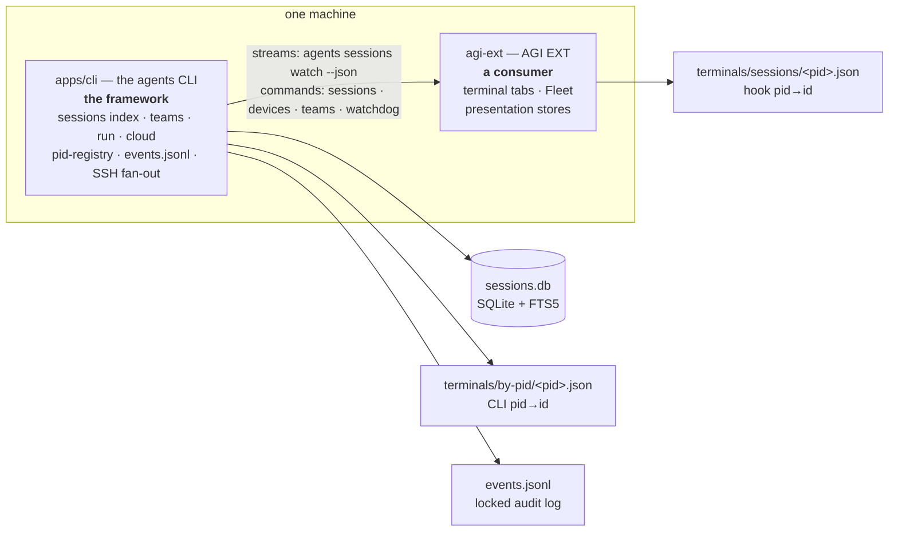
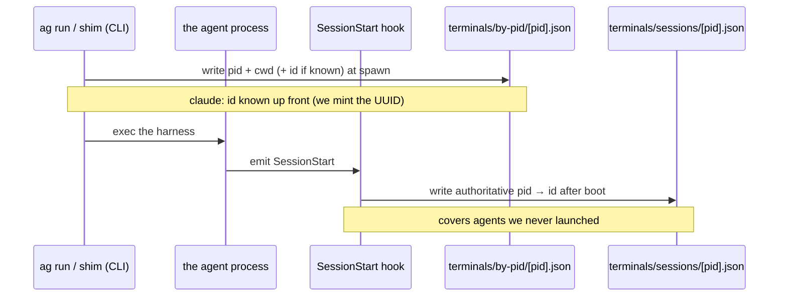

# Architecture

How the parts fit together: **two application layers** (the `agents` CLI and the
AGI EXT), **two meanings of "session"** (a transcript vs a live identity),
and the on-disk stores that connect them. Read this once and the rest of the docs
(`sessions.md`, `observability.md`, `teams.md`) slot into place.

Everything here is read from source — file references are `path:line` at the time of
writing; treat them as pointers, not guarantees.

---

## 1. Two application layers

`agents-cli` is two application-layer surfaces over one shared set of on-disk state:

- **`apps/cli` — the `agents` / `ag` CLI. The framework.** It owns the durable
  state and every mechanism: the SQLite transcript index, `sessions` / `teams` /
  `run` / `cloud`, the CLI-side pid→id registry, the audit log, and the SSH fan-out
  to peer machines.
- **`agi-ext` — AGI EXT, the VS Code extension. A consumer.** It spawns agent
  terminals as tabs and renders the Fleet dashboard. Its state layer is a
  presentation projection of CLI JSON: one elected monitor owns
  `agents sessions watch --json`, while one-shot pickers and controls invoke the
  owning CLI noun. It does not scan transcript, team, tracker, watchdog, device,
  account, or quota stores itself.

The important consequence: **the CLI is where the mechanisms live**, so a change to
how live state is computed (or cached) benefits every consumer — a terminal, the
extension, another machine — at once. The extension is a thin reshaping layer.

> AGI EXT is a **separate product** with its own publish identity
> (publisher `swarmify`, name `swarm-ext`). See the [phnx-labs/agi-ext](https://github.com/phnx-labs/agi-ext) repo’s `AGENTS.md`.

---

## 2. Two meanings of "session"

The word "session" names two unrelated things. Keeping them apart removes most of the
confusion in this codebase.

| | Transcript | Live identity |
|---|---|---|
| **What it is** | the conversation on disk (one file/row per session) | which running **pid** is which session, right now |
| **Where** | agent-native files → indexed in `sessions.db` | `terminals/*/<pid>.json` cache files |
| **Read by** | `agents sessions` (the CLI) | the CLI (`--active`) and the extension |
| **Lifetime** | durable (survives reboot) | ephemeral (deleted with the pid) |
| **Covered in** | [sessions.md](sessions.md) | §3 below |

The **transcript** side is a SQLite index (`~/.agents/.history/sessions/sessions.db`,
`SCHEMA_VERSION` in [`src/lib/session/db.ts`](../src/lib/session/db.ts)) with a
`scan_ledger` that re-reads a file only when its `mtime`/`size` changed, a
`dir_ledger` that skips the per-file `stat` of a leaf transcript directory whose
`(mtime, entry_count)` is unchanged, plus a `session_text` FTS5 table for search.
For **Claude**, **Codex**, and **Kimi**, a changed file that merely grew is parsed
**incrementally**: the `scan_ledger` also stores a resumable continuation
(`parser_state`, plus `content_text` for Claude/Codex) so the next scan resumes
from the saved byte offset and folds in only the appended lines — falling back to
a full reparse on a truncation / rewrite or a clock rewind. (Kimi's continuation
tracks its `agents/main/wire.jsonl` offset + the additive counters.) Grok is not
incremental — it reads a whole `summary.json`, not an append-only JSONL.
Both paths share one reducer per scanner, so the incremental row is identical to a full reparse.
Listing is a DB read; only opening one session fully re-parses its transcript.
Detail in [sessions.md](sessions.md).

The **live identity** side is the rest of this document.

---

## 3. Live identity: two `pid → id` writers

An agent is one OS process with a pid. To say "this terminal is running session
`4d…`", something must map that pid to a session id and store it in a file **named
after the pid** — never the database, because a pid is an OS-recycled number
(a saved `pid 1234 → session-abc` row becomes a lie the moment 1234 is reused).

There are **two** such writers, and they fire at different moments:

- **CLI pid-registry — `terminals/by-pid/<pid>.json`.** Written by `ag run` / the
  shim at spawn ([`src/lib/session/pid-registry.ts`](../src/lib/session/pid-registry.ts),
  `writePidSessionEntry`, interface `PidSessionEntry`). Immediate, but covers only
  launches **we** make, and the id is exact only when known at launch (see §4). Each
  entry also records the `$TMUX_PANE` it launched into, which is what lets the
  authoritative tmux source attribute a pane it did NOT wrap — an agent bare-spawned
  into a split of an existing session — to its own launch (`resolvePaneIdentity` in
  `src/lib/session/active.ts`) instead of dropping it to the `ps`-scan fallback.
- **session-tracker — `terminals/sessions/<pid>.json`.** Written by the polyglot
  `SessionStart` hook after the agent boots
  ([`packages/session-tracker`](../../../packages/session-tracker), `STATE_DIR` in
  `src/state-file.ts`, interface `SessionState`). Authoritative (reads the agent's
  own payload) and covers **any** start — including a user typing `claude` in a
  terminal, which the CLI never launched — for harnesses that expose a hook.

**Reader split:** the CLI reads `by-pid/`; the **extension** reads `sessions/`
(`agi-ext/src/core/liveSession.ts`). Same pid→id data, two writers, two readers.
The join key already exists — the hook records `terminal_id` / `launch_id` from the
env the launcher sets (`AGENT_TERMINAL_ID`, `AGENT_LAUNCH_ID`) — so the two files can
be merged behind one path later; today both exist because neither subsumes the other
(immediate-but-ours vs delayed-but-any).

---

## 4. Who assigns the session id — it differs per harness

This is the crux of "why isn't it uniform." The dividing line is **who names the
session**:

- **`claude`** — *we* do. `ag run` generates a UUID and passes `--session-id`
  ([`src/lib/exec.ts`](../src/lib/exec.ts), `spawnAgent`), so the id is known before
  the process runs and the pid-registry entry is exact immediately.
- **every other harness** — the *agent* owns the id, and we discover it: from its
  `SessionStart` hook payload if it has one, else by reading it out of the transcript
  later. Until then the pid-registry entry records pid + cwd + agent so `--active`
  can correlate by folder.

Two formats trip people up (both handled in [`src/lib/session/discover.ts`](../src/lib/session/discover.ts)):

- **Codex** — the file is `rollout-<timestamp>-<uuid>.jsonl`, but the id is **not**
  that filename; it's a separate UUID read from `session_meta.payload.id` inside the
  file.
- **OpenCode** — ids are `ses_<…>` and live in a SQLite database
  (`~/.local/share/opencode/opencode.db`), pointed at by a synthetic
  `opencode.db#<id>` path.

**Which harnesses are session-tracked** is a distinct set from which the CLI can
*run*. The run set is the `AGENTS` registry ([`src/lib/agents.ts`](../src/lib/agents.ts));
the **session-discoverable** set is `SESSION_AGENTS`
([`src/lib/session/types.ts`](../src/lib/session/types.ts)): `claude`, `codex`,
`gemini`, `antigravity`, `opencode`, `openclaw`, `rush`, `hermes`, `grok`, `kimi`,
`droid`, `cursor`, `muse`. `copilot` is runnable but not session-discoverable.
`isSessionTrackedAgent()` in the same file is the single predicate every session-index
writer gates on.

### Across the SSH hop: `AGENT_LAUNCH_ID` is the one correlation key

`agents run --device` runs `agents run` on a remote box, so the "who names the session"
split above still holds — Claude forwards a `--session-id` the launcher controls, every
other agent coins its own id on the peer. The launcher recovers that remote-coined id
through **one stable correlation key it controls end-to-end**: `AGENT_LAUNCH_ID`.

- The launcher forwards a launch id (`--env AGENT_LAUNCH_ID=<id>`); the remote
  `agents run` **adopts** it rather than minting a fresh one (`resolveLaunchId` in
  [`src/lib/exec.ts`](../src/lib/exec.ts)), so the remote SessionStart hook records the
  agent's real `session_id` under that exact key in `terminals/sessions/<pid>.json`.
- **Headless** host runs read the id back from the followed log — the remote prints it
  as a `--emit-session-id` marker ([`src/lib/hosts/session-marker.ts`](../src/lib/hosts/session-marker.ts)).
- **Interactive** host runs have no followed log (the TTY is wired straight through
  `sshStream`), so after the stream returns the launcher does one ssh read of the remote
  hook dir and resolves the id by launch id — `resolveRemoteSessionId` /
  `pickRemoteSessionId` in [`src/lib/hosts/remote-session-id.ts`](../src/lib/hosts/remote-session-id.ts).
  It then registers the real id in the local session index and reconnects against it on a
  dropped link — for Codex/Kimi/Grok/Gemini, not only Claude.

---

## 5. Storage map

Everything the two layers share lives in one of a few stores, each chosen for how
long it must live and how it's read back:

| Store | Path | Kind | Written / read |
|---|---|---|---|
| Sessions index | `~/.agents/.history/sessions/sessions.db` | SQLite + FTS5 | CLI scans transcripts → rows; `agents sessions` reads |
| Transcripts | `~/.claude/projects/…`, `~/.codex/sessions/…`, … | agent-native files (read-only) | the raw truth; parsed on demand |
| CLI pid-registry | `~/.agents/.cache/terminals/by-pid/<pid>.json` | ephemeral file | `ag run`/shim write; CLI reads (§3) |
| Live-session state | `~/.agents/.cache/terminals/sessions/<pid>.json` | ephemeral file | hook writes; extension reads (§3) |
| Audit log | `~/.agents/.history/events/YYYY-MM-DD/events.jsonl` | dated, locked shared log | `emit()` in [`src/lib/feed/events.ts`](../src/lib/feed/events.ts); `agents events` reads; `agents events audit` / `agents logs` are aliases |
| Teams sentinels | `…/agents/<uuid>/exit_code`, `hosts/<id>.log` + `.exit` | ephemeral files | teammate writes exit code; supervisor reads (§6) |
| Mailbox spool | `~/.agents/.history/mailbox/<id>/…` | append-only dirs | `agents message` / feed; `agents mailboxes` reads |

There is **one** audit event implementation, split into local-date files and
file-locked because many processes append concurrently. It is the single choke
point for "who did what" — see
[observability.md](observability.md).

---

## 6. Teams & remote execution

Teams and `run` share code through the `agents run` **command line**, not a shared
function — on purpose.

- **Launch.** A team builds an `agents run …` argv (`buildRunArgv` in
  [`src/lib/teams/agents.ts`](../src/lib/teams/agents.ts)) and runs it — locally as a
  background shell, remotely over SSH. Any new `run` flag works in teams for free.
- **Completion.** Each teammate runs `<cmd>; echo $? > exit_code` (`buildSentinelCommand`);
  the supervisor polls that `exit_code` sentinel (locally, or by tailing the log +
  reading the remote file over SSH, batched one SSH per host), flips the status, then
  `startReady` launches whatever was waiting on it. The signal is a file with an exit
  code — no live connection is held.
- **Placement.** The scheduler ([`src/lib/teams/scheduler.ts`](../src/lib/teams/scheduler.ts),
  `pickLeastLoaded`) picks a pinned host → the only host in the pool → the host
  running the **fewest teammates** (a count, not real CPU/memory) → this machine.

Detail in [teams.md](teams.md); the SSH transport is [ssh-transport.md](ssh-transport.md).

---

## 7. Account state is daemon-owned; session detail is computed on demand

Usage and auth health are exceptions to on-demand computation. The daemon starts
one `account-state-service` per state directory: it refreshes persisted usage
snapshots and authentication verdicts, while command and UI readers only render
those files. When `usage.primary-host` is configured, only that host's usage tick
calls providers. It publishes a schema-limited envelope containing usage windows
and routing headroom; peer ticks fetch it over the registered SSH path and merge
it into their local caches. Tokens and credentials are never exported. Without a
pin, the prior per-host refresh behavior remains active. Explicit `--refresh`
calls use the same device-wide lease keyed by provider account, so separate
`agents` processes cannot duplicate a provider request. The lease owner atomically
publishes the snapshot; waiters re-read it.
Local-log sources such as Codex and Grok follow the same rule because a render
loop repeatedly scanning transcripts is still duplicate collection.

Native OAuth credentials are deliberately outside this shared read model. They
are minted and refreshed by the harness on each device; agents-cli publishes only
the resulting safe health/account metadata. Durable API keys, setup tokens, and
bearer tokens use the named account registry and each device's credential store.

### Live state is published once and streamed

The CLI daemon publishes the local active-session snapshot used by all readers.
`agents sessions watch --json` emits a versioned reset followed by ordered
upsert/remove/scope/heartbeat envelopes. Its fleet mode holds one long-lived local
subscription plus one persistent SSH stream per peer. A peer outage marks that scope
unavailable and retains its last rows; it never turns an outage into mass removals.
Transcript history remains a separate, one-shot `agents sessions --all --json` query
for Resume and Fork pickers.

### Coarse status is honest, not guessed

The rich `SessionActivity` maps to a coarse `ActiveStatus` the renderer and counts
use: `working → running`, `waiting_input → input_required`, `idle → idle`. Rich
state is derived for **every tracked harness**: Claude/Codex take the fast bounded
byte-tail (`readSessionTailWithRaw`, which also yields tokens/sec), and every other
tracked kind (grok, droid, rush, gemini, kimi, hermes, opencode, antigravity, cursor) is
parsed by its own parser and run through the same `inferSessionState`
(`computeLiveSignals` → `parseSession`). `findSessionFileForKind` locates the
transcript for all of them, and a KNOWN session id always selects that session's
own file: Claude off disk (`findClaudeSessionFile`), every other tracked kind by
id against the session index (`indexedSessionFileForId`). `latestSessionFileForCwd`
— newest indexed transcript in the cwd — is only the fallback for a process whose
id we do not know; using it with an id in hand handed every co-located
same-harness agent one stranger's transcript (RUSH-2691). One consequence: a
non-Claude session has no transcript until the index reaches it, which the
daemon's warm tick keeps to seconds. Only an **opaque/untracked** kind or an
unreadable/empty transcript has no rich state, and then one canonical function,
`resolveFallbackStatus(sessionFile, pidAlive)`, decides the status:

| Situation | Status | Why |
|---|---|---|
| Transcript not written for `ABANDONED_STALE_MS` | `abandoned` | days-stale/dangling work needs attention and outranks both live and dead PID signals |
| Process **alive** (any kind, no rich state, transcript not abandoned) | `running` | alive is itself a positive signal — the honest floor; never `unknown`, never a fabricated `idle` |
| Not alive, transcript still on disk | `closed` | the process exited; do not report it as live-idle |
| Not alive, no transcript | `closed` | death is a definitive observable signal even when the file is absent |
| No PID signal and no file signal | `unknown` | genuinely nothing left to measure |

The headline guarantee: **a running agent is never `unknown`.** The old blanket
`unknown` for every live non-Claude/Codex agent is gone — a live process resolves to
`running` at worst, and to a real `working`/`waiting_input`/`idle` whenever its
transcript is locatable + parseable. Dead processes resolve to `closed`; days-stale
transcripts resolve to `abandoned`. `unknown` survives only when the framework has
neither a PID signal nor a file signal, and renders as `◌` (magenta), distinct from
the `○` idle. This is why status is trustworthy
uniformly across harnesses.

This is deliberately simple and correct; the "compute once, subscribe" direction (a
resident process that parses each file once and emits only what changed) is the
optimization pattern tracked in [optimizations.md](optimizations.md). Describe
current behavior against this doc; that file owns the proposals.

---

## Related

- [concepts.md](concepts.md) — DotAgents repos, resources, resolution, version homes
- [sessions.md](sessions.md) — the transcript index in depth
- [observability.md](observability.md) — events, feed, mailboxes, cost
- [teams.md](teams.md) · [hosts.md](hosts.md) · [ssh-transport.md](ssh-transport.md)
- [`packages/session-tracker/README.md`](../../../packages/session-tracker/README.md) — the live-state writer (hook)
