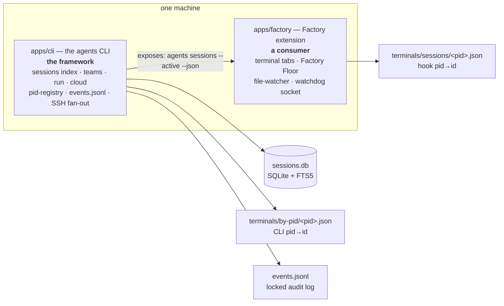
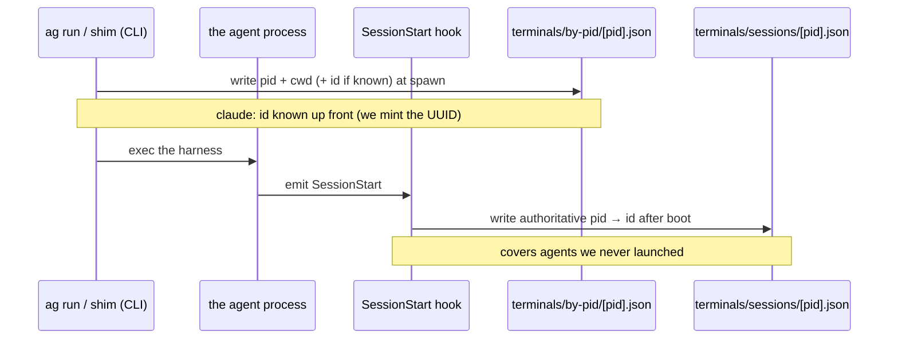

# Architecture

How the parts fit together: **two application layers** (the `agents` CLI and the
Factory extension), **two meanings of "session"** (a transcript vs a live identity),
and the on-disk stores that connect them. Read this once and the rest of the docs
(`05-sessions.md`, `06-observability.md`, `teams.md`) slot into place.

Everything here is read from source — file references are `path:line` at the time of
writing; treat them as pointers, not guarantees.

---

## 1. Two application layers

`agents-cli` is two application-layer surfaces over one shared set of on-disk state:

- **`apps/cli` — the `agents` / `ag` CLI. The framework.** It owns the durable
  state and every mechanism: the SQLite transcript index, `sessions` / `teams` /
  `run` / `cloud`, the CLI-side pid→id registry, the audit log, and the SSH fan-out
  to peer machines.
- **`apps/factory` — the Factory VS Code extension. A consumer.** It spawns agent
  terminals as tabs and renders the Factory Floor dashboard, but it holds **no data
  models of its own** beyond the live-session state file. For "what's running", it
  shells out to the CLI (`agents sessions --active --json`) and reshapes the JSON.

The important consequence: **the CLI is where the mechanisms live**, so a change to
how live state is computed (or cached) benefits every consumer — a terminal, the
extension, another machine — at once. The extension is a thin reshaping layer.

> The Factory extension is a **separate product** with its own publish identity
> (publisher `swarmify`, name `swarm-ext`). See [`apps/factory/AGENTS.md`](../../factory/AGENTS.md).

---

## 2. Two meanings of "session"

The word "session" names two unrelated things. Keeping them apart removes most of the
confusion in this codebase.

| | Transcript | Live identity |
|---|---|---|
| **What it is** | the conversation on disk (one file/row per session) | which running **pid** is which session, right now |
| **Where** | agent-native files → indexed in `sessions.db` | `terminals/*/<pid>.json` cache files |
| **Read by** | `agents sessions` (the CLI) | the CLI (`--active`) and the extension |
| **Lifetime** | durable (survives reboot) | ephemeral (deleted with the pid) |
| **Covered in** | [05-sessions.md](05-sessions.md) | §3 below |

The **transcript** side is a SQLite index (`~/.agents/.history/sessions/sessions.db`,
`SCHEMA_VERSION` in [`src/lib/session/db.ts`](../src/lib/session/db.ts)) with a
`scan_ledger` that re-reads a file only when its `mtime`/`size` changed, plus a
`session_text` FTS5 table for search. Listing is a DB read; only opening one session
fully re-parses its transcript. Detail in [05-sessions.md](05-sessions.md).

The **live identity** side is the rest of this document.

---

## 3. Live identity: two `pid → id` writers

An agent is one OS process with a pid. To say "this terminal is running session
`4d…`", something must map that pid to a session id and store it in a file **named
after the pid** — never the database, because a pid is an OS-recycled number
(a saved `pid 1234 → session-abc` row becomes a lie the moment 1234 is reused).

There are **two** such writers, and they fire at different moments:

- **CLI pid-registry — `terminals/by-pid/<pid>.json`.** Written by `ag run` / the
  shim at spawn ([`src/lib/session/pid-registry.ts`](../src/lib/session/pid-registry.ts),
  `writePidSessionEntry`, interface `PidSessionEntry`). Immediate, but covers only
  launches **we** make, and the id is exact only when known at launch (see §4).
- **session-tracker — `terminals/sessions/<pid>.json`.** Written by the polyglot
  `SessionStart` hook after the agent boots
  ([`packages/session-tracker`](../../../packages/session-tracker), `STATE_DIR` in
  `src/state-file.ts`, interface `SessionState`). Authoritative (reads the agent's
  own payload) and covers **any** start — including a user typing `claude` in a
  terminal, which the CLI never launched — for harnesses that expose a hook.

**Reader split:** the CLI reads `by-pid/`; the **extension** reads `sessions/`
(`apps/factory/src/core/liveSession.ts`). Same pid→id data, two writers, two readers.
The join key already exists — the hook records `terminal_id` / `launch_id` from the
env the launcher sets (`AGENT_TERMINAL_ID`, `AGENT_LAUNCH_ID`) — so the two files can
be merged behind one path later; today both exist because neither subsumes the other
(immediate-but-ours vs delayed-but-any).

---

## 4. Who assigns the session id — it differs per harness

This is the crux of "why isn't it uniform." The dividing line is **who names the
session**:

- **`claude`** — *we* do. `ag run` generates a UUID and passes `--session-id`
  ([`src/lib/exec.ts`](../src/lib/exec.ts), `spawnAgent`), so the id is known before
  the process runs and the pid-registry entry is exact immediately.
- **every other harness** — the *agent* owns the id, and we discover it: from its
  `SessionStart` hook payload if it has one, else by reading it out of the transcript
  later. Until then the pid-registry entry records pid + cwd + agent so `--active`
  can correlate by folder.

Two formats trip people up (both handled in [`src/lib/session/discover.ts`](../src/lib/session/discover.ts)):

- **Codex** — the file is `rollout-<timestamp>-<uuid>.jsonl`, but the id is **not**
  that filename; it's a separate UUID read from `session_meta.payload.id` inside the
  file.
- **OpenCode** — ids are `ses_<…>` and live in a SQLite database
  (`~/.local/share/opencode/opencode.db`), pointed at by a synthetic
  `opencode.db#<id>` path.

**Which harnesses are session-tracked** is a distinct set from which the CLI can
*run*. The run set is the `AGENTS` registry ([`src/lib/agents.ts`](../src/lib/agents.ts));
the **session-discoverable** set is `SESSION_AGENTS`
([`src/lib/session/types.ts`](../src/lib/session/types.ts)): `claude`, `codex`,
`gemini`, `antigravity`, `opencode`, `openclaw`, `rush`, `hermes`, `grok`, `kimi`,
`droid`. `cursor` and `copilot` are runnable but not session-discoverable.

---

## 5. Storage map

Everything the two layers share lives in one of a few stores, each chosen for how
long it must live and how it's read back:

| Store | Path | Kind | Written / read |
|---|---|---|---|
| Sessions index | `~/.agents/.history/sessions/sessions.db` | SQLite + FTS5 | CLI scans transcripts → rows; `agents sessions` reads |
| Transcripts | `~/.claude/projects/…`, `~/.codex/sessions/…`, … | agent-native files (read-only) | the raw truth; parsed on demand |
| CLI pid-registry | `~/.agents/.cache/terminals/by-pid/<pid>.json` | ephemeral file | `ag run`/shim write; CLI reads (§3) |
| Live-session state | `~/.agents/.cache/terminals/sessions/<pid>.json` | ephemeral file | hook writes; extension reads (§3) |
| Audit log | `~/.agents/events.jsonl` | locked shared log | `emit()` in [`src/lib/events.ts`](../src/lib/events.ts); `agents events` reads |
| Teams sentinels | `…/agents/<uuid>/exit_code`, `hosts/<id>.log` + `.exit` | ephemeral files | teammate writes exit code; supervisor reads (§6) |
| Mailbox spool | `~/.agents/.history/mailbox/<id>/…` | append-only dirs | `agents message` / feed; `agents mailboxes` reads |

There is **one** audit log (`events.jsonl`), shared and file-locked because many
processes append to it. It is the single choke point for "who did what" — see
[06-observability.md](06-observability.md).

---

## 6. Teams & remote execution

Teams and `run` share code through the `agents run` **command line**, not a shared
function — on purpose.

- **Launch.** A team builds an `agents run …` argv (`buildRunArgv` in
  [`src/lib/teams/agents.ts`](../src/lib/teams/agents.ts)) and runs it — locally as a
  background shell, remotely over SSH. Any new `run` flag works in teams for free.
- **Completion.** Each teammate runs `<cmd>; echo $? > exit_code` (`buildSentinelCommand`);
  the supervisor polls that `exit_code` sentinel (locally, or by tailing the log +
  reading the remote file over SSH, batched one SSH per host), flips the status, then
  `startReady` launches whatever was waiting on it. The signal is a file with an exit
  code — no live connection is held.
- **Placement.** The scheduler ([`src/lib/teams/scheduler.ts`](../src/lib/teams/scheduler.ts),
  `pickLeastLoaded`) picks a pinned host → the only host in the pool → the host
  running the **fewest teammates** (a count, not real CPU/memory) → this machine.

Detail in [teams.md](teams.md); the SSH transport is [09-ssh-transport.md](09-ssh-transport.md).

---

## 7. Live state is computed on demand

`agents sessions --active` re-derives state on every call — it re-reads the **tail**
of each live transcript, infers `working` / `waiting_input` / `idle`, and computes
tokens/sec ([`src/lib/session/active.ts`](../src/lib/session/active.ts),
`readSessionTailWithRaw` → `inferSessionState` → `computeTokPerSec`). There is no
resident cache: each call pays the recompute, and the Factory extension polls it
(local sessions ~3s, remote peers ~45s, `apps/factory/ui/.../UnifiedAgentsPane.tsx`).
Other machines are reached by running the same command over SSH per peer.

This is deliberately simple and correct; the "compute once, subscribe" direction (a
resident process that parses each file once and emits only what changed) is the
optimization pattern tracked in [99-optimizations.md](99-optimizations.md). Describe
current behavior against this doc; that file owns the proposals.

---

## Related

- [00-concepts.md](00-concepts.md) — DotAgents repos, resources, resolution, version homes
- [05-sessions.md](05-sessions.md) — the transcript index in depth
- [06-observability.md](06-observability.md) — events, feed, mailboxes, cost
- [teams.md](teams.md) · [hosts.md](hosts.md) · [09-ssh-transport.md](09-ssh-transport.md)
- [`packages/session-tracker/README.md`](../../../packages/session-tracker/README.md) — the live-state writer (hook)
