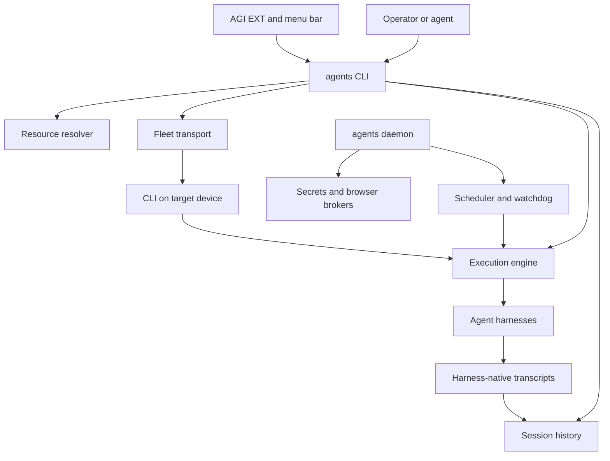
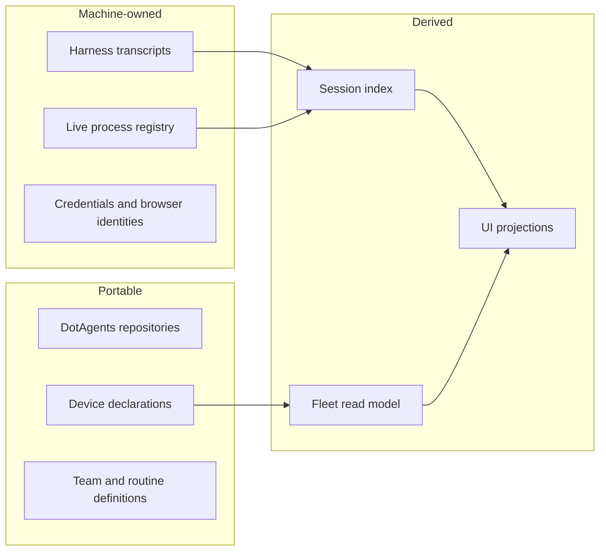

# Architecture

agents-cli is the owning control plane. It installs and projects resources, launches
harnesses, records sessions and execution state, schedules automation, coordinates
devices, and exposes browser/computer tools. UI clients render CLI-owned state and call
CLI actions; they do not duplicate schedulers, stores, or decision engines.

## Process boundaries

The one-shot CLI is the public control surface and composition root. The daemon owns
only responsibilities that require continuity across invocations: scheduling, browser
IPC, secret brokering, watchdog decisions, usage refresh, and read-model publication.
Harnesses remain separate processes with native storage and authentication.

Remote execution crosses SSH through the same command and environment contracts as
local execution. AGI EXT and the menu bar are projections: they may poll read-only state
and request actions, but never decide when fleet-affecting work should execute.
Extension-internal presentation and terminal architecture belongs in the
[AGI EXT repository](https://github.com/phnx-labs/agi-ext/tree/main/docs).

## State ownership

Durable transcripts remain harness-native. The session index is a rebuildable search
projection. Run, team, and routine records own execution outcomes and link to sessions
instead of replacing them. Device declarations and resource repositories are portable;
caches, credentials, browser identities, and live-process registries are machine-local.

## Major subsystem seams

- [Resources](resources.md) resolve portable intent and project it into harness-native
  configuration.
- [Execution](execution.md) turns normalized run intent into a local or remote harness
  process.
- [Sessions](sessions.md) normalize native transcripts into searchable cross-device
  history.
- [Orchestration](orchestration.md) coordinates executions with durable dependencies.
- [Fleet](fleet.md) owns device identity, placement, and SSH transport.
- [Automation](automation.md) owns scheduled and progress-triggered execution.
- [Secrets](secrets.md) owns credential custody and controlled materialization.
- [Interfaces](interfaces.md) expose browser, computer, and terminal capabilities.

## Core invariants

1. Every agent launch enters the same execution engine.
2. One scheduler and one executor own each fleet-affecting action.
3. Shared work is claimed once or proven idempotent.
4. Unsupported capability and remote-boundary loss fail loudly.
5. UI state is derived from CLI truth, never maintained as a parallel mechanism.
6. Healthy running work is collapsed; unfinished non-progressing work is raised.

Detailed behavioral requirements, current gaps, and compatibility commitments live in
[specifications.md](specifications.md).
