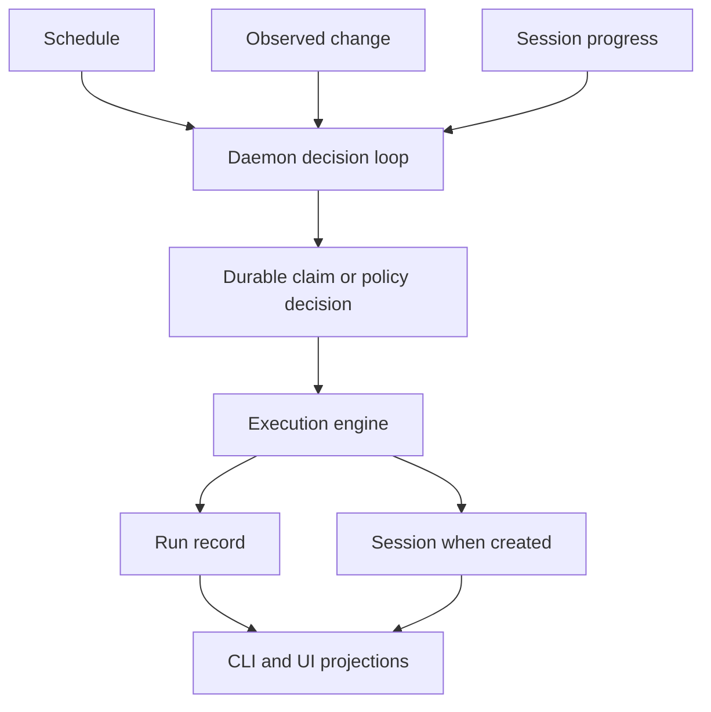

# Automation

The daemon is the sole scheduler for routines, monitors, watchdog passes, and periodic
maintenance. UI clients may request a run or render state; they never own an acting timer.

## Routines

A routine definition says what should run and when. Device activation separately says
where it may run. Each scheduled fire has a unique claim distinct from the active-run
claim. Readiness failures create visible blocked/skipped/missed run records instead of a
fake session.

The occurrence claim answers whether this scheduled slot may dispatch. The active-run
claim answers whether another instance is already executing. Keeping them separate makes
catch-up, overlap policy, and crash recovery observable rather than timing-dependent.

## Monitors

A monitor observes a source, compares it with durable observed state, and submits an
action through the same execution path as a routine. Semantic identity deduplicates the
watched condition across the fleet; execution placement is not part of that identity.
A `run`/`routine` action may declare a `postcondition` shell command; after the
dispatched run settles, the fire is `ok` only if that command exits 0. `completed`
without a met postcondition is `no effect`, not success.

## Watchdog

The watchdog reads fleet progress, classifies non-progressing unfinished sessions, asks a
real decider for an action, delivers to the exact session, and records confirmation. Hard
account limits may rotate in place, preserving tab and conversation context. Detection is
fleet-wide; delivery remains local to the owning device.

Automation always creates or updates its own attempt record. A session is linked only
after a harness conversation exists. This lets blocked readiness, missed schedules, and
failed dispatch remain visible without inventing transcript history.
