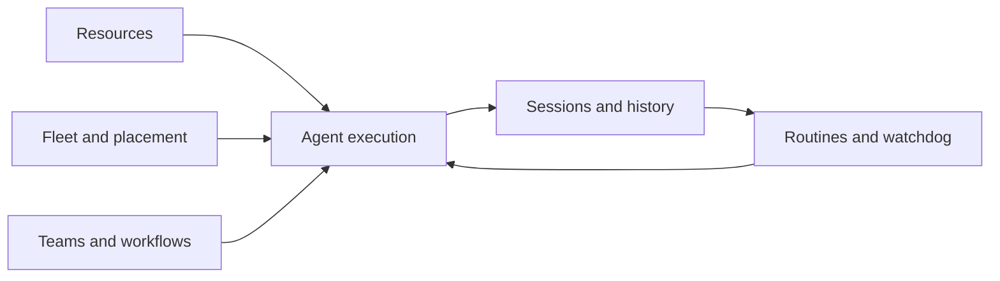

# Core concepts

The product is easiest to reason about as four connected planes: portable resources,
agent execution, durable history, and fleet coordination. Teams and automation compose
those planes; they do not create parallel implementations.

## Resources and resolution

A resource is portable agent input: rules, commands, skills, hooks, MCP servers,
permissions, subagents, workflows, profiles, routers, secret metadata, or host CLI
declarations. A DotAgents repository stores these concepts in a harness-neutral form.

Resolution is layered: project overrides user, user overrides extra repositories, and
system is the lowest layer. Same-name entries override as complete resources; different
names union. Synchronization then projects the result into a capable harness's native
format. A repository describes desired configuration, not runtime state.

## Harnesses and versions

A harness is the integration contract around an agent CLI: how it is installed,
launched, configured, resumed, and parsed. Pinnable versions run in isolated homes so
configuration cannot bleed between releases. Self-updating harnesses have one current
binary and do not acquire fictional version homes.

Capability support belongs to the harness registry and may vary by version. Custom
harnesses bind a host harness, model, endpoint, and account while remaining distinct
launch targets.

## Runs and sessions

A run is an attempted execution. A session is a conversation. An execution may create a
session; failed prerequisites, skipped work, missed schedules, and command-only
executions may not. The records link when both exist but retain different ownership.

This distinction is central to teams and routines: an orchestrator needs a truthful
record that work was blocked before launch, while session history cannot contain a
conversation that never existed.

## Devices, placement, and projects

A device is a registered machine and its connection facts. Placement selects where work
runs, then carries the same execution contract across transport. Each machine owns its
credentials, browser identity, transcripts, live processes, and runtime health.

A project is a named set of repositories and execution anchors. It supplies attribution
and context without owning a second scheduler, resource resolver, or session store.

## Teams, workflows, and subagents

A team is a runtime DAG of executions. A workflow is a portable named composition that
can instantiate work. A subagent is a portable role definition that a capable harness
can invoke. Separating them prevents declarative resources from becoming process
supervisors and keeps every launched agent on the same execution path.

## Routines, monitors, and watchdog

A routine starts work on a schedule. A monitor starts work when an observed condition
changes. The watchdog advances unfinished sessions that have stopped progressing. All
three are daemon-owned decision loops and submit work through the ordinary execution
engine. Their triggers differ; their scheduler and executor ownership does not.

## Owners and projections

| Concept | Durable owner | Derived projections |
|---|---|---|
| Conversation | Harness transcript | Session index, rendered view, UI stream |
| Attempt | Run/team/routine record | Status summaries, feed events |
| Resource intent | Layered DotAgents repositories | Harness-native files |
| Credential value | Platform or encrypted secret store | Child environment |
| Live process | Owning device registry | Fleet and UI status |

When a projection disagrees with its owner, repair or rebuild the projection. Do not add
a fallback that makes both representations authoritative.
