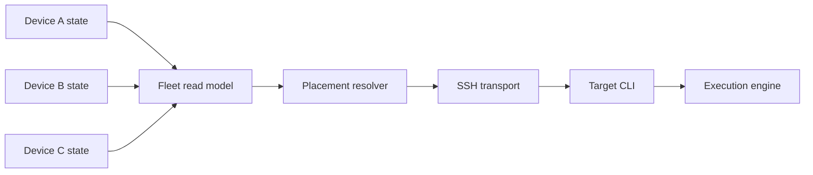

# Fleet and placement

The fleet is a registry of machines plus live self-reported state. Each device publishes
only its own health; readers union peer snapshots. This avoids an N-squared probe mesh.

Device declarations hold shared identity, role, and connection configuration. Runtime
load, caches, logins, and local browser identities remain machine-owned. Native OAuth
credentials do not become fleet configuration; declared provider accounts move only
through explicit secret transport.

Automatic placement uses one shared resolver. When worker roles exist, they form an
allowlist and personal devices are excluded. An empty eligible pool is an error, never an
implicit local fallback.

Remote commands reuse the SSH transport and the ordinary CLI surface. Host resolution,
identity pinning, environment forwarding, working-directory mapping, and reconnectable
streaming are shared primitives so callers cannot drift on security or semantics.

The origin coordinates; the target owns execution. A remote transcript, process, and
credential remain on the target device. Fleet aggregation makes them discoverable
without pretending their underlying state has moved.

## Held worktrees — surface stranded work, don't just count it

The nightly `worktree-sweep` routine (PHNX-3503, in `phnx-labs/.agents`) reclaims merged
agent worktrees and correctly **holds** anything dirty, unmerged, or undeterminable — a
fail-closed bias that is right for a destructive job, but which left the held set a
silent, growing residue that nothing resolved. `agents fleet worktrees` is the read-only
surfacing half. It classifies every held worktree under a repo's `.agents/worktrees/`
into three buckets:

- **`unmerged-commits`** — the one that matters. The branch carries commits with no
  patch-equivalent upstream (judged by `git cherry`, so a rebase-merged branch is not
  mis-read as unmerged): real work visible to nobody, the PHNX-2951 / PHNX-2732 class.
- **`uncommitted-changes`** — a dirty tree. Live work or build output; needs a human eye.
- **`undeterminable`** — `status-unreadable` (a locked index) or `merge-state-unknown`
  (no resolvable default ref). Fails closed, never read as clean.

`--json` emits the structured set (device, repo, worktree, branch, reason, age, size) for
machine callers; `--fleet` fans out over every online device and aggregates, stamping each
entry with its source device; `--bucket <name>` filters. The safe recovery action for the
stranded bucket is `--push`: it publishes each `unmerged-commits` branch that is on no
remote — re-reading the merge state immediately before pushing and refusing anything
already on origin — so the work becomes visible. It never removes a worktree or a branch;
the destructive reclaim stays in the sweep. Implementation:
[`src/lib/worktree/held.ts`](../src/lib/worktree/held.ts).
