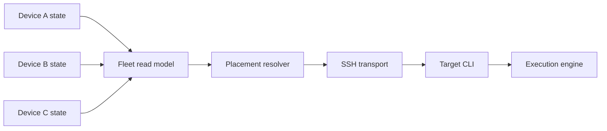

# Fleet and placement

The fleet is a registry of machines plus live self-reported state. Each device publishes
only its own health; readers union peer snapshots. This avoids an N-squared probe mesh.

Device declarations hold shared identity, role, and connection configuration. Runtime
load, caches, logins, and local browser identities remain machine-owned. Native OAuth
credentials do not become fleet configuration; declared provider accounts move only
through explicit secret transport.

Automatic placement uses one shared resolver. When worker roles exist, they form an
allowlist and personal devices are excluded. An empty eligible pool is an error, never an
implicit local fallback.

Remote commands reuse the SSH transport and the ordinary CLI surface. Host resolution,
identity pinning, environment forwarding, working-directory mapping, and reconnectable
streaming are shared primitives so callers cannot drift on security or semantics.

The origin coordinates; the target owns execution. A remote transcript, process, and
credential remain on the target device. Fleet aggregation makes them discoverable
without pretending their underlying state has moved.
