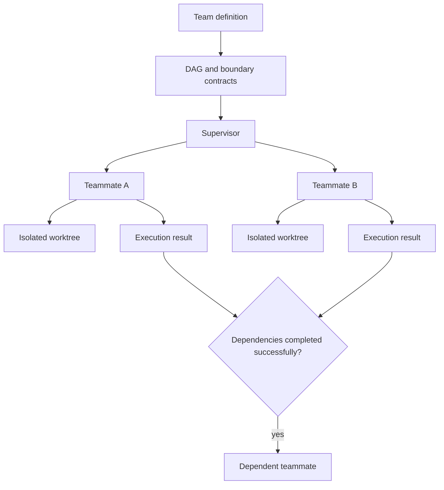
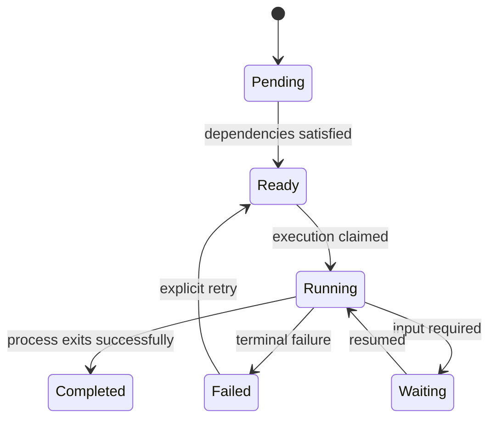

# Teams, workflows, and subagents

Teams coordinate several executions as a directed acyclic graph. Each teammate owns its
process, worktree, conversation, and result; the team registry owns dependency and
supervision state. Boundary contracts state what an upstream task must deliver before a
dependent task can start.

## Team ownership

The team is the durable coordination object. It records members, dependency edges,
placement, execution identifiers, and outcomes. A teammate is an ordinary agent run with
a team identity; it does not get a privileged execution path. Its conversation is useful
evidence, but the supervisor relies on execution state rather than interpreting
transcript prose as completion.

Each coding teammate works in an isolated worktree. Isolation prevents concurrent edits
from colliding, while boundary contracts make the handoff explicit: files owned, facts
established, artifacts produced, or a verdict returned. These contracts guide the
teammates and reviewers; they are not machine-validated gates. Today a dependent becomes
ready when every declared upstream process exits successfully.

Supervision advances ready nodes, observes execution truth, resumes a known teammate,
and surfaces failures. Retry preserves team/member identity and records a new attempt
rather than rewriting the previous outcome.

## Distributed teams

Local and remote teammates use the same launch engine. Placement changes where a task
runs, not its identity, capability rules, or delivery contract. A remote teammate gets an
isolated worktree on its execution device and carries actor/session lineage across SSH.

The team registry remains the coordination owner while the target device owns the
process, worktree, and transcript. Loss of reachability is not completion. The member
stays attributable to its device until reconnection, recovery, or an explicit terminal
decision.

## Workflows and subagents

A workflow is a portable named composition. A subagent is a portable agent role. Teams
are runtime coordination objects. Keeping them separate lets a workflow instantiate a
team and lets teammates use subagent definitions without making either resource
responsible for process supervision.

Both resources use layered resolution and capability-aware projection. Neither creates
a parallel execution engine. Budget and repository-freshness gates run before spawn.

## Invariants

- A member has one execution identity and one owned worktree per attempt.
- Dependency readiness comes from successful upstream process completion, not transcript
  guessing; promised artifacts still require downstream or reviewer verification.
- Local and remote members cross the same capability and execution boundaries.
- Cancellation and retry are explicit state transitions with durable history.
- A workflow or subagent cannot bypass team supervision or the execution engine.
