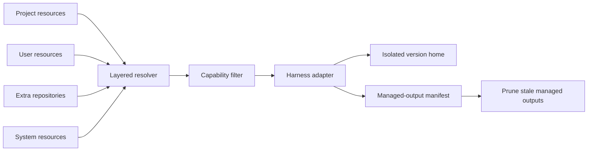
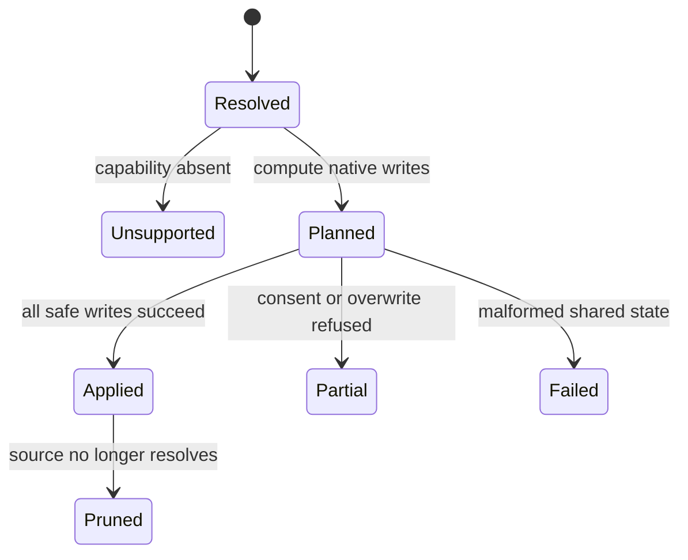

# Resources and synchronization

Resources are the portable inputs that make an agent useful in a project: rules,
commands, skills, hooks, MCP servers, permissions, subagents, workflows, profiles,
routers, secret metadata, and host CLI declarations. A DotAgents repository stores
these concepts in a harness-neutral form. Synchronization projects that form into each
harness's native layout.

The important distinction is between resolution and projection. Resolution decides
which logical resources exist. Projection decides how a supported harness represents
them. Every consumer uses the same resolver; a harness adapter must not invent its own
precedence rules.

## Resolution model

Layers are ordered project → user → extra repositories → system. Resources with
different names union. When two layers provide the same kind and name, the higher layer
wins as a complete resource; fields from different layers are not deep-merged. This
keeps provenance understandable and makes a project override reversible.

Project-scoped resources are resolved for a launch or an explicit project sync. They do
not leak into global version homes. Plugin resources participate in the same resolution
model, but executable plugin surfaces remain inert until explicitly enabled.

## Projection model

The capability registry answers whether a harness and version support a resource kind.
Only then does an adapter convert the canonical resource into native files or config.
Rules may become a harness-specific memory filename, permissions may require format
conversion, and MCP configuration may require a structured merge rather than a symlink.
Those are representation differences, not separate resource semantics.

Projection owns only paths recorded in its manifest. A later reconciliation removes a
previously managed output when its source disappears or loses precedence, while leaving
unmanaged user content untouched. Shared structured files are updated surgically;
malformed input fails loudly instead of being replaced.

## Synchronization invariants

- The resolver is the only authority for layer precedence.
- The capability registry is the only authority for harness support.
- A sync is reconciliation, not append-only copying: stale managed outputs disappear.
- Ownership is explicit. Synchronization never deletes a path it did not previously
  manage.
- Partial outcomes are reported as partial; a declined permission is not clean success.
- Secret values never enter a DotAgents repository. Only bundle names and policy sync.
- A plugin cannot bypass capability, precedence, consent, or pruning rules.

## Change guidance

A new resource kind needs a canonical representation, layer-resolution semantics,
capability declarations for every applicable harness, projection adapters, managed-path
ownership, and pruning behavior. If it cannot answer all six, it is not yet a resource
the synchronization system can safely own.
