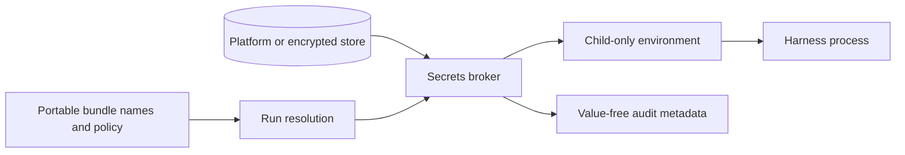

# Secrets and credential custody

Secret values are never DotAgents resources. Portable repositories contain names and
policy only; values live in a platform-backed store or encrypted headless store.

## Two boundaries

Storage protection answers where plaintext rests. Materialization protection answers
whether a value enters agent-visible stdout, environment, files, or transcripts. They are
separate guarantees.

Injection passes named values directly into a child environment without printing them.
Materialization deliberately reveals a value and therefore requires the policy and human
gate defined by the current command contract. All materializing paths must agree; a
command-specific exception cannot contradict the system threat model.

The daemon hosts the lightweight broker so repeated launches do not trigger repeated
platform prompts. Expensive or failure-prone work remains outside the daemon's critical
loop. Remote use transports values on demand to an authenticated target and never turns
them into synced plaintext.

The reserved `auth` bundle is file-backed by construction: it holds long-lived Claude
setup-tokens that usage/probe and unattended workers read without Touch ID. Creating it
on the keychain or vault backend fails loud. The daemon's `auth-sync` service pushes a
local file-backed `auth` bundle to pinned fleet devices that lack it, always with the
file backend so each destination auto-provisions its own machine-local key.

**The usage-read credential is role-gated (USAGE-READ-1/2).** By default a usage read
resolves only this file-based setup-token, never the interactive login (RUSH-1822) —
the guarantee every background caller (daemon usage warm, auth-health probe, watchdog)
keeps, since the fleet-logout revocation came from an unattended loop firing the
interactive token at Anthropic. The setup-token itself lacks the `user:profile` scope a
usage read requires (RUSH-2392), so on a `worker`/unmarked device — or any `--json` or
piped reader — an account signed in interactively and nothing else reports `usage
unavailable (no usage credential)`. `agents view` names that state precisely instead of
folding it into the generic bucket, which used to send operators back to `claude
setup-token` for a remedy that cannot work (#2987); a cache that has not been read yet
reports the distinct `usage pending`.

The one exception is a **foreground human `agents view` on a `personal` device**
(`selfConfiguredDeviceRole() === 'personal'` **and** `process.stdout.isTTY`): the read
falls through to the interactive OAuth login — the only credential carrying
`user:profile` — so `agents view --refresh` repopulates a live session (5h) + week (7d)
bar for every signed-in account. This mirrors the exec-credential role gate (EXEC-2a):
the personal box authenticates from its interactive login; unattended loops and machine
readers never touch it. A usage read never *refreshes* an access token — an expired
interactive login reports `expired-credential`, not a silent refresh.

Actors, audit events, and usage counters contain metadata only. Redaction is defense in
depth, not permission to publish raw transcripts.

## Linux: headless servers and the encrypted-file fallback

Off macOS there is no platform keychain, so the encrypted-file store is the backend. Its
data key is unwrapped from a machine-local key file at `~/.agents/.secrets-key/passphrase`
— mode 0600, generated on first use, never synced and never a DotAgents resource. That
file *is* the store: a machine that has it can read every bundle on it.

Resolution is entirely non-interactive: the daemon-hosted broker reads the key file
directly, and there is **no TTY step anywhere in this list**. A command that appears to
wait for a passphrase is waiting for the *transport* passphrase of `secrets push` /
`secrets pull` / `--to-file`, which is `AGENTS_SYNC_PASSPHRASE` — a different secret with
a different lifetime. Headless sync is configured with that transport variable.

<!-- docs-hygiene:allow-master-key-discussion -->
**Never place the master key in a shell startup file.** `AGENTS_SECRETS_PASSPHRASE`
overrides the key file, so exporting it from `~/.zshenv`, `~/.bashrc`, or any other rc
file leaves the plaintext key readable by every process the account starts — including
agents — and `agents doctor` reports it as an `env-secret-export` warning. This is not
hypothetical: it is what RUSH-1968 was, on seven machines at once, because an earlier
revision of this page recommended it.
<!-- /docs-hygiene:allow-master-key-discussion -->

<!-- docs-hygiene:allow-master-key-discussion -->
`agents secrets export --device --remote-backend file` never forwards
`AGENTS_SECRETS_PASSPHRASE`. The remote auto-provisions its own machine-local key
so headless reads work. Forwarding that env var used to key destination ciphertext
to a secret the remote daemon did not hold, while import still printed success.
<!-- /docs-hygiene:allow-master-key-discussion -->
