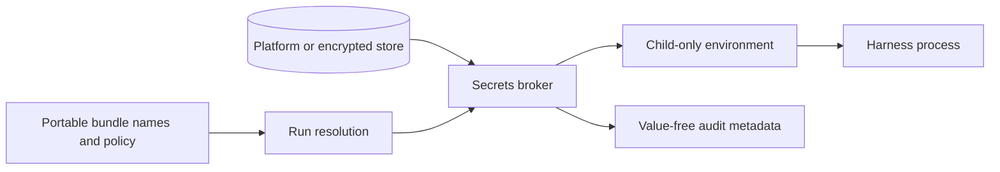

# Secrets and credential custody

Secret values are never DotAgents resources. Portable repositories contain names and
policy only; values live in a platform-backed store or encrypted headless store.

## Two boundaries

Storage protection answers where plaintext rests. Materialization protection answers
whether a value enters agent-visible stdout, environment, files, or transcripts. They are
separate guarantees.

Injection passes named values directly into a child environment without printing them.
Materialization deliberately reveals a value and therefore requires the policy and human
gate defined by the current command contract. All materializing paths must agree; a
command-specific exception cannot contradict the system threat model.

The daemon hosts the lightweight broker so repeated launches do not trigger repeated
platform prompts. Expensive or failure-prone work remains outside the daemon's critical
loop. Remote use transports values on demand to an authenticated target and never turns
them into synced plaintext.

Actors, audit events, and usage counters contain metadata only. Redaction is defense in
depth, not permission to publish raw transcripts.
