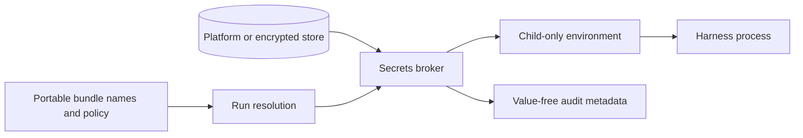

# Secrets and credential custody

Secret values are never DotAgents resources. Portable repositories contain names and
policy only; values live in a platform-backed store or encrypted headless store.

## Two boundaries

Storage protection answers where plaintext rests. Materialization protection answers
whether a value enters agent-visible stdout, environment, files, or transcripts. They are
separate guarantees.

Injection passes named values directly into a child environment without printing them.
Materialization deliberately reveals a value and therefore requires the policy and human
gate defined by the current command contract. All materializing paths must agree; a
command-specific exception cannot contradict the system threat model.

The daemon hosts the lightweight broker so repeated launches do not trigger repeated
platform prompts. Expensive or failure-prone work remains outside the daemon's critical
loop. Remote use transports values on demand to an authenticated target and never turns
them into synced plaintext.

Actors, audit events, and usage counters contain metadata only. Redaction is defense in
depth, not permission to publish raw transcripts.

## Linux: headless servers and the encrypted-file fallback

Off macOS there is no platform keychain, so the encrypted-file store is the backend. Its
data key is unwrapped from a machine-local key file at `~/.agents/.secrets-key/passphrase`
— mode 0600, generated on first use, never synced and never a DotAgents resource. That
file *is* the store: a machine that has it can read every bundle on it.

Resolution is entirely non-interactive: the daemon-hosted broker reads the key file
directly, and there is **no TTY step anywhere in this list**. A command that appears to
wait for a passphrase is waiting for the *transport* passphrase of `secrets push` /
`secrets pull` / `--to-file`, which is `AGENTS_SYNC_PASSPHRASE` — a different secret with
a different lifetime. Headless sync is configured with that transport variable.

<!-- docs-hygiene:allow-master-key-discussion -->
**Never place the master key in a shell startup file.** `AGENTS_SECRETS_PASSPHRASE`
overrides the key file, so exporting it from `~/.zshenv`, `~/.bashrc`, or any other rc
file leaves the plaintext key readable by every process the account starts — including
agents — and `agents doctor` reports it as an `env-secret-export` warning. This is not
hypothetical: it is what RUSH-1968 was, on seven machines at once, because an earlier
revision of this page recommended it.
<!-- /docs-hygiene:allow-master-key-discussion -->

<!-- docs-hygiene:allow-master-key-discussion -->
The one legitimate use is `agents secrets export --device`, which forwards
`AGENTS_SECRETS_PASSPHRASE` over ssh stdin so the remote can key its own store. It is
opt-in, never written to disk on either side, and never persisted in an environment.
<!-- /docs-hygiene:allow-master-key-discussion -->
