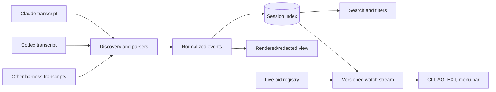

# Sessions and session history

A session is a harness-native conversation. agents-cli does not replace the harness's
transcript format; it discovers those transcripts and builds a normalized, searchable
history across harnesses and devices. The transcript remains durable truth. SQLite,
live-process state, summaries, and UI streams are derived views that can be rebuilt.



## Two identities with different lifetimes

The durable session identifier belongs to the harness transcript. The live identity
maps a currently running process to the session it owns. Live identity is ephemeral and
machine-local; it disappears when the process exits. Harnesses reveal conversation IDs
at different points, so the launch ID is the cross-harness correlation seam during
startup rather than a fabricated universal session ID.

Two writers may contribute live identity: launch-time process registration and harness
hooks that learn the native ID. Readers reconcile them into one view. They must tolerate
arrival order without overwriting richer identity with an earlier partial record.

## History pipeline

Discovery locates harness-native transcripts and records their origin device, harness,
version, project, timestamps, and format. Parsers emit a shared event model for messages,
tool calls, results, usage, and lifecycle signals. The index stores searchable text and
metadata, not a second authoritative transcript.

Incremental scans append or enrich known sessions. Enrichment may fill missing actor,
lineage, cost, or resource-usage fields, but must not erase previously known provenance.
Schema migrations preserve the stable machine-readable envelope described in the
[normative session specification](specifications.md#sessions).

```mermaid
sequenceDiagram
  participant Harness
  participant Scanner
  participant Index
  participant Consumer
  Harness->>Harness: append native transcript
  Scanner->>Harness: discover changed content
  Scanner->>Index: upsert normalized events and metadata
  Index-->>Consumer: reset snapshot with stream version
  Index-->>Consumer: monotonic increments
  Note over Consumer: replace on reset; apply newer increments only
```

## Progress and attention

Session state describes progress, not merely whether a PID exists. Running work is
healthy. Waiting for explicit input, idle unfinished work, crashes, and orphaned remote
work require different recovery actions. Finished work is terminal and must remain
distinct from idle work; otherwise a quiet completed session and silently abandoned work
become indistinguishable.

The live registry contributes liveness, while transcript tails, execution records, and
explicit completion markers contribute progress. A reader that lacks one signal reports
degraded or unknown rather than manufacturing certainty.

## Cross-device history

Each transcript has an origin device. Fleet search unions indexed metadata without
pretending remote files are local. Detail reads, resume, migration, and export route to
the owning device through explicit transport. Migration transfers the conversation and
its provenance, then records the new origin; it does not create two independent owners.

## Derived capabilities

- Search and ranking operate over normalized messages and metadata. A keyword
  content query unions FTS5 hits with the listing page so an indexed transcript
  is returned even when it missed the default cwd/limit window. `--project`,
  `--agent`, and `--routine` still filter that union — a content hit in another
  project does not leak back in.
- Rendering and sharing redact credential-shaped values and local identity by default.
- Export/import preserves provenance and stable IDs while treating indexes as rebuildable.
- Insights and resource-usage analysis are projections; they never mutate transcripts.
- Execution records link to sessions when a conversation exists, but remain independently
queryable when a run failed before session creation.

Raw transcripts are private machine state and are never committed as documentation or
attached directly to public work.
